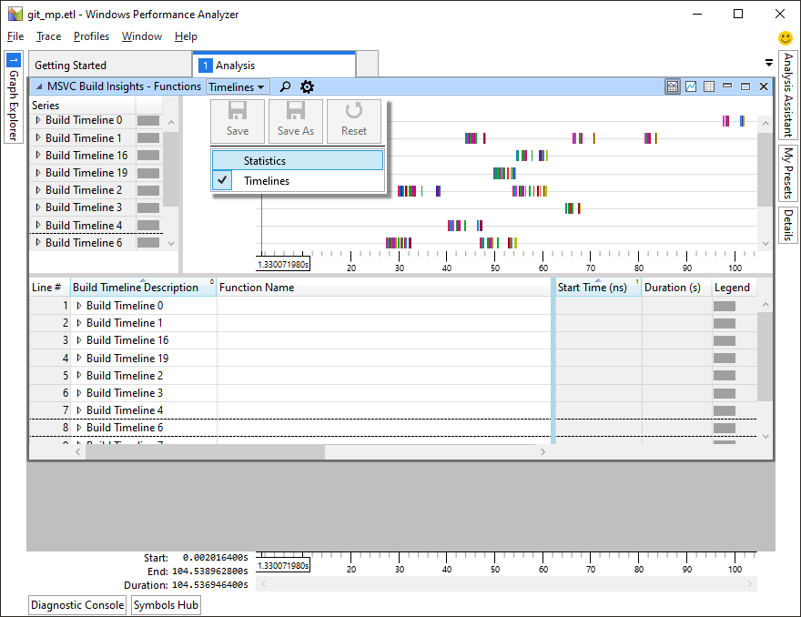

# Tutorial: Windows Performance Analyzer basics

::: moniker range="<=vs-2017"

The C++ Build Insights tools are available in Visual Studio 2019. To see the documentation for that version, set the Visual Studio version selector control for this article to Visual Studio 2019.

::: moniker-end
::: moniker range="vs-2019"

Using C++ Build Insights effectively requires some knowledge of Windows Performance Analyzer (WPA). This article helps you become familiar with common WPA operations. For more information on how to use WPA, see the [Windows Performance Analyzer](/windows-hardware/test/wpt/windows-performance-analyzer) documentation.

## Change the view mode

WPA offers two basic view modes for you to explore your traces:

- graph mode, and
- table mode.

You can switch between them by using the view mode icons in the top of the view pane:

## Select presets

Most C++ Build Insights WPA views have multiple presets for you to choose from. You can select the preset you want by using the drop-down menu in the top of the view pane:

## Zoom in and out

Some build traces are so large it's hard to make out the details. To zoom in on an area that interests you, right-click on the graph and select **Zoom**. You can always go back to the previous setting by choosing **Undo Zoom**. This image shows an example of using a selection and the **Zoom** command to zoom in on a section of the graph:

## Group by different columns

You can customize the way your trace is displayed. Click on the gear icon at the top of a view pane and rearrange the columns in the Build Explorer View Editor. The columns found above the yellow line in this dialog are the ones your data rows are grouped by. The column right above the yellow line is special: in the graph view, it's displayed on the colored bars.

This image shows an example bar graph of a link invocation. We use the gear icon to open the Build Explorer View Editor dialog. Then we drag the Component and Name column entries above the yellow line. The configuration is changed to increase the level of detail, and to see what actually happened inside the linker:

## See also

[Tutorial: vcperf and Windows Performance Analyzer](vcperf-and-wpa.md)\
[Reference: vcperf commands](/cpp/build-insights/reference/vcperf-commands)\
[Reference: Windows Performance Analyzer views](/cpp/build-insights/reference/wpa-views)\
[Windows Performance Analyzer](/windows-hardware/test/wpt/windows-performance-analyzer)

::: moniker-end
