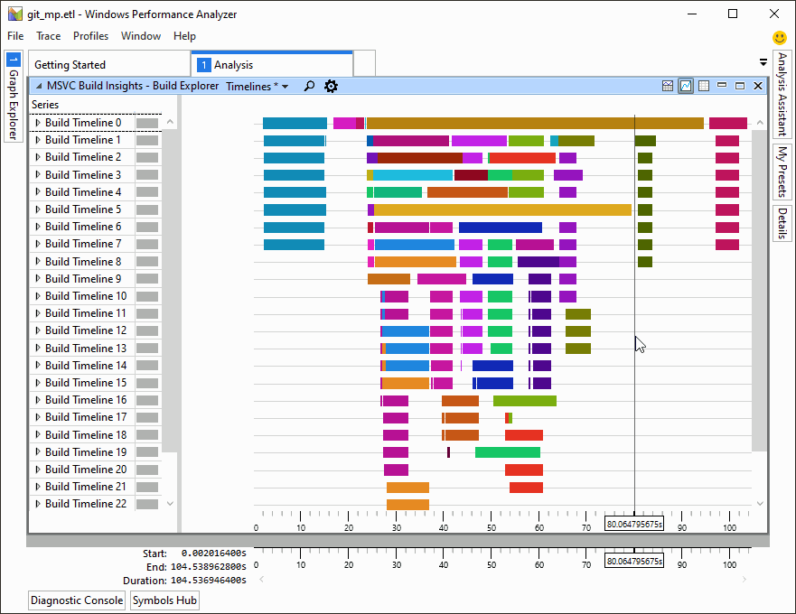

# C++ Build Insights: Windows Performance Analyzer basics

## Introduction

Using C++ Build Insights effectively requires some knowledge of Windows Performance Analyzer (WPA). This section helps you become familiar with common WPA operations.

## Changing the view mode

WPA offers two basic view modes for you to explore your traces:

- graph mode, and
- table mode.

You can switch between them:

## Selecting presets

Most C++ Build Insights WPA views have multiple presets for you to choose from. You can select the preset you want by using the drop-down menu:

## Zooming in and out

Some build traces are so large it's hard to make out the details. Zoom in on an area that interests you by right-clicking on the graph and selecting *Zoom*. You can always go back to the previous setting by choosing *Undo Zoom*. Here's an example of zooming:

## Grouping by different columns

You can customize the way your trace is displayed. Click on the gear icon at the top of a view and rearrange the columns. The columns found above the yellow line in this dialog are the ones your data rows are grouped by. The column right above the yellow line has a special significance for the graph view: it's displayed on the colored bars. Here's an example bar graph of a link invocation. The configuration is changed to increase the level of detail and see what was actually happening inside the linker:

## More information

For more information on how to use WPA, see the [Windows Performance Analyzer](/windows-hardware/test/wpt/windows-performance-analyzer) documentation.
