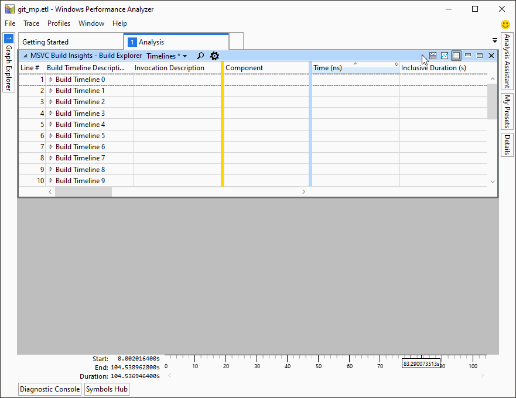
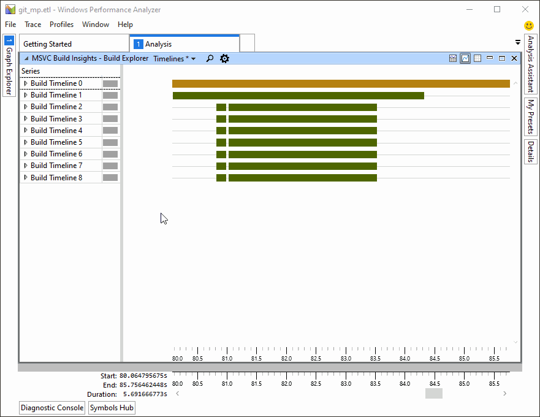

# C++ Build Insights: Windows Performance Analyzer basics

## Introduction

Using C++ Build Insights effectively requires some knowledge of Windows Performance Analyzer (WPA). This section will help you become familiar with common WPA operations.

## Changing the view mode

WPA offers two basic view modes for you to explore your traces:

- graph mode; and
- table mode.

You can switch between them as follows:

## Selecting presets

Most C++ Build Insights WPA views have multiple presets for you to choose from. You can select your desired preset by using the drop-down menu shown below:

## Zooming in and out

Some build traces are so large it is hard to make out the details. Consider zooming on an area that interests you by right-clicking on the graph and selecting *Zoom*. You can always go back to the previous setting by choosing *Undo Zoom*. An example of zooming is illustrated below:

## Grouping by different columns

You can customize the way your trace is displayed by clicking on the gear icon at the top of a view and rearranging columns. The columns that are found above the yellow line in this dialog are the ones your data rows will be grouped by. The column right above the yellow line has a special significance for the graph view: it will be displayed on the colored bars. Here is an example where we are looking at a bar graph of a link invocation. The configuration is changed to increase the level of detail and see what was actually happening inside the linker:

## More information

For more information on how to use WPA, please refer to its official documentation at [https://docs.microsoft.com/windows-hardware/test/wpt/windows-performance-analyzer](https://docs.microsoft.com/windows-hardware/test/wpt/windows-performance-analyzer).
