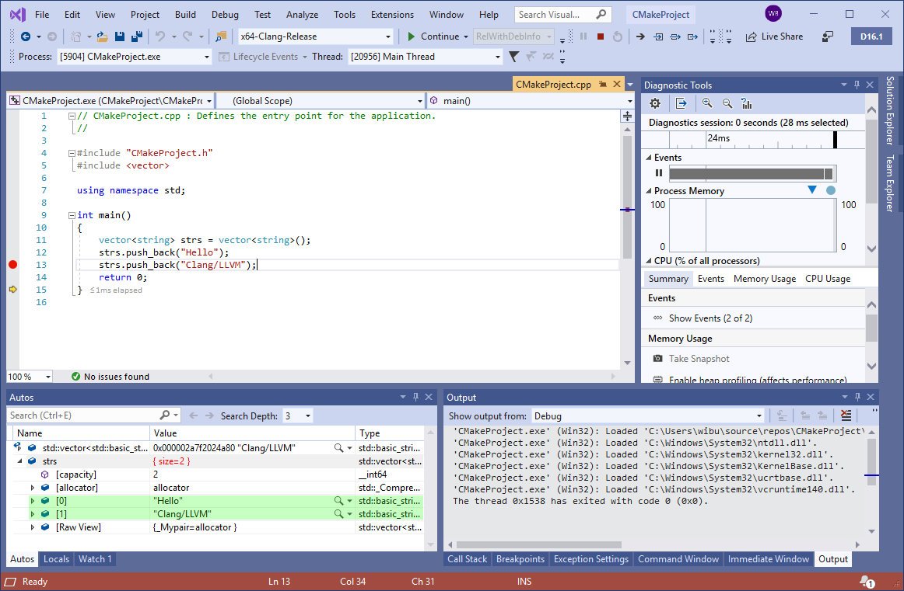

# Clang/LLVM support in Visual Studio projects

::: moniker range="<=vs-2017"

Clang support for both CMake and MSBuild projects is available in Visual Studio 2019.

::: moniker-end

::: moniker range="vs-2019"

You can use Visual Studio 2019 version 16.2 with Clang to edit, build, and debug C++ Visual Studio projects (MSBuild) that target Windows or Linux.

## Install

For best IDE support in Visual Studio, we recommend using the latest Clang compiler tools for Windows. If you don't already have those, you can install them by opening the Visual Studio Installer and choosing **C++ Clang tools for Windows** under **Desktop development with C++** optional components. If you prefer to use an existing Clang installation on your machine, choose the **C++ Clang-cl for v142 build tools.** optional component. Note that the Microsoft C++ Standard Library currently requires at least Clang 8.0.0; the bundled version of Clang will automatically be updated to stay current with updates in the Microsoft implementation of the Standard Library. 

## Configure a Windows project to use Clang tools

To configure a Visual Studio project to use clang, right-click on the project node in **Solution Explorer** and choose **Properties**. Typically, you should first choose **All configurations** at the top of the dialog. Then, under **General** > **Platform Toolset**, choose **LLVM (clang-cl)** and then **OK**.

If you are using the Clang tools that are bundled with Visual Studio, no additional steps are required. For Windows projects, Visual Studio by default invokes Clang in [clang-cl](https://llvm.org/devmtg/2014-04/PDFs/Talks/clang-cl.pdf) mode and links with the Microsoft implementation of the Standard Library. By default, **clang-cl.exe** is located in `C:\Program Files (x86)\Microsoft Visual Studio\2019\Common7\IDE\CommonExtensions\Microsoft\Llvm\bin`.

If you are using a custom Clang installation, then you must manually edit the project file. To do this:

1. Right-click on the project node, and choose **Unload project**. 
1. Save any changes you have made, and then right-click again on the project node and choose **Edit \<project name>.vcxproj**.
1. In the `<ItemGroup Label="ProjectConfigurations">` node, add the following line to each `ProjectConfiguration`: `<LLVMInstallDir>PATH_TO_LLVM</LLVMInstallDir>` but substitute the actual path to LLVM.

## Configure a Linux project to use Clang tools

For Linux projects, Visual Studio uses the Clang GCC-compatible frontend. The project properties and nearly all compiler flags are identical.

To configure a Visual Studio Linux project to use Clang:

1. Right-click on the project node in **Solution Explorer** and choose **Properties**. 
1. Typically, you should first choose **All configurations** at the top of the dialog. 
1. Under **General** > **Platform Toolset**, choose **WSL_Clang_1_0** if you are using Windows Subsystem for Linux, or **Remote_Clang_1_0** if you are using a remote machine or VM.
1. Press **OK**.

On Linux, Visual Studio by default uses the first Clang location that it encounters in the PATH environment variable. To use a different Clang installation, then you must manually edit the project file. To do this:

1. Right-click on the project node, and choose **Unload project**. 
1. Save any changes you have made, and then right-click again on the project node and choose **Edit \<project name>.vcxproj**.
1. In the `<ItemGroup Label="ProjectConfigurations">` node, add the following line to each `ProjectConfiguration`: `<LLVMInstallDir>PATH_TO_LLVM</LLVMInstallDir>` but substitute the actual path to LLVM.

## Set additional properties, edit, build, and debug

After you have set up a Clang configuration, right-click again on the project node and choose **Reload project**. You can now build and debug the project using the Clang tools. Visual Studio detects that you are using the Clang compiler and provides IntelliSense, highlighting, navigation, and other editing features. Errors and warnings are displayed in the **Output Window**. The project property pages for a Clang configuration are very similar to those for MSVC, although some compiler-dependent features such as Edit and Continue are not available for Clang configurations. To set a Clang compiler or linker option that is not available in the property pages, you can add it manually in the property pages under **Configuration Properties** > **C/C++ (or Linker)** > **Command Line**.

When debugging, you can use breakpoints, memory and data visualization, and most other debugging features.  

::: moniker-end
