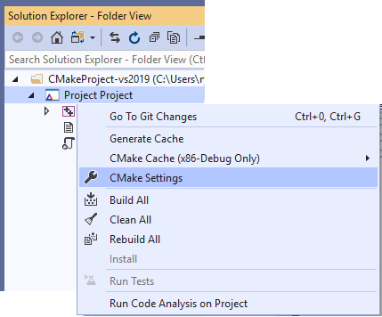
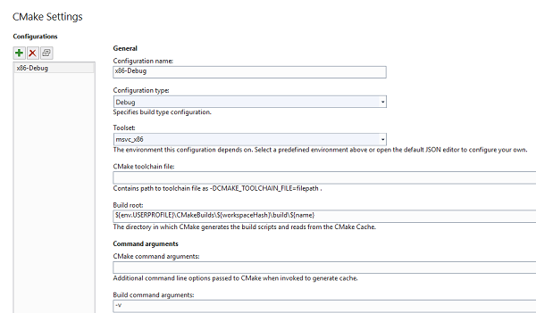

In Visual Studio 2019 and later, you can add configurations and customize their settings by right-clicking on the project node in **Solution Explorer** and choosing **CMake Settings**.

If no configurations are defined yet, Visual Studio will display a list for you to choose from:

After you choose a configuration, Visual Studio shows the CMake Settings editor. The settings that you see in the editor might vary depending on which configuration is selected.

 The options that you choose here are written to a file called CMakeSettings.json. This file provides command-line arguments and environment variables that are passed to CMake when you build the projects. Visual Studio never modifies CMakeLists.txt automatically; by using CMakeSettings.json you can customize the build through Visual Studio while leaving the CMake project files untouched so that others on your team can consume them with whatever tools they are using.

## CMake General Settings

The following settings are available under the **General** heading:

### Configuration name

- **name**: the name that appears in the C++ configuration dropdown. The `${name}` macro enables you to use this value when composing other property values such as paths. For an example, see the **buildRoot** definition in  `CMakeSettings.json`.

### Configuration type

- **configurationType**: defines the build configuration type for the selected generator. Currently supported values are "Debug", "MinSizeRel", "Release", and "RelWithDebInfo".

### Toolset
### CMake toolchain file
### Build root:

## Command arguments

The following settings are available under the **Command arguments** heading:

### CMake command arguments

- **cmakeCommandArgs**: specifies any additional switches you want to pass to CMake.exe.

### Build command arguments

- **buildCommandArgs**: specifies additional switches to pass to the underlying build system. For example, passing -v when using the Ninja generator forces Ninja to output command lines.

### CTest command arguments

- **ctestCommandArgs**: specifies additional switches to pass to CTest when running tests.

## CMake variables and cache

These settings enable you to set CMake variables and save them in CMakeSettings.json. They will be passed to CMake at build time and will override whatever values might be in the CMakeLists.txt file.

## Advanced settings

### CMake generator
### IntelliSense mode

### Install diretory

### CMake executable