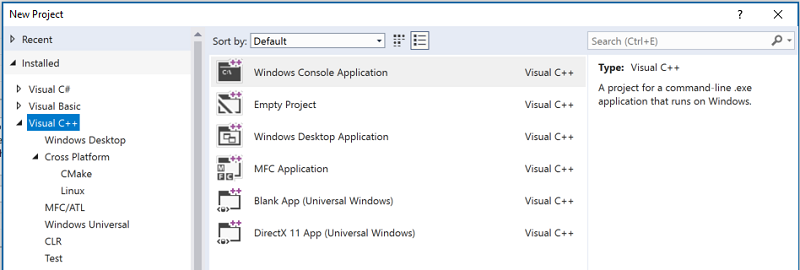
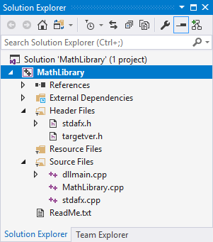

# Visual Studio projects - C++

A *Visual Studio project* is a project based on the MSBuild build system. MSBuild is the native build system for Visual Studio and is generally the best build system to use for UWP apps as well as Desktop applications that use MFC or ATL libraries, COM components, and other Windows-specific programs. MSBuild is tightly integrated with Visual Studio, but you can also use it from the command line. 

## Create a project

You can create C++ projects by choosing **File &#124; New &#124; Project**, then choosing Visual C++ in the left pane. In the center pane you see a list of project templates: 

   

For more information about all the default project templates that are included in Visual Studio, see [C++ project templates in Visual Studio](reference/visual-cpp-project-types.md). You can create your own project templates. For more information, see [How to: Create project templates](/visualstudio/ide/how-to-create-project-templates).

After you create a project, it appears in the [Solution Explorer](/visualstudio/ide/solutions-and-projects-in-visual-studio) window:

    "Visual Studio 2017 Solution Explorer")

When you create a new project, a solution file (.sln) is also created. You can add additional projects to the solution by right-clicking on it in **Solution Explorer**. The solution file is used to coordinate build dependencies when you have multiple related projects but doesn't do much more than that. All the compiler options are set at the project level.

## Add items

Add source code files, icons, or any other items to your project by right-clicking on the project in **Solution Explorer** and choosing **Add > New** or **Add > Existing**.

## Add third party libraries

To add third-party libraries, use the [vcpkg](../vcpkg.md) package manager. Run the Visual Studio integration step to set up the paths to that library when you reference it from any Visual Studio project. 

## Set compiler options and other build properties

To configure build settings for a project, right-click on the project in **Solution Explorer** and choose **Properties**. For more information, see [Set compiler and build properties](working-with-project-properties.md).

## Compile and run

To compile and run the new project, press **F5** or click the *debug dropdown* with the green arrow on the main toolbar. The *configuration dropdown* is where you choose whether to perform a *Debug* or *Release* build (or some other custom configuration).

A new project compiles without errors. When adding your own code, you may occasionally introduce an error or trigger a warning. An error prevents the build from completing; a warning does not. All errors and warnings will appear both in the Output Window and in the Error List when you build the project. 

    "Visual Studio 2017 error List")

In the Error List, you can press **F1** on a highlighted error to go to its documentation topic.

## In This Section

[Creating Desktop Projects By Using Application Wizards](creating-desktop-projects-by-using-application-wizards.md) 
How to use the wizards to create C++ projects.

[Set compiler and build properties](working-with-project-properties.md) 
Describes how to use Property Pages and Property Sheets to specify your project settings.

[Adding Functionality with Code Wizards](../ide/adding-functionality-with-code-wizards-cpp.md) 
Describes how to add classes, methods, variables, and other elements to your project to add functionality.

[How to: Organize Project Output Files for Builds](how-to-organize-project-output-files-for-builds.md) 
Describes how to organize project output files.

## See Also

[Building C/C++ Programs](building-c-cpp-programs.md) 
