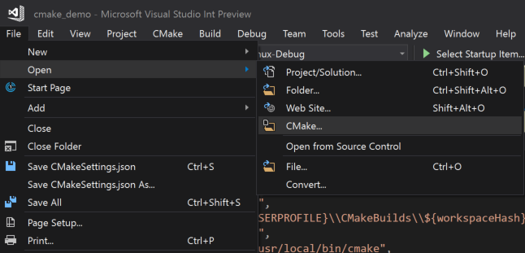
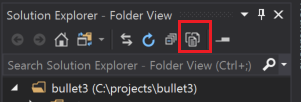
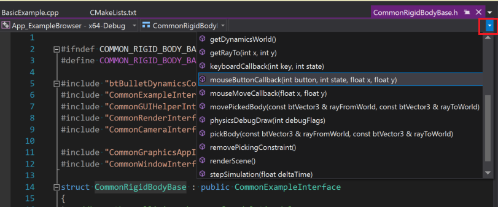
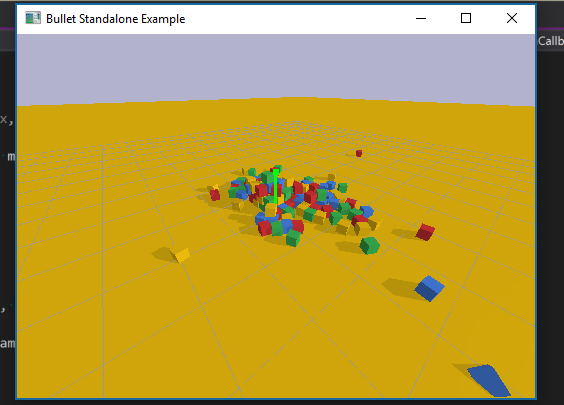

# Tutorial: Create C++ cross-platform projects in Visual Studio

Visual Studio C and C++ development isn't just for Windows anymore. This tutorial shows how to use Visual Studio for C++ cross platform development on Windows and Linux. It's based on CMake, so you don't have to create or generate Visual Studio projects. When you open a folder that contains a CMakeLists.txt file, Visual Studio configures the IntelliSense and build settings automatically. You can quickly start editing, building, and debugging your code locally on Windows. Then, switch your configuration to do the same on Linux, all from within Visual Studio.

In this tutorial, you learn how to:

> [!div class="checklist"]
> * clone an open-source CMake project from GitHub
> * open the project in Visual Studio
> * build and debug an executable target on Windows
> * add a connection to a Linux machine
> * build and debug the same target on Linux

## Prerequisites

* Set up Visual Studio for Cross Platform C++ Development
  * First, [install Visual Studio](https://visualstudio.microsoft.com/vs/) and choose the **Desktop development with C++** and **Linux development with C++ workloads**. This minimal install is only 3 GB. Depending on your download speed, installation shouldn't take more than 10 minutes.

* Set up a Linux machine for Cross Platform C++ Development
  * Visual Studio doesn't require any specific distribution of Linux. The OS can be running on a physical machine, in a VM, or in the cloud. You could also use the Windows Subsystem for Linux (WSL). However, for this tutorial a graphical environment is required. WSL isn't recommended here, because it's intended primarily for command-line operations.
  * Visual Studio requires these tools on the Linux machine: C++ compilers, gdb, ssh, rsync, and zip. On Debian-based systems, you can use this command to install these dependencies:

    ```cmd
    sudo apt install -y openssh-server build-essential gdb rsync zip
    ```

  * Visual Studio requires a recent version of CMake on the Linux machine that has server mode enabled (at least 3.8). Microsoft produces a universal build of CMake that you can install on any Linux distro. We recommend you use this build to ensure that you have the latest features. You can get the CMake binaries from [the Microsoft fork of the CMake repo](https://github.com/Microsoft/CMake/releases) on GitHub. Go to that page and download the version that matches the system architecture on your Linux machine, then mark it as an executable:

    ```cmd
    wget <path to binary>
    chmod +x cmake-3.11.18033000-MSVC_2-Linux-x86_64.sh
    ```

  * You can see the options for running the script with `-–help`. We recommend that you use the `–prefix` option to specify installing in the **/usr/local** path, because that's the default location where Visual Studio looks for CMake. The following example shows the Linux-x86_64 script. Change it as needed if you're using a different target platform.

    ```cmd
    sudo ./cmake-3.11.18033000-MSVC_2-Linux-x86_64.sh --skip-license --prefix=/usr/local
    ```

* Git for windows installed on your Windows machine.
* A GitHub account.

## Clone an open-source CMake project from GitHub

This tutorial uses the Bullet Physics SDK on GitHub. It provides collision detection and physics simulations for many applications. The SDK includes sample executable programs that compile and run without having to write additional code. This tutorial doesn't modify any of the source code or build scripts. To start, clone the *bullet3* repository from GitHub on the machine where you have Visual Studio installed.

```cmd
git clone https://github.com/bulletphysics/bullet3.git
```

1. On the Visual Studio main menu, choose **File > Open > CMake**. Navigate to the CMakeLists.txt file in the root of the bullet3 repo you just downloaded.

    

    As soon as you open the folder, your folder structure becomes visible in the **Solution Explorer**.

    

    This view shows you exactly what is on disk, not a logical or filtered view. By default, it doesn't show hidden files.

1. Choose the **Show all files** button to see all the files in the folder.

    

## Switch to targets view

When you open a folder that uses CMake, Visual Studio automatically generates the CMake cache. This operation might take a few moments, depending on the size of your project.

1. In the **Output Window**, select **Show output from** and then choose **CMake** to monitor the status of the cache generation process. When the operation is complete, it says "Target info extraction done".

   

   After this operation completes, IntelliSense is configured. You can build the project, and debug the application. Visual Studio now shows a logical view of the solution, based on the targets specified in the CMakeLists files.

1. Use the **Solutions and Folders** button in the **Solution Explorer** to switch to CMake Targets View.

   

   Here is what that view looks like for the Bullet SDK:

   

   Targets view provides a more intuitive view of what is in this source base. You can see some targets are libraries and others are executables.

1. Expand a node in CMake Targets View to see its source code files, wherever those files might be located on disk.

## Add an explicit Windows x64-Debug configuration

Visual Studio creates a default **x64-Debug** configuration for Windows. Configurations are how Visual Studio understands what platform target it's going to use for CMake. The default configuration isn't represented on disk. When you explicitly add a configuration, Visual Studio creates a file called *CMakeSettings.json*. It's populated with settings for all the configurations you specify.

1. Add a new configuration. Open the **Configuration** drop-down in the toolbar and select **Manage Configurations**.

   

   The [CMake Settings Editor](customize-cmake-settings.md) opens. Select the green plus sign on the left-hand side of the editor to add a new configuration. The **Add Configuration to CMakeSettings** dialog appears.

   

   This dialog shows all the configurations included with Visual Studio, plus any custom configurations that you create. If you want to continue to use a **x64-Debug** configuration, that should be the first one you add. Select **x64-Debug**, and then choose the **Select** button. Visual Studio creates the CMakeSettings.json file with a configuration for **x64-Debug**, and saves it to disk. You can use whatever names you like for your configurations by changing the name parameter directly in CMakeSettings.json.

## Set a breakpoint, build, and run on Windows

In this step, we'll debug an example program that demonstrates the Bullet Physics library.
  
1. In **Solution Explorer**, select AppBasicExampleGui and expand it.

1. Open the file `BasicExample.cpp`.

1. Set a breakpoint that gets hit when you click in the running application. The click event is handled in a method within a helper class. To quickly get there:

   1. Select `CommonRigidBodyBase` that the struct `BasicExample` is derived from. It's around line 30.

   1. Right-click and choose **Go to Definition**. Now you're in the header CommonRigidBodyBase.h.

   1. In the browser view above your source, you should see that you're in the `CommonRigidBodyBase`. To the right, you can select members to examine. Open the drop-down and select `mouseButtonCallback` to go to the definition of that function in the header.

      

1. Place a breakpoint on the first line within this function. It gets hit when you click a mouse button within the window of the application, when run under the Visual Studio debugger.

1. To launch the application, select the launch drop-down in the toolbar. It's the one with the green play icon that says "Select Startup Item". In the drop-down, select AppBasicExampleGui.exe. The executable name now displays on the launch button:

   

1. Choose the launch button to build the application and necessary dependencies, then launch it with the Visual Studio debugger attached. After a few moments, the running application appears:

   

1. Move your mouse into the application window, then click a button to trigger the breakpoint. The breakpoint brings Visual Studio back to the foreground, and the editor shows the line where execution is paused. You can inspect the application variables, objects, threads, and memory, or step through your code interactively. Choose **Continue** to let the application resume, and then exit it normally. Or, halt execution within Visual Studio by using the stop button.

## Add a Linux configuration and connect to the remote machine

1. Add a Linux configuration. Right-click the CMakeSettings.json file in the **Solution Explorer** view and select **Add Configuration**. You see the same Add Configuration to CMakeSettings dialog as before. Select **Linux-Debug** this time, then save the CMakeSettings.json file (ctrl + s).

1. Select **Linux-Debug** in the configuration drop-down.

   

   If it's the first time you're connecting to a Linux system, the **Connect to Remote System** dialog appears.

   

   If you've already added a remote connection, you can open this window by navigating to **Tools > Options > Cross Platform > Connection Manager**.

1. Provide the [connection information to your Linux machine](/cpp/linux/connect-to-your-remote-linux-computer.md) and choose **Connect**. Visual Studio adds that machine as to CMakeSettings.json as your default connection for **Linux-Debug**. It also pulls down the headers from your remote machine, so you get [IntelliSense specific to that remote connection](/cpp/linux/configure-a-linux-project?view=vs-2019#remote_intellisense). Next, Visual Studio sends your files to the remote machine and generates the CMake cache on the remote system. These steps may take some time, depending on the speed of your network and power of your remote machine. You'll know it's complete when the message "Target info extraction done" appears in the CMake output window.

## Set a breakpoint, build, and run on Linux

Because it's a desktop application, you need to provide some additional configuration information to the debug configuration.

1. In the CMake Targets view, right-click AppBasicExampleGui and choose **Debug and Launch Settings** to open the launch.vs.json file that's in the hidden **.vs** subfolder. This file is local to your development environment. You can move it into the root of your project if you wish to check it in and save it with your team. In this file, a configuration has been added for AppBasicExampleGui. These default settings work in most cases, but not here. Because it's a desktop application, you need to provide some additional information to launch the program so you can see it on your Linux machine.

1. To find the value of the environment variable `DISPLAY` on your Linux machine, run this command:

   ```cmd
   echo $DISPLAY
   ```

   In the configuration for AppBasicExampleGui, there's a parameter array, "pipeArgs". It contains a line: "${debuggerCommand}". It's the command that launches gdb on the remote machine. Visual Studio must export the display into this context before that command runs. For example, if the value of your display is `:1`, modify that line as follows:

   ```cmd
   "export DISPLAY=:1;${debuggerCommand}",
   ```

1. Launch and debug your application. Open the **Select Startup Item** drop-down in the toolbar and choose **AppBasicExampleGui**. Next, either choose the green play icon in the toolbar, or press **F5**. The application and its dependencies are built on the remote Linux machine, then launched with the Visual Studio debugger attached. On your remote Linux machine, you should see an application window appear.

1. Move your mouse into the application window, and click a button. The breakpoint is hit. Program execution pauses, Visual Studio comes back to the foreground, and you see your breakpoint. You should also see a Linux Console Window appear in Visual Studio. The window provides output from the remote Linux machine, and it can also accept input for `stdin`. Like any Visual Studio window, you can dock it where you prefer to see it. Its position is persisted in future sessions.

   

1. You can inspect the application variables, objects, threads, memory, and step through your code interactively using Visual Studio. But this time, you're doing it all on a remote Linux machine instead of your local Windows environment. You can choose **Continue** to let the application resume and exit normally, or you can choose the stop button, just as with local execution.

1. Look at the Call Stack window and view the Calls to `x11OpenGLWindow` since Visual Studio launched the application on Linux.

   

## What you learned

In this tutorial, you cloned a code base directly from GitHub. You built, ran, and debugged it on Windows without modifications. Then you used the same code base, with minor configuration changes, to build, run, and debug on a remote Linux machine.

## Next steps

Learn more about configuring and debugging CMake projects in Visual Studio:

> [!div class="nextstepaction"]
> [CMake Projects in Visual Studio](cmake-projects-in-visual-studio.md)<br/><br/>
> [Configure a Linux CMake project](../linux/cmake-linux-project.md)<br/><br/>
> [Connect to your remote Linux computer](../linux/connect-to-your-remote-linux-computer.md)<br/><br/>
> [Customize CMake build settings](customize-cmake-settings.md)<br/><br/>
> [Configure CMake debugging sessions](configure-cmake-debugging-sessions.md)<br/><br/>
> [Deploy, run, and debug your Linux project](../linux/deploy-run-and-debug-your-linux-project.md)<br/><br/>
> [CMake predefined configuration reference](cmake-predefined-configuration-reference.md)
>
