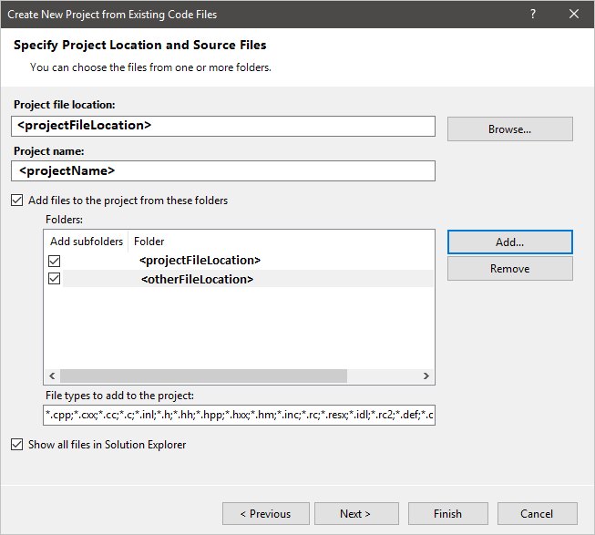
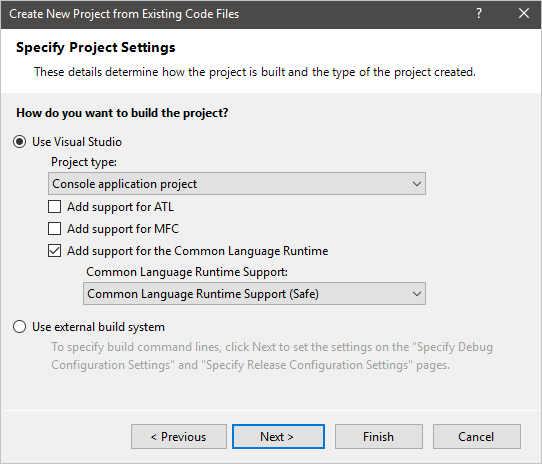
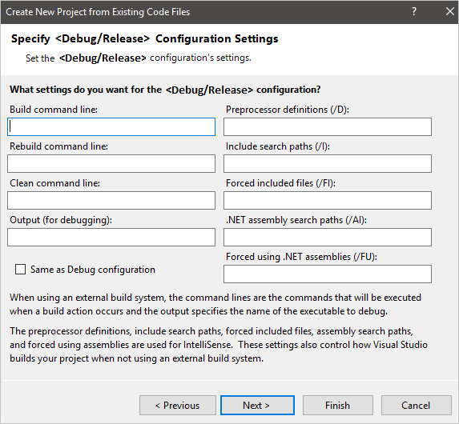

# How to: Create a C++ Project from Existing Code

In Visual Studio, you can port existing code files into a C++ project using the **Create New Project From Existing Code Files** wizard. This wizard creates a project solution that uses the MSBuild system to manage source files and build configuration. It works best with relatively simple projects that do not have complex folder hierarchies. The wizard isn't available in older Express editions of Visual Studio. 

Porting existing code files into a C++ project enables the use of native MSBuild project management features built into the IDE. If you prefer to use your existing build system, such as nmake makefiles, CMake, or alternatives, you can use the Open Folder or CMake options instead. For more information, see [Open Folder projects in Visual C++](non-msbuild-projects.md) or [CMake projects in Visual Studio](cmake-tools-for-visual-cpp.md). Both options let you use IDE features such as [IntelliSense](/visualstudio/ide/using-intellisense) and [Project Properties](working-with-project-properties.md).

### To create a C++ project from existing code

1. On the **File** menu, select **New** > **Project From Existing Code**.

1. On the first page of the **Create New Project from Existing Code Files** wizard, select **Visual C++** in the **What type of project would you like to create?** list. Choose **Next** to continue.

1. Specify your project location, the directory for your source files, and the kinds of files the wizard imports into the new project. Choose **Next** to continue.

    | Setting | Description |
    | --- | --- |
    | **Project file location** | Specifies the directory path of the new project. This location is where the wizard deposits all the files (and subdirectories) of the new project.  Select **Browse** to display the **Project file location** dialog. Navigate to the right folder and specify the directory that contains the new project. |
    | **Project name** | Specifies the name of the new project. Project files, which have file extensions such as .vcxproj adopts this name and existing code files keep their original name. |
    | **Add files to the project from these folders** | Check to set the wizard to copy existing code files from their original directories (that are specified in the list box below this control) into the new project.  Check **Add Subfolders** to specify copying code files from all subdirectories into the project. The directories are listed in the **Folder** column. - Select **Add** to display the **Add files to the project from this folder** dialog box, to specify directories the wizard searches for existing code files. - Select **Remove** to delete the directory path selected in the list box.  In the **File types to add to the project** box, specify the kinds of files that the wizard adds to the new project based on the given file extensions. File extensions are preceded with the asterisk wildcard character and are delimited in the list of file extensions by a semicolon. |
    | **Show all files in Solution Explorer** | Specifies that all files in the new project to be visible and displayed in the **Solution Explorer** window. This option is enabled by default. |

    

1. Specify the project settings to use such as the build environment for the new project and the build settings to match a specific type of new project to generate. Choose **Next** to continue.

    | Setting | Description |
    | --- | --- |
    | **Use Visual Studio** | Specifies to use build tools that are included in Visual Studio for building the new project. This option is selected by default.  Select **Project Type** to specify the type of project the wizard generates. Choose **Windows application project**, **Console application project**, **Dynamically linked library (DLL) project**, or **Static library (LIB) project**.  Check **Add support for ATL** to add ATL support to the new project.  Check **Add support for MFC** to add MFC support to the new project.  Check **Add support for the Common Language Runtime** to add CLR programming support to the project. Choose the **Common Language Runtime Support** for compliance type, such as **Common Language Runtime (old syntax)** for compliance with Managed Extensions for C++ syntax, the CLR programming syntax before Visual C++ 2005. |
    | **Use external build system** | Specifies to use build tools that aren't included in Visual Studio for building the new project. When this option is selected, you can specify build command lines on the **Specify Debug Configuration Settings** and **Specify Release Configuration Settings** pages. |

    

    > [!NOTE]
    > When the **Use External Build System** option is checked, the IDE doesn't build the project, so the /D, /I, /FI, /AI, or /FU options aren't required for compilation. However, these options must be set correctly in order for IntelliSense to function properly.

1. Specify the Debug configuration settings to use. Choose **Next** to continue.

    | Setting | Description |
    | --- | --- |
    | **Build command line** | Specifies the command line that builds the project. Enter the name of the compiler (plus any switches or arguments) or the build scripts that you want to use to build the project. |
    | **Rebuild command line** | Specifies the command line that rebuilds the new project. |
    | **Clean command line** | Specifies the command line to delete support files generated by the build tools for the project. |
    | **Output (for debugging)** | Specifies the directory path of the output files for the Debug configuration of the project. |
    | **Preprocessor definitions (/D)** | Defines preprocessor symbols for the project, see [/D (Preprocessor Definitions)](../build/reference/d-preprocessor-definitions.md). |
    | **Include search path (/I)** | Specifies directory paths the compiler searches to resolve file references passed to preprocessor directives in the project, see [/I (Additional Include Directories)](../build/reference/i-additional-include-directories.md). |
    | **Forced included files (/FI)** | Specifies header files to process when building the project, see [/FI (Name Forced Include File)](../build/reference/fi-name-forced-include-file.md). |
    | **.NET assembly search path (/AI)** | Specifies the directory paths that the compiler searches to resolve .NET assembly references passed to preprocessor directives in the project, see [/AI (Specify Metadata Directories)](../build/reference/ai-specify-metadata-directories.md). |
    | **Forced using .NET assemblies (/FU)** | Specifies .NET assemblies to process when building the project, see [/FU (Name Forced #using File)](../build/reference/fu-name-forced-hash-using-file.md). |

    

    > [!NOTE]
    > The **Build**, **Rebuild**, **Clean** command line, and **Output (for debugging)** settings are only enabled if the **Use external build system** option is selected on the **Specify Project Settings** page.

1. Specify the Release configuration settings to use, these settings are the same as the Debug configuration settings. Choose **Finish** to generate the new project.

    > [!NOTE]
    > Here you can check **Same as Debug configuration** to specify that the wizard will generate Release configuration project settings identical to Debug configuration project settings. This option is checked by default. All other options on this page are inactive unless you uncheck this box.
