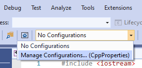
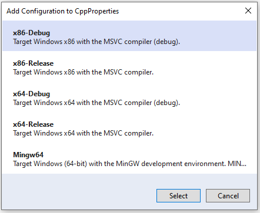

# Open Folder support for C++ build systems in Visual Studio

::: moniker range="vs-2015"

The Open Folder feature is available in Visual Studio 2017 and later.

::: moniker-end

::: moniker range=">=vs-2017"

In Visual Studio 2017 and later, the "Open Folder" feature enables you to open a folder of source files and immediately start coding with support for IntelliSense, browsing, refactoring, debugging, and so on. As you edit, create, move, or delete files, Visual Studio tracks the changes automatically and continuously updates its IntelliSense index. No .sln or .vcxproj files are loaded; if needed, you can specify custom tasks as well as build and launch parameters through simple .json files. This feature enables you to integrate any third-party build system into Visual Studio. For general information about Open Folder, see [Develop code in Visual Studio without projects or solutions](/visualstudio/ide/develop-code-in-visual-studio-without-projects-or-solutions).

## CMake and Qt

CMake is integrated in the Visual Studio IDE as a component of the C++ desktop workload. The workflow for CMake is not identical to the workflow described in this article. If you are using CMake, see [CMake projects in Visual Studio](cmake-projects-in-visual-studio.md). You can also use CMake to build Qt projects, or you can use the [Qt Visual Studio Extension](https://download.qt.io/development_releases/vsaddin/) for either Visual Studio 2015 or Visual Studio 2017.

## Other build systems

To use the Visual Studio IDE with a build system or compiler toolset that is not directly supported from the main menu select **File | Open | Folder** or press **Ctrl + Shift + Alt + O**. Navigate to the folder that contains your source code files. To build the project, configure IntelliSense and set debugging parameters, you add three JSON files:

| | |
|-|-|
|CppProperties.json|Specify custom configuration information for browsing. Create this file, if needed, in your root project folder. (Not used in CMake projects.)|
|tasks.vs.json|Specify custom build commands. Accessed via the **Solution Explorer** context menu item **Configure Tasks**.|
|launch.vs.json|Specify command line arguments for the debugger. Accessed via the **Solution Explorer** context menu item **Debug and Launch Settings**.|

## Configure code navigation with CppProperties.json

For IntelliSense and browsing behavior such as **Go to Definition** to work correctly, Visual Studio needs to know which compiler you are using, where the system headers are, and where any additional include files are located if they are not directly in the folder you have opened (the workspace folder). To specify a configuration, you can choose **Manage Configurations** from the dropdown in the main toolbar:



Visual Studio offers the following default configurations:



If, for example, you choose **x64-Debug**, Visual Studio creates a file called *CppProperties.json* in your root project folder:

```json
{
  "configurations": [
    {
      "inheritEnvironments": [
        "msvc_x64"
      ],
      "name": "x64-Debug",
      "includePath": [
        "${env.INCLUDE}",
        "${workspaceRoot}\\**"
      ],
      "defines": [
        "WIN32",
        "_DEBUG",
        "UNICODE",
        "_UNICODE"
      ],
      "intelliSenseMode": "windows-msvc-x64"
    }
  ]
}
```

This configuration inherits the environment variables of the Visual Studio [x64 Developer Command Prompt](building-on-the-command-line.md). One of those variables is `INCLUDE` and you can refer to it here by using the `${env.INCLUDE}` macro. The `includePath` property tells Visual Studio where to look for all the sources that it needs for IntelliSense. In this case, it says "look in the all the directories specified by the INCLUDE environment variable, and also all the directories in the current working folder tree." The `name` property is the name that will appear in the dropdown, and can be anything you like. The `defines` property provides hints to IntelliSense when it encounters conditional compilation blocks. The `intelliSenseMode` property provides some additional hints based on the compiler type. Several options are available for MSVC, GCC, and Clang.

> [!NOTE]
> If Visual Studio seems to be ignoring settings in *CppProperties.json*, try adding an exception to your *.gitignore* file like this: `!/CppProperties.json`.

## Default configuration for MinGW-w64

If you add the MinGW-W64 configuration, the JSON looks this this:

```json
{
  {
      "inheritEnvironments": [
        "mingw_64"
      ],
      "name": "Mingw64",
      "includePath": [
        "${env.INCLUDE}",
        "${workspaceRoot}\\**"
      ],
      "intelliSenseMode": "linux-gcc-x64",
      "environments": [
        {
          "MINGW64_ROOT": "C:\\msys64\\mingw64",
          "BIN_ROOT": "${env.MINGW64_ROOT}\\bin",
          "FLAVOR": "x86_64-w64-mingw32",
          "TOOLSET_VERSION": "9.1.0",
          "PATH": "${env.BIN_ROOT};${env.MINGW64_ROOT}\\..\\usr\\local\\bin;${env.MINGW64_ROOT}\\..\\usr\\bin;${env.MINGW64_ROOT}\\..\\bin;${env.PATH}",
          "INCLUDE": "${env.MINGW64_ROOT}\\include\\c++\\${env.TOOLSET_VERSION};${env.MINGW64_ROOT}\\include\\c++\\${env.TOOLSET_VERSION}\\tr1;${env.MINGW64_ROOT}\\include\\c++\\${env.TOOLSET_VERSION}\\${env.FLAVOR}",
          "environment": "mingw_64"
        }
      ]
    }
}
```

Note the `environments` block. It defines properties that behave like environment variables and are available not only in the *CppProperties.json* file, but also in the other configuration files *task.vs.json* and *launch.vs.json*. The `Mingw64` configuration inherits the `mingw_w64` environment, and uses its `INCLUDE` property to specify the value for `includePath`. You can add other paths to this array property as needed.`

The `intelliSenseMode` property is set to a value appropriate for GCC. For more information on all these properties, see [CppProperties schema reference](cppproperties-schema-reference.md).

When everything is working correctly, you will see IntelliSense from the GCC headers when you hover over a type:


## Enable IntelliSense diagnostics

If you are not seeing the IntelliSense that you expect, you can troubleshoot by going to **Tools** > **Options** > **Text Editor** > **C/C++** > **Advanced** and setting **Enable Logging** to **true**. To start with, try setting **Logging Level** to 5, and **Logging Filters** to 8.


Output is piped to the **Output Window** and is visible when you choose **Show Output From: Visual C++ Log*. The output contains, among other things, the list of actual include paths that IntelliSense is trying to use. If the paths do not match the ones in *CppProperties.json*, try closing the folder and deleting the *.vs* subfolder which contains cached browsing data.

### Define build tasks with tasks.vs.json

You can automate build scripts or any other external operations on the files you have in your current workspace by running them as tasks directly in the IDE. You can configure a new task by right-clicking on a file or folder and selecting **Configure Tasks**.


This creates (or opens) the *tasks.vs.json* file in the .vs folder which Visual Studio creates in your root project folder. You can define any arbitrary task in this file and then invoke it from the **Solution Explorer** context menu. To continue the GCC example, the following snippet shows a complete *tasks.vs.json* file with as single task that invokes *g++.exe* to build a project. Assume the project contains a single file called *hello.cpp*.

```json
{
  "version": "0.2.1",
  "tasks": [
    {
      "taskLabel": "build hello",
      "appliesTo": "/",
      "type": "default",
      "command": "g++",
      "args": [
        "-g",
        "-o",
        "hello",
        "hello.cpp"
      ]
    }
  ]
}

```

The JSON file is placed in the *.vs* subfolder. To see that folder, click on the **Show All Files** button at the top of **Solution Explorer**. You can run this task by right-clicking on the root node in **Solution Explorer** and choosing **build hello**. When the task completes you should see a new file, *hello.exe* in **Solution Explorer**.

You can define many kinds of tasks. The following example shows a *tasks.vs.json file* that defines a single task. `taskLabel` defines the name that appears in the context menu. `appliesTo` defines which files the command can be performed on. The `command` property refers to the COMSPEC environment variable, which identifies the path for the console (*cmd.exe* on Windows). You can also reference environment variables that are declared in CppProperties.json or CMakeSettings.json. The `args` property specifies the command line to be invoked. The `${file}` macro retrieves the selected file in **Solution Explorer**. The following example will display the filename of the currently selected .cpp file.

```json
{
  "version": "0.2.1",
  "tasks": [
    {
      "taskLabel": "Echo filename",
      "appliesTo": "*.cpp",
      "type": "command",
      "command": "${env.COMSPEC}",
      "args": ["echo ${file}"]
    }
  ]
}
```

After saving *tasks.vs.json*, you can right-click any *.cpp* file in the folder, choose **Echo filename** from the context menu, and see the file name displayed in the Output window.

For more information, see [Tasks.vs.json schema reference](tasks-vs-json-schema-reference-cpp.md).

### Configure debugging parameters with launch.vs.json

To customize your program's command line arguments and debugging instructions, right-click on the executable in **Solution Explorer** and select **Debug and Launch Settings**. This will open an existing *launch.vs.json* file, or if none exists, it will create a new file with a set of minimal launch settings. First you are given a choice of what kind of debug session you want to configure. For debugging a MinGw-w64 project, we choose **C/C++ Launch for MinGW/Cygwin (gdb)**. This creates a launch configuration for using *gdb.exe* with some educated guesses about default values. One of those default values is `MINGW_PREFIX`. You can substitute the literal path (as shown below) or you can define a `MINGW_PREFIX` property in *CppProperties.json*:

```json
{
  "version": "0.2.1",
  "defaults": {},
  "configurations": [
    {
      "type": "cppdbg",
      "name": "hello.exe",
      "project": "hello.exe",
      "cwd": "${workspaceRoot}",
      "program": "${debugInfo.target}",
      "MIMode": "gdb",
      "miDebuggerPath": "c:\\msys64\\usr\\bin\\gdb.exe",
      "externalConsole": true
    }
  ]
}

```

To start debugging, choose the executable in the debug dropdown, then click the green arrow:


You should see the **Initializing Debugger** dialog and then an external console window that is running your program.

For more information, see [launch.vs.json schema reference](launch-vs-schema-reference-cpp.md).

## Launching other executables

You can define launch settings for any executable on your computer. The following example launches *7za* and specifies additional arguments, by adding them to the `args` JSON array:

```json
{
  "version": "0.2.1",
  "defaults": {},
  "configurations": [
    {
      "type": "default",
      "project": "CPP\\7zip\\Bundles\\Alone\\O\\7za.exe",
      "name": "7za.exe list content of helloworld.zip",
      "args": [ "l", "d:\\sources\\helloworld.zip" ]
    }
  ]
}
```

When you save this file, the new configuration appears in the Debug Target dropdown and you can select it to start the debugger. You can create as many debug configurations as you like, for any number of executables. If you press **F5** now, the debugger will launch and hit any breakpoint you may have already set. All the familiar debugger windows and their functionality are now available.

::: moniker-end
