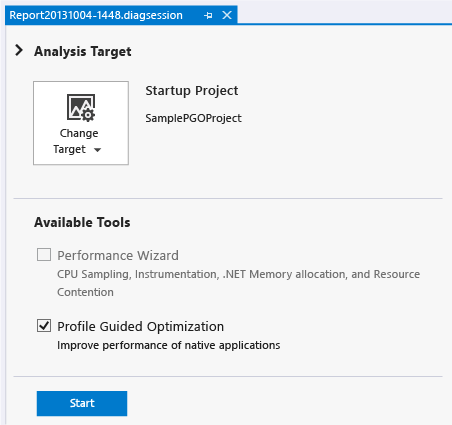
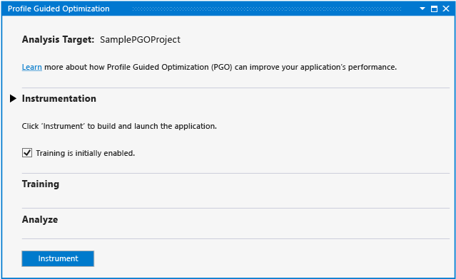
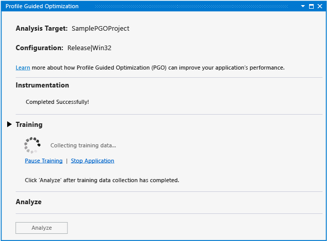
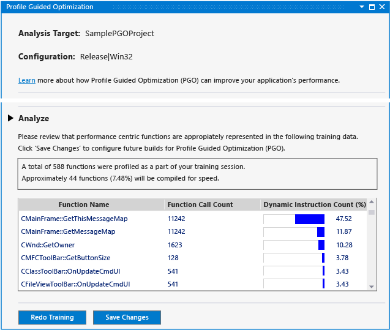
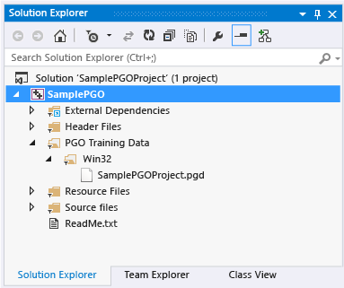

# Profile Guided Optimization in the Performance and Diagnostics Hub
The Profile Guided Optimization for Visual C++ plug-in in the Performance and Diagnostics Hub streamlines the profile guided optimization experience for developers. You can [download the plug-in](http://go.microsoft.com/fwlink/p/?LinkId=327915) from the Visual Studio website.  
  
 Profile guided optimization (PGO) helps you create builds of x86 and x64 native apps that are optimized for the way users interact with them. PGO is a multi-step process: You create an app build that's instrumented for profiling, and then you perform "training"—that is, you run the instrumented app through common user interaction scenarios. You save the captured profiling data, and then you rebuild your app by using the results to guide whole-program optimization. Although you can perform these steps individually in Visual Studio or on the command line, the PGO plug-in centralizes and simplifies the process. The PGO plug-in sets all of the required options, guides you through each step, shows you the analysis, and then uses the results to configure the build to optimize each function for size or speed. The PGO plug-in also makes it easy to rerun your app training and update the build-optimization data as you change your code.  
  
## Prerequisites  
 You must [download the PGO plug-in](http://go.microsoft.com/fwlink/p/?LinkId=327915) and install it in Visual Studio before you can use it in the Performance and Diagnostics Hub.  
  
## Walkthrough: Using the PGO Plug-in to Optimize an App  
 First, you'll create a basic Win32 desktop app in Visual Studio. If you already have a native app that you want to optimize, you can use it and skip this step.  
  
#### To create an app  
  
1.  On the menu bar, choose **File**, **New**, **Project**.  
  
2.  In the left pane of the **New Project** dialog box, expand **Installed**, **Templates**, **Visual C++**, and then select **MFC**.  
  
3.  In the center pane, select **MFC Application**.  
  
4.  Specify a name for the project—for example, **SamplePGOProject**—in the **Name** box. Choose the **OK** button.  
  
5.  On the **Overview** page of the **MFC Application Wizard** dialog box, choose the **Finish** button.  
  
 Next, set the build configuration of your app to Release to ready it for the PGO build and training steps.  
  
#### To set the build configuration  
  
1.  On the menu bar, choose **Build**, **Configuration Manager**.  
  
2.  In the **Configuration Manager** dialog box, choose the **Active Solution Configuration** drop-down button and select **Release**. Choose the **Close** button.  
  
 Open the Performance and Diagnostics Hub—on the menu bar, choose **Analyze**, **Performance and Diagnostics**. This opens a diagnostics session page that has the analysis tools that are available for your project type.  
  
   
  
 In **Available Tools**, select the **Profile Guided Optimization** check box. Choose the **Start** button to start the PGO plug-in.  
  
   
  
 The **Profile Guided Optimization** page describes the steps the plug-in uses to improve the performance of your app. Choose the **Start** button.  
  
   
  
 In the **Instrumentation** section, you use the **Training is initially enabled** option to choose whether to include the startup phase of your app as part of the training. If this option is not selected, training data is not recorded in a running instrumented app until you explicitly enable training.  
  
 Choose the **Instrument** button to build your app with a special set of compiler options. The compiler inserts probe instructions in the generated code. These instructions record profiling data during the training phase.  
  
   
  
 When the instrumented build of your app is complete, the app is started automatically.  
  
 If any errors or warnings occur during the build, correct them and then choose **Restart Build** to restart the instrumented build.  
  
 When your app is started, you can use the **Start Training** and **Pause Training** links in the **Training** section to control when profiling information is recorded. You can use the **Stop Application** and **Start Application** links to stop and restart the app.  
  
   
  
 During training, go through your user scenarios to capture the profiling information that the PGO plug-in needs to optimize the code. When you have completed the training, close your app or choose the **Stop Application** link. Choose the **Analyze** button to start the analysis step.  
  
 When the analysis is complete, the **Analysis** section shows a report of the profiling information that was captured during the user-scenario training phase. You can use this report to examine which functions your app called the most and spent the most time in. The PGO plug-in uses the information to determine which app functions to optimize for speed and which to optimize for size. The PGO plug-in configures build optimizations to create the smallest, fastest app for the user scenarios that you recorded during training.  
  
   
  
 If the training captured the expected profiling information, you can choose **Save Changes** to save the analyzed profile data in your project to optimize future builds. To discard the profile data and start the training over from the beginning, choose **Redo Training**.  
  
 The profile data file is saved in your project in a **PGO Training Data** folder. This data is used to control the compiler build optimization settings in your app.  
  
   
  
 After analysis, the PGO plug-in sets build options in your project to use the profile data to selectively optimize your app during compilation. You can continue to modify and build your app with the same profile data. When the app is built, the build output reports how many functions and instructions were optimized by using profile data.  
  
   
  
 If you make significant code changes during development, you may have to retrain your app to get the best optimizations. We recommend that you retrain your app when the build output reports that less than 80 percent of functions or instructions were optimized by using profile data.