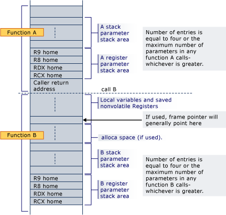

# Stack Allocation

A function's prolog is responsible for allocating stack space for local variables, saved registers, stack parameters, and register parameters.

The parameter area is always at the bottom of the stack (even if alloca is used), so that it will always be adjacent to the return address during any function call. It contains at least four entries, but always enough space to hold all the parameters needed by any function that may be called. Note that space is always allocated for the register parameters, even if the parameters themselves are never homed to the stack; a callee is guaranteed that space has been allocated for all its parameters. Home addresses are required for the register arguments so a contiguous area is available in case the called function needs to take the address of the argument list (va_list) or an individual argument. This area also provides a convenient place to save register arguments during thunk execution and as a debugging option (for example, it makes the arguments easy to find during debugging if they are stored at their home addresses in the prolog code). Even if the called function has fewer than 4 parameters, these 4 stack locations are effectively owned by the called function, and may be used by the called function for other purposes besides saving parameter register values.  Thus the caller may not save information in this region of stack across a function call.

If space is dynamically allocated (alloca) in a function, then a nonvolatile register must be used as a frame pointer to mark the base of the fixed part of the stack and that register must be saved and initialized in the prolog. Note that when alloca is used, calls to the same callee from the same caller may have different home addresses for their register parameters.

The stack will always be maintained 16-byte aligned, except within the prolog (for example, after the return address is pushed), and except where indicated in [Function Types](../build/function-types.md) for a certain class of frame functions.

The following is an example of the stack layout where function A calls a non-leaf function B. Function A's prolog has already allocated space for all the register and stack parameters required by B at the bottom of the stack. The call pushes the return address and B's prolog allocates space for its local variables, nonvolatile registers, and the space needed for it to call functions. If B uses alloca, the space is allocated between the local variable/nonvolatile register save area and the parameter stack area.

When the function B calls another function, the return address is pushed just below the home address for RCX.

## See Also

[Stack Usage](../build/stack-usage.md)