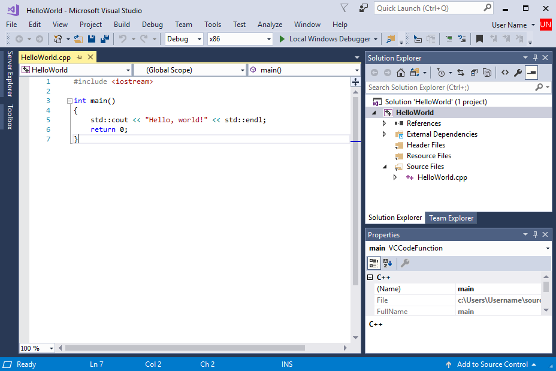
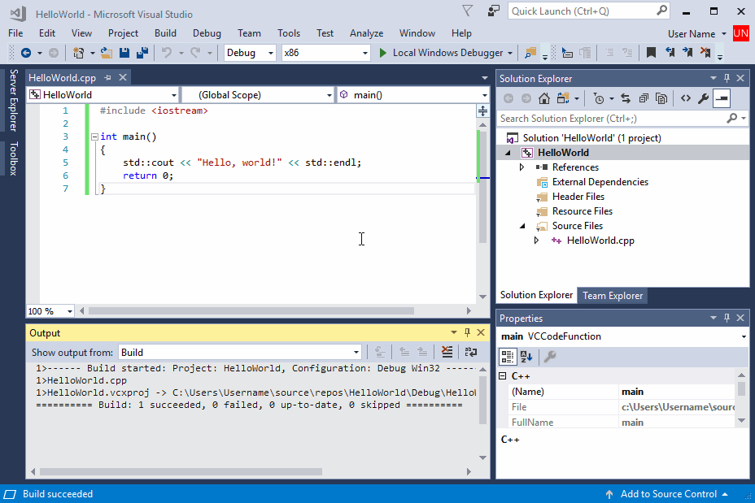
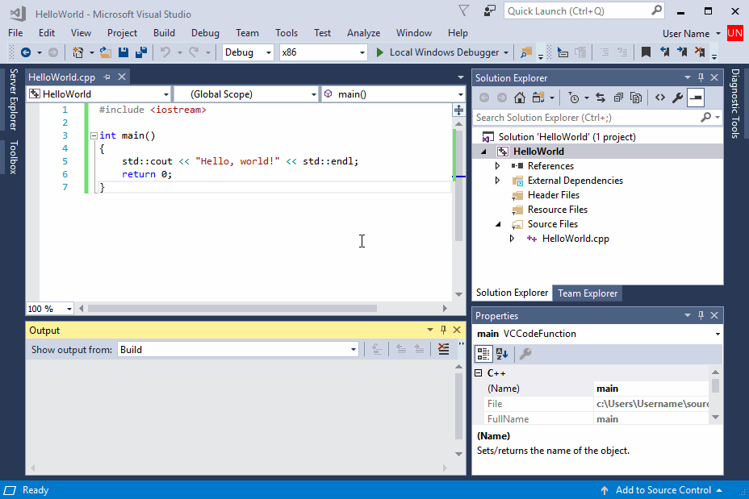

# Build and run a C++ console app project

When you've created a C++ console app project and entered your code, you can build and run it within Visual Studio, and then run it as a stand-alone app from the command line.

## Prerequisites

- Have Visual Studio with the Desktop development with C++ workload installed and running on your computer. If it's not installed yet, follow the steps in [Install C++ support in Visual Studio](../build/vscpp-step-0-installation.md).

- Create a "Hello, World!" project and enter its source code. If you haven't done this yet, follow the steps in [Create a C++ console app project](../build/vscpp-step-1-create.md).

If Visual Studio looks like this, you're ready to build and run your app:

   

## Build and run your code in Visual Studio

1. To build your project, choose **Build Solution** from the **Build** menu. The **Output** window shows the results of the build process.

   

1. To run the code, on the menu bar, choose **Debug**, **Start without debugging**.

   

   A console window opens and then runs your app. When you start a console app in Visual Studio, it runs your code, then prints "Press any key to continue . . ." to give you a chance to see the output.

Congratulations! You've created your first "Hello, world!" console app in Visual Studio! Press a key to dismiss the console window and return to Visual Studio.

[I ran into a problem.](#build-and-run-your-code-in-visual-studio-issues)

## Run your code in a command window

Normally, you run console apps at the command prompt, not in Visual Studio. Once your app is built by Visual Studio, you can run it from any command window. Here's how to find and run your new app in a command prompt window.

1. In **Solution Explorer**, select the HelloWorld solution and right-click to open the context menu. Choose **Open Folder in File Explorer** to open a **File Explorer** window in the HelloWorld solution folder.

1. In the **File Explorer** window, open the Debug folder. This contains your app, HelloWorld.exe, and a couple of other debugging files. Select HelloWorld.exe, hold down the Shift key and right-click to open the context menu. Choose **Copy as path** to copy the path to your app to the clipboard.

1. To open a command prompt window, press Windows-R to open the **Run** dialog. Enter *cmd.exe* in the **Open** textbox, then choose **OK** to run a command prompt window.

1. In the command prompt window, right-click to paste the path to your app into the command prompt. Press Enter to run your app.

   

Congratulations, you've built and run a console app in Visual Studio!

[I ran into a problem.](#run-your-code-in-a-command-window-issues)

## Next Steps

Once you've built and run this simple app, you're ready for more complex projects. See [Using the Visual Studio IDE for C++ Desktop Development](using-the-visual-studio-ide-for-cpp-desktop-development.md) for more detailed walkthroughs that explore the capabilities of Visual C++ in Visual Studio.

## Troubleshooting guide

Come here for solutions to common issues when you create your first C++ project.

### Build and run your code in Visual Studio issues

If red squiggles appear under anything in the source code editor, the build may have errors or warnings. Check that your code matches the example in spelling, punctuation, and case.

[Go back.](#build-and-run-your-code-in-visual-studio)

### Run your code in a command window issues

You can also navigate to the solution Debug folder at the command line to run your app. You can't run your app from other directories without specifying the path to the app. However, you can copy your app to another directory and run it from there.

If you don't see **Copy as path** in the shortcut menu, dismiss the menu, and then hold down the Shift key while you open it again. This is just for convenience. You can also copy the path to the folder from the File Explorer search bar, and paste it into the **Run** dialog, and then enter the name of your executable at the end. It's just a little more typing, but it has the same result.

[Go back.](#run-your-code-in-a-command-window)

<iframe src="" height="0" width="0" frameborder="0" name="frameTarget" />
