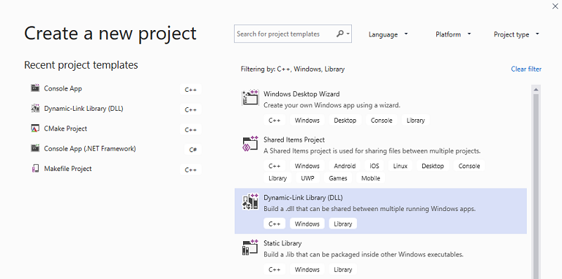
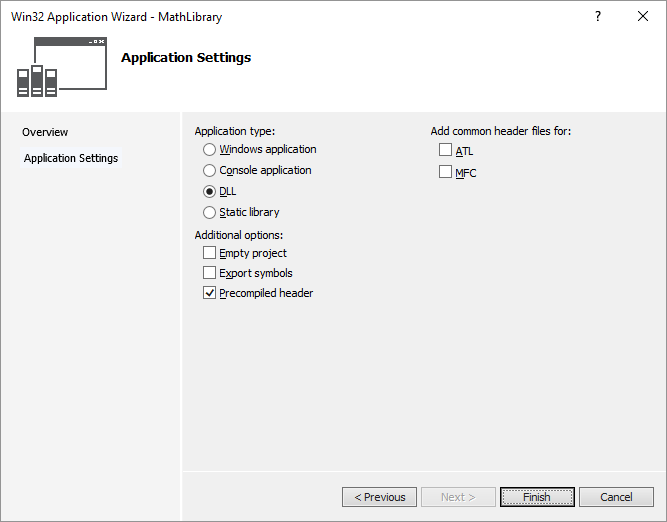
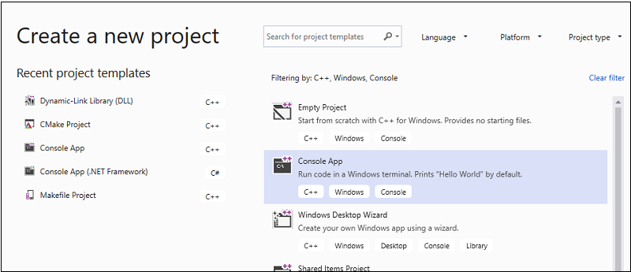
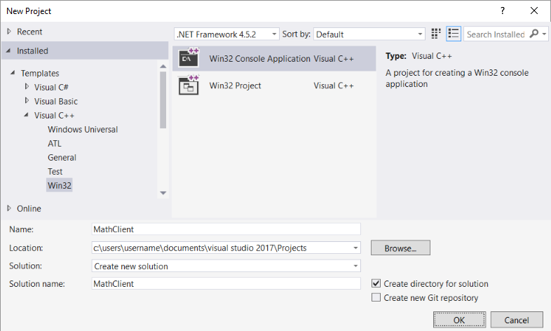
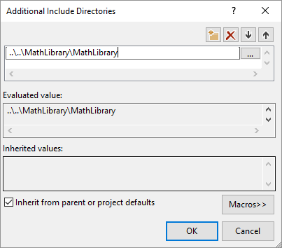
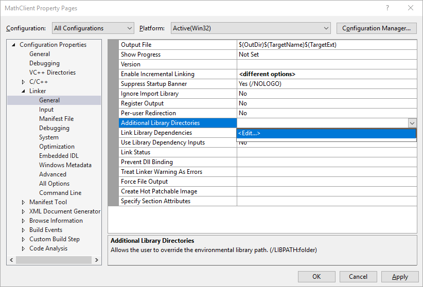
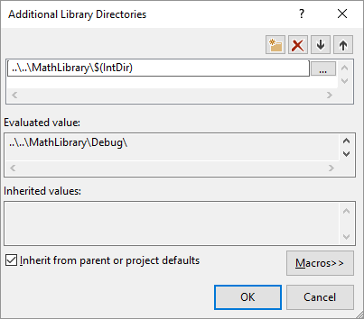
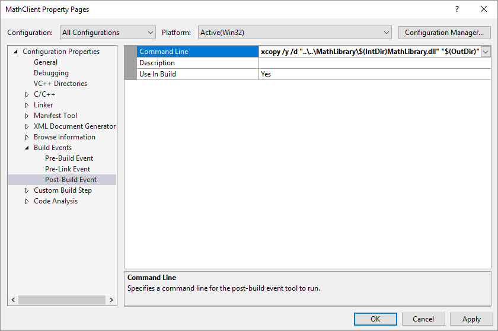
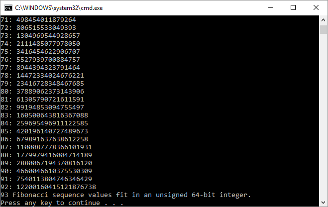

# Walkthrough: Create and use your own Dynamic Link Library (C++)

This step-by-step walkthrough shows how to use the Visual Studio IDE to create your own dynamic link library (DLL) written in C++, and then use it from another C++ app. DLLs (also known as shared libraries in UNIX-based operating systems) are one of the most useful kinds of Windows components. You can use them as a way to share code and resources, to shrink the size of your apps, and to make it easier to service and extend your apps. In this walkthrough, you create a DLL that implements some math functions, and then create a console app that uses the functions from the DLL. Along the way, you get an introduction to some of the programming techniques and conventions used in Windows DLLs.

This walkthrough covers these tasks:

- Create a DLL project in Visual Studio.

- Add exported functions and variables to the DLL.

- Create a console app project in Visual Studio.

- Use the functions and variables imported from the DLL in the console app.

- Run the completed app.

Like a statically linked library, a DLL _exports_ variables, functions, and resources by name, and your app _imports_ those names to use those variables, functions, and resources. Unlike a statically linked library, Windows connects the imports in your app to the exports in a DLL at load time or at run time, instead of connecting them at link time. Windows requires extra information that isn't part of the standard C++ compilation model to make these connections. The MSVC compiler implements some Microsoft-specific extensions to C++ to provide this extra information. We explain these extensions as we go.

This walkthrough creates two Visual Studio solutions; one that builds the DLL, and one that builds the client app. The DLL uses the C calling convention so it can be called from apps built by using other languages, as long as the platform and calling and linking conventions match. The client app uses _implicit linking_, where Windows links the app to the DLL at load-time. This linking lets the app call the DLL-supplied functions just like the functions in a statically linked library.

This walkthrough doesn't cover some common situations. It doesn't show the use of C++ DLLs by other programming languages. It doesn't show how to create a resource-only DLL. It also doesn't show the use of explicit linking to load DLLs at run-time rather than at load-time. Rest assured, you can use Visual Studio to do all these things. For links to more information about DLLs, see [Create C/C++ DLLs in Visual Studio](dlls-in-visual-cpp.md). For more information about implicit linking and explicit linking, see [Determining Which Linking Method to Use](linking-an-executable-to-a-dll.md#determining-which-linking-method-to-use). For information about creating C++ DLLs for use with programming languages that use C-language linkage conventions, see [Exporting C++ Functions for Use in C-Language Executables](exporting-cpp-functions-for-use-in-c-language-executables.md). For information about how to create DLLs for use with .NET languages, see [Calling DLL Functions from Visual Basic Applications](calling-dll-functions-from-visual-basic-applications.md).

## Prerequisites

- A computer that runs Microsoft Windows 7 or later versions. We recommend Windows 10 for the best development experience.

- A copy of Visual Studio. For information on how to download and install Visual Studio, see [Install Visual Studio](/visualstudio/install/install-visual-studio). When you run the installer, make sure that the **Desktop development with C++** workload is checked. Don't worry if you didn't install this workload when you installed Visual Studio. You can run the installer again and install it now.

   

- An understanding of the basics of using the Visual Studio IDE. If you've used Windows desktop apps before, you can probably keep up. For an introduction, see [Visual Studio IDE feature tour](/visualstudio/ide/visual-studio-ide).

- An understanding of enough of the fundamentals of the C++ language to follow along. Don't worry, we don't do anything too complicated.

## Create the DLL project

In this set of tasks, you create a project for your DLL, add code, and build it. To begin, start the Visual Studio IDE, and sign in if you need to. The instructions vary slightly depending on which version of Visual Studio you are using. Make sure you have the correct version selected in the control in the upper left of this page.

::: moniker range="=vs-2019"

### To create a DLL project in Visual Studio 2019

1. On the menu bar, choose **File** > **New** > **Project** to open the **Create a New Project** dialog box.

   

1. At the top of the dialog, set  **Language** to **C++**, set **Platform** to **Windows**, and set **Project type** to **Library**. 

1. From the filtered list of project types, choose **Dynamic-link Library (DLL)** then choose **Next**. In the next page, enter `MathLibrary` in the **Name** box to specify a name for the project, and specify the project location if desired.

1. Choose the **Create** button to create the project.

::: moniker-end

::: moniker range="vs-2017"

### To create a DLL project in Visual Studio 2017

1. On the menu bar, choose **File** > **New** > **Project** to open the **New Project** dialog box.

1. In the left pane of the **New Project** dialog box, expand **Installed** and **Visual C++** if necessary, and then choose **Windows Desktop**. In the center pane, select **Windows Desktop Wizard**. Enter `MathLibrary` in the **Name** box to specify a name for the project.

   

1. Choose the **OK** button to dismiss the **New Project** dialog and start the **Windows Desktop Project** wizard.

1. In the **Windows Desktop Project** wizard, under **Application type**, select **Dynamic Link Library (.dll)**.

   

1. Choose the **OK** button to create the project.

> [!NOTE]
> Additional steps are required to fix an issue in Visual Studio 2017 version 15.3. Follow these instructions to see if you need to make this change.
>
>1. In **Solution Explorer**, if it is not already selected, select the **MathLibrary** project under **Solution 'MathLibrary'**.
>
>1. On the menu bar, choose **Project** > **Properties**.
>
>1. In the left pane of the **Property Pages** dialog box, select **Preprocessor** under **Configuration Properties** > **C/C++**. Check the contents of the **Preprocessor Definitions** property.<br/><br/><br/><br/>If you see **MATHLIBRARY&#95;EXPORTS** in the **Preprocessor Definitions** list, then you do not need to change anything. If you see **MathLibrary&#95;EXPORTS** instead, then continue to follow these steps.
>
>1. At the top of the **Property Pages** dialog, change the **Configuration** drop-down to **All Configurations**.
>
>1. In the property pane, select the drop-down control next to the edit box for **Preprocessor Definitions**, and then choose **Edit**.<br/><br/>
>
>1. In the top pane of the **Preprocessor Definitions** dialog, add a new symbol, `MATHLIBRARY_EXPORTS`.<br/><br/>
>
>1. Choose **OK** to dismiss the **Preprocessor Definitions** dialog, and then choose **OK** to save your changes to the project properties.

::: moniker-end

::: moniker range="=vs-2015"

### To create a DLL project in older versions of Visual Studio

1. On the menu bar, choose **File** > **New** > **Project**.

1. In the left pane of the **New Project** dialog box, expand **Installed** > **Templates**, and select **Visual C++**, and then in the center pane, select **Win32 Console Application**. Enter `MathLibrary` in the **Name** edit box to specify a name for the project.

   

1. Choose the **OK** button to dismiss the **New Project** dialog and start the **Win32 Application Wizard**.

   

1. Choose the **Next** button. On the **Application Settings** page, under **Application type**, select **DLL**.

   

1. Choose the **Finish** button to create the project.

When the wizard completes the solution, you can see the generated project and source files in the **Solution Explorer** window in Visual Studio.


Right now, this DLL doesn't do very much. Next, you create a header file to declare the functions your DLL exports, and then add the function definitions to the DLL to make it more useful.

::: moniker-end

### To add a header file to the DLL

1. To create a header file for your functions, on the menu bar, choose **Project** > **Add New Item**.

1. In the **Add New Item** dialog box, in the left pane, select **Visual C++**. In the center pane, select **Header File (.h)**. Specify `MathLibrary.h` as the name for the header file.

   

1. Choose the **Add** button to generate a blank header file, which is displayed in a new editor window.

   

1. Replace the contents of the header file with this code:

   ```cpp
   // MathLibrary.h - Contains declarations of math functions
   #pragma once

   #ifdef MATHLIBRARY_EXPORTS
   #define MATHLIBRARY_API __declspec(dllexport)
   #else
   #define MATHLIBRARY_API __declspec(dllimport)
   #endif

   // The Fibonacci recurrence relation describes a sequence F
   // where F(n) is { n = 0, a
   //               { n = 1, b
   //               { n > 1, F(n-2) + F(n-1)
   // for some initial integral values a and b.
   // If the sequence is initialized F(0) = 1, F(1) = 1,
   // then this relation produces the well-known Fibonacci
   // sequence: 1, 1, 2, 3, 5, 8, 13, 21, 34, ...

   // Initialize a Fibonacci relation sequence
   // such that F(0) = a, F(1) = b.
   // This function must be called before any other function.
   extern "C" MATHLIBRARY_API void fibonacci_init(
       const unsigned long long a, const unsigned long long b);

   // Produce the next value in the sequence.
   // Returns true on success and updates current value and index;
   // false on overflow, leaves current value and index unchanged.
   extern "C" MATHLIBRARY_API bool fibonacci_next();

   // Get the current value in the sequence.
   extern "C" MATHLIBRARY_API unsigned long long fibonacci_current();

   // Get the position of the current value in the sequence.
   extern "C" MATHLIBRARY_API unsigned fibonacci_index();
   ```

This header file declares some functions to produce a generalized Fibonacci sequence, given two initial values. A call to `fibonacci_init(1, 1)` generates the familiar Fibonacci number sequence.

Notice the preprocessor statements at the top of the file. By default, the New Project template for a DLL adds **\<em>PROJECTNAME\</em>&#95;EXPORTS** to the defined preprocessor macros for the DLL project. In this example, Visual Studio defines **MATHLIBRARY&#95;EXPORTS** when your MathLibrary DLL project is built. 

::: moniker range="=vs-2017"

(The wizard in Visual Studio 2017 version 15.3 doesn't force this symbol definition to upper case. If you name your project "MathLibrary", then the symbol defined is MathLibrary&#95;EXPORTS instead of MATHLIBRARY&#95;EXPORTS. That's why there are extra steps above to add this symbol.)

::: moniker-end

When the **MATHLIBRARY&#95;EXPORTS** macro is defined, the **MATHLIBRARY&#95;API** macro sets the `__declspec(dllexport)` modifier on the function declarations. This modifier tells the compiler and linker to export a function or variable from the DLL so that it can be used by other applications. When **MATHLIBRARY&#95;EXPORTS** is undefined, for example, when the header file is included by a client application, **MATHLIBRARY&#95;API** applies the `__declspec(dllimport)` modifier to the declarations. This modifier optimizes the import of the function or variable in an application. For more information, see [dllexport, dllimport](../cpp/dllexport-dllimport.md).

### To add an implementation to the DLL

::: moniker range="vs-2019"

1. In **Solution Explorer**, right-click on the **Source Files** node and add a new .cpp file called `MathLibrary.cpp` in the same way that you added a new header file in the previous step.

::: moniker-end

1. In the editor window, select the tab for **MathLibrary.cpp** if it's already open. If not, in **Solution Explorer**, open **MathLibrary.cpp** in the **Source Files** folder of the **MathLibrary** project.

1. In the editor, replace the contents of the MathLibrary.cpp file with the following code:

   ```cpp
   // MathLibrary.cpp : Defines the exported functions for the DLL.
   #include "stdafx.h" // use pch.h in Visual Studio 2019
   #include <utility>
   #include <limits.h>
   #include "MathLibrary.h"

   // DLL internal state variables:
   static unsigned long long previous_;  // Previous value, if any
   static unsigned long long current_;   // Current sequence value
   static unsigned index_;               // Current seq. position

   // Initialize a Fibonacci relation sequence
   // such that F(0) = a, F(1) = b.
   // This function must be called before any other function.
   void fibonacci_init(
       const unsigned long long a,
       const unsigned long long b)
   {
       index_ = 0;
       current_ = a;
       previous_ = b; // see special case when initialized
   }

   // Produce the next value in the sequence.
   // Returns true on success, false on overflow.
   bool fibonacci_next()
   {
       // check to see if we'd overflow result or position
       if ((ULLONG_MAX - previous_ < current_) ||
           (UINT_MAX == index_))
       {
           return false;
       }

       // Special case when index == 0, just return b value
       if (index_ > 0)
       {
           // otherwise, calculate next sequence value
           previous_ += current_;
       }
       std::swap(current_, previous_);
       ++index_;
       return true;
   }

   // Get the current value in the sequence.
   unsigned long long fibonacci_current()
   {
       return current_;
   }

   // Get the current index position in the sequence.
   unsigned fibonacci_index()
   {
       return index_;
   }
   ```

To verify that everything works so far, compile the dynamic link library. To compile, choose **Build** > **Build Solution** on the menu bar. The output should look something like:

```Output
1>------ Build started: Project: MathLibrary, Configuration: Debug Win32 ------
1>MathLibrary.cpp
1>dllmain.cpp
1>Generating Code...
1>   Creating library C:\Users\username\Source\Repos\MathLibrary\Debug\MathLibrary.lib and object C:\Users\username\Source\Repos\MathLibrary\Debug\MathLibrary.exp
1>MathLibrary.vcxproj -> C:\Users\username\Source\Repos\MathLibrary\Debug\MathLibrary.dll
1>MathLibrary.vcxproj -> C:\Users\username\Source\Repos\MathLibrary\Debug\MathLibrary.pdb (Partial PDB)
========== Build: 1 succeeded, 0 failed, 0 up-to-date, 0 skipped ==========
```

Congratulations, you've created a DLL using Visual Studio! Next, you'll create a client app that uses the functions exported by the DLL.

## Create a client app that uses the DLL

When you create a DLL, you must think about how your DLL can be used. To compile code that calls the functions exported by a DLL, the declarations must be included in the client source code. At link time, when these calls to DLL functions are resolved, the linker must have an *import library*, a special library file that contains information for Windows about how to find the functions, instead of the actual code. And at run time, the DLL must be available to the client, in a location that the operating system can find.

To make use of a DLL, whether your own or a third-party DLL, your client app project must find the headers that declare the DLL exports, the import libraries for the linker, and the DLL itself. One way, is to copy all of these files into your client project. For third-party DLLs that are unlikely to change while your client is in development, this method may be the best way to use them. However, when you also build the DLL, it's better to avoid duplication. If you make a copy of DLL files that are under development, you may accidentally change a header file in one copy but not the other, or use an out-of-date library. To avoid this problem, we recommend you set the include path in your client project to include the DLL header files from the DLL project. Also, set the library path in your client project to include the DLL import libraries from the DLL project. And finally, copy the built DLL from the DLL project into your build output directory. This step allows your client app to use the same DLL code you build.

::: moniker range="vs-2019"

### To create a client app in Visual Studio 2019

1. On the menu bar, choose **File** > **New** > **Project** to open the **Create a New Project** dialog box.

1. At the top of the dialog, set  **Language** to **C++**, set **Platform** to **Windows**, and set **Project type** to **Console**. 

1. From the filtered list of project types, choose **Console App** then choose **Next**. In the next page, enter `MathClient` in the **Name** box to specify a name for the project, and specify the project location if desired.

   

1. Choose the **Create** button to create the client project.

::: moniker-end

::: moniker range="vs-2017"

### To create a client app in Visual Studio 2017

1. To create a C++ app that uses the DLL that you created, on the menu bar, choose **File** > **New** > **Project**.

1. In the left pane of the **New Project** dialog, select **Windows Desktop** under **Installed** > **Visual C++**. In the center pane, select **Windows Desktop Wizard**. Specify the name for the project, `MathClient`, in the **Name** edit box.

   

1. Choose **OK** to start the **Windows Desktop Project** wizard. In the wizard, choose **OK** to create the client app project.

::: moniker-end

::: moniker range="vs-2015"

### To create a client app in older versions of Visual Studio 2017

1. To create a C++ app that uses the DLL that you created, on the menu bar, choose **File** > **New** > **Project**.

1. In the left pane of the **New Project** dialog, select **Win32** under **Installed** > **Templates** > **Visual C++**. In the center pane, select **Win32 Console Application**. Specify the name for the project, `MathClient`, in the **Name** edit box.

   

1. Choose the **OK** button to dismiss the **New Project** dialog and start the **Win32 Application Wizard**. On the **Overview** page of the **Win32 Application Wizard** dialog box, choose the **Next** button.

1. On the **Application Settings** page, under **Application type**, select **Console application** if it isn't already selected.

1. Choose the **Finish** button to create the project.

::: moniker-end

When the wizard finishes, a minimal console application project is created for you. The name for the main source file is the same as the project name that you entered earlier. In this example, it's named **MathClient.cpp**. You can build it, but it doesn't use your DLL yet.

Next, to call the MathLibrary functions in your source code, your project must include the MathLibrary.h file. You could copy this header file into your client app project, then add it to the project as an existing item. This method can be a good choice for third-party libraries. However, if you're working on the code for your DLL at the same time as your client, that might lead to changes in one header file that aren't shown in the other. To avoid this issue, you can change the **Additional Include Directories** path in your project to include the path to the original header.

### To add the DLL header to your include path

1. Right-click on the **MathClient** node in **Solution Explorer** to open the **Property Pages** dialog.

1. In the **Configuration** drop-down box, select **All Configurations** if it isn't already selected.

1. In the left pane, select **General** under **Configuration Properties** > **C/C++**.

1. In the property pane, select the drop-down control next to the **Additional Include Directories** edit box, and then choose **Edit**.

   

1. Double-click in the top pane of the **Additional Include Directories** dialog box to enable an edit control.

1. In the edit control, specify the path to the location of the **MathLibrary.h** header file. Click the down-arrow, then choose **\<Edit>**. You can click the folder icon, then the ellipsis (**...**) to browse to the correct folder.
 
   You can also this case, you can type in a relative path from the folder that contains your .cpp files in the client project to the folder that contains the .h file in the DLL project. If your client project is in a separate solution in the same folder as the DLL solution, the relative path should look like this:

   `..\MathLibrary\MathLibrary`

   If your DLL and client projects are in the same solution, or the solutions are in different folders, then you must adjust the relative path accordingly or else browse for the folder using the method described previously.

   

1. After you've entered the path to the header file in the **Additional Include Directories** dialog box, choose the **OK** button to go back to the **Property Pages** dialog box, and then choose the **OK** button to save your changes.

You can now include the **MathLibrary.h** file and use the functions it declares in your client application. Replace the contents of **MathClient.cpp** by using this code:

```cpp
// MathClient.cpp : Client app for MathLibrary DLL.
// #include "pch.h" Uncomment for Visual Studio 2017 and earlier
#include <iostream>
#include "MathLibrary.h"

int main()
{
    // Initialize a Fibonacci relation sequence.
    fibonacci_init(1, 1);
    // Write out the sequence values until overflow.
    do {
        std::cout << fibonacci_index() << ": "
            << fibonacci_current() << std::endl;
    } while (fibonacci_next());
    // Report count of values written before overflow.
    std::cout << fibonacci_index() + 1 <<
        " Fibonacci sequence values fit in an " <<
        "unsigned 64-bit integer." << std::endl;
}
```

This code can be compiled, but not linked, because the linker can't find the import library required to build the app yet. The linker must find the MathLibrary.lib file to link successfully. Add the MathLibrary.lib file to the build by setting the **Additional Dependencies** property. Once again, you could copy the library file into your client app project, but if both the library and the client app are under development, that might lead to changes in one copy that aren't shown in the other. To avoid this issue, you can change the **Additional Library Directories** path in your project to include the path to the original library when you link.

### To add the DLL import library to your project

1. Right-click on the **MathClient** node in **Solution Explorer** to open the **Property Pages** dialog.

1. In the **Configuration** drop-down box, select **All Configurations** if it isn't already selected. This setting ensures that the path is set for both Debug and Release builds.

1. In the left pane, select **Input** under **Configuration Properties** > **Linker**. In the property pane, select the drop-down control next to the **Additional Dependencies** edit box, and then choose **Edit**.

   

1. In the **Additional Dependencies** dialog, add `MathLibrary.lib` to the list in the top edit control.

   

1. Choose **OK** to go back to the **Property Pages** dialog box.

1. In the left pane, select **General** under **Configuration Properties** > **Linker**. In the property pane, select the drop-down control next to the **Additional Library Directories** edit box, and then choose **Edit**.

   

1. Double-click in the top pane of the **Additional Library Directories** dialog box to enable an edit control. In the edit control, specify the path to the location of the **MathLibrary.lib** file. Enter this value to use a macro that works for both Debug and Release builds:

   **Visual Studio 2019:**

   `..\MathLibrary\$(IntDir)`

   **Visual Studio 2017 and earlier:**

   `..\..\MathLibrary\$(IntDir)`
 
   

1. Once you've entered the path to the library file in the **Additional Library Directories** dialog box, choose the **OK** button to go back to the **Property Pages** dialog box.

Your client app can now compile and link successfully, but it still doesn't have everything it needs to run. When the operating system loads your app, it looks for the MathLibrary DLL. If it can't find the DLL in certain system directories, the environment path, or the local app directory, the load fails. One way to avoid this issue is to copy the DLL to the directory that contains your client executable as part of the build process. To copy the DLL, you can add a **Post-Build Event** to your project, to add a command that copies the DLL to your build output directory. The command specified here copies the DLL only if it's missing or has changed, and uses macros to copy to and from the correct Debug or Release locations for your configuration.

### To copy the DLL in a post-build event

1. Right-click on the **MathClient** node in **Solution Explorer** to open the **Property Pages** dialog.

1. In the Configuration drop-down box, select **All Configurations** if it isn't already selected.

1. In the left pane, select **Post-Build Event** under **Configuration Properties** > **Build Events**.

1. In the property pane, select the edit control in the **Command Line** field, and then enter this command:

   **Visual Studio 2019:**

   `xcopy /y /d "..\MathLibrary\$(IntDir)MathLibrary.dll" "$(OutDir)"`

    **Visual Studio 2017 and earlier:**

   `xcopy /y /d "..\..\MathLibrary\$(IntDir)MathLibrary.dll" "$(OutDir)"`

   

1. Choose the **OK** button to save your changes to the project properties.

Now your client app has everything it needs to build and run. Build the application by choosing **Build** > **Build Solution** on the menu bar. The **Output** window in Visual Studio should have something like this depending on your version of Visual Studio:

```Output
1>------ Build started: Project: MathClient, Configuration: Debug Win32 ------
1>pch.cpp
1>MathClient.cpp
1>MathClient.vcxproj -> C:\Users\username\Source\Repos\MathClient\Debug\MathClient.exe
1>MathClient.vcxproj -> C:\Users\username\Source\Repos\MathClient\Debug\MathClient.pdb (Partial PDB)
1>1 File(s) copied
========== Build: 1 succeeded, 0 failed, 0 up-to-date, 0 skipped ==========
```

Congratulations, you've created an application that calls functions in your DLL. Now run your application to see what it does. On the menu bar, choose **Debug** > **Start Without Debugging**. Visual Studio opens a command window for the program to run in. The last part of the output should look like:



Press any key to dismiss the command window.

Now that you've created a DLL and a client application, you can experiment. Try setting breakpoints in the code of the client app, and run the app in the debugger. See what happens when you step into a library call. Add other functions to the library, or write another client app that uses your DLL.

When you deploy your app, you must also deploy the DLLs it uses. The simplest way to make the DLLs that you build or that you include from third parties available to your app is to put them in the same directory as your app, also known as *app-local deployment*. For more information about deployment, see [Deployment in Visual C++](../windows/deployment-in-visual-cpp.md).

## See also

[Calling DLL Functions from Visual Basic Applications](calling-dll-functions-from-visual-basic-applications.md)
