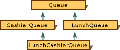
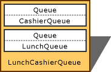
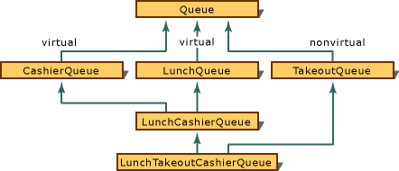
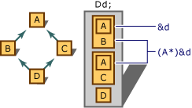
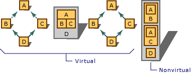

# Multiple Base Classes

A class can be derived from more than one base class. In a multiple-inheritance model (where classes are derived from more than one base class), the base classes are specified using the *base-list* grammar element. For example, the class declaration for `CollectionOfBook`, derived from `Collection` and `Book`, can be specified:

```cpp
// deriv_MultipleBaseClasses.cpp
// compile with: /LD
class Collection {
};
class Book {};
class CollectionOfBook : public Book, public Collection {
    // New members
};
```

The order in which base classes are specified is not significant except in certain cases where constructors and destructors are invoked. In these cases, the order in which base classes are specified affects the following:

- The order in which initialization by constructor takes place. If your code relies on the `Book` portion of `CollectionOfBook` to be initialized before the `Collection` part, the order of specification is significant. Initialization takes place in the order the classes are specified in the *base-list*.

- The order in which destructors are invoked to clean up. Again, if a particular "part" of the class must be present when the other part is being destroyed, the order is significant. Destructors are called in the reverse order of the classes specified in the *base-list*.

    > [!NOTE]
    >  The order of specification of base classes can affect the memory layout of the class. Do not make any programming decisions based on the order of base members in memory.

When specifying the *base-list*, you cannot specify the same class name more than once. However, it is possible for a class to be an indirect base to a derived class more than once.

## Virtual base classes

Because a class can be an indirect base class to a derived class more than once, C++ provides a way to optimize the way such base classes work. Virtual base classes offer a way to save space and avoid ambiguities in class hierarchies that use multiple inheritance.

Each nonvirtual object contains a copy of the data members defined in the base class. This duplication wastes space and requires you to specify which copy of the base class members you want whenever you access them.

When a base class is specified as a virtual base, it can act as an indirect base more than once without duplication of its data members. A single copy of its data members is shared by all the base classes that use it as a virtual base.

When declaring a virtual base class, the **virtual** keyword appears in the base lists of the derived classes.

Consider the class hierarchy in the following figure, which illustrates a simulated lunch line.

 <br/>
Simulated lunch-line graph

In the figure, `Queue` is the base class for both `CashierQueue` and `LunchQueue`. However, when both classes are combined to form `LunchCashierQueue`, the following problem arises: the new class contains two subobjects of type `Queue`, one from `CashierQueue` and the other from `LunchQueue`. The following figure shows the conceptual memory layout (the actual memory layout might be optimized).

 <br/>
Simulated lunch-line object

Note that there are two `Queue` subobjects in the `LunchCashierQueue` object. The following code declares `Queue` to be a virtual base class:

```cpp
// deriv_VirtualBaseClasses.cpp
// compile with: /LD
class Queue {};
class CashierQueue : virtual public Queue {};
class LunchQueue : virtual public Queue {};
class LunchCashierQueue : public LunchQueue, public CashierQueue {};
```

The **virtual** keyword ensures that only one copy of the subobject `Queue` is included (see the following figure).

 <br/>
Simulated lunch-line object with virtual base classes

A class can have both a virtual component and a nonvirtual component of a given type. This happens in the conditions illustrated in the following figure.

 <br/>
Virtual and non-virtual components of the same class

In the figure, `CashierQueue` and `LunchQueue` use `Queue` as a virtual base class. However, `TakeoutQueue` specifies `Queue` as a base class, not a virtual base class. Therefore, `LunchTakeoutCashierQueue` has two subobjects of type `Queue`: one from the inheritance path that includes `LunchCashierQueue` and one from the path that includes `TakeoutQueue`. This is illustrated in the following figure.

 <br/>
Object layout with virtual and non-virtual inheritance

> [!NOTE]
> Virtual inheritance provides significant size benefits when compared with nonvirtual inheritance. However, it can introduce extra processing overhead.

If a derived class overrides a virtual function that it inherits from a virtual base class, and if a constructor or a destructor for the derived base class calls that function using a pointer to the virtual base class, the compiler may introduce additional hidden "vtordisp" fields into the classes with virtual bases. The `/vd0` compiler option suppresses the addition of the hidden vtordisp constructor/destructor displacement member. The `/vd1` compiler option, the default, enables them where they are necessary. Turn off vtordisps only if you are sure that all class constructors and destructors call virtual functions virtually.

The `/vd` compiler option affects an entire compilation module. Use the `vtordisp` pragma to suppress and then reenable `vtordisp` fields on a class-by-class basis:

```cpp
#pragma vtordisp( off )
class GetReal : virtual public { ... };
\#pragma vtordisp( on )
```

## Name ambiguities

Multiple inheritance introduces the possibility for names to be inherited along more than one path. The class-member names along these paths are not necessarily unique. These name conflicts are called "ambiguities."

Any expression that refers to a class member must make an unambiguous reference. The following example shows how ambiguities develop:

```cpp
// deriv_NameAmbiguities.cpp
// compile with: /LD
// Declare two base classes, A and B.
class A {
public:
    unsigned a;
    unsigned b();
};

class B {
public:
    unsigned a();  // Note that class A also has a member "a"
    int b();       //  and a member "b".
    char c;
};

// Define class C as derived from A and B.
class C : public A, public B {};
```

Given the preceding class declarations, code such as the following is ambiguous because it is unclear whether `b` refers to the `b` in `A` or in `B`:

```cpp
C *pc = new C;

pc->b();
```

Consider the preceding example. Because the name `a` is a member of both class `A` and class `B`, the compiler cannot discern which `a` designates the function to be called. Access to a member is ambiguous if it can refer to more than one function, object, type, or enumerator.

The compiler detects ambiguities by performing tests in this order:

1. If access to the name is ambiguous (as just described), an error message is generated.

1. If overloaded functions are unambiguous, they are resolved.

1. If access to the name violates member-access permission, an error message is generated. (For more information, see [Member-Access Control](../cpp/member-access-control-cpp.md).)

When an expression produces an ambiguity through inheritance, you can manually resolve it by qualifying the name in question with its class name. To make the preceding example compile properly with no ambiguities, use code such as:

```cpp
C *pc = new C;

pc->B::a();
```

> [!NOTE]
> When `C` is declared, it has the potential to cause errors when `B` is referenced in the scope of `C`. No error is issued, however, until an unqualified reference to `B` is actually made in `C`'s scope.

### Dominance

It is possible for more than one name (function, object, or enumerator) to be reached through an inheritance graph. Such cases are considered ambiguous with nonvirtual base classes. They are also ambiguous with virtual base classes, unless one of the names "dominates" the others.

A name dominates another name if it is defined in both classes and one class is derived from the other. The dominant name is the name in the derived class; this name is used when an ambiguity would otherwise have arisen, as shown in the following example:

```cpp
// deriv_Dominance.cpp
// compile with: /LD
class A {
public:
    int a;
};

class B : public virtual A {
public:
    int a();
};

class C : public virtual A {};

class D : public B, public C {
public:
    D() { a(); } // Not ambiguous. B::a() dominates A::a.
};
```

### Ambiguous conversions

Explicit and implicit conversions from pointers or references to class types can cause ambiguities. The next figure, Ambiguous Conversion of Pointers to Base Classes, shows the following:

- The declaration of an object of type `D`.

- The effect of applying the address-of operator (**&**) to that object. Note that the address-of operator always supplies the base address of the object.

- The effect of explicitly converting the pointer obtained using the address-of operator to the base-class type `A`. Note that coercing the address of the object to type `A*` does not always provide the compiler with enough information as to which subobject of type `A` to select; in this case, two subobjects exist.

 <br/>
Ambiguous conversion of pointers to base classes

The conversion to type `A*` (pointer to `A`) is ambiguous because there is no way to discern which subobject of type `A` is the correct one. Note that you can avoid the ambiguity by explicitly specifying which subobject you mean to use, as follows:

```cpp
(A *)(B *)&d       // Use B subobject.
(A *)(C *)&d       // Use C subobject.
```

### Ambiguities and virtual base classes

If virtual base classes are used, functions, objects, types, and enumerators can be reached through multiple-inheritance paths. Because there is only one instance of the base class, there is no ambiguity when accessing these names.

The following figure shows how objects are composed using virtual and nonvirtual inheritance.

 <br/>
Virtual vs. non-virtual derivation

In the figure, accessing any member of class `A` through nonvirtual base classes causes an ambiguity; the compiler has no information that explains whether to use the subobject associated with `B` or the subobject associated with `C`. However, when `A` is specified as a virtual base class, there is no question which subobject is being accessed.

## See also

[Inheritance](../cpp/inheritance-cpp.md)
