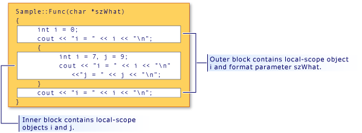

# Scope (C++)

When you declare a program element such as a class, function, or variable, its name can only be "seen" and used in certain parts of your program. The context in which a name is visible is called its *scope*. For example, if you declare a variable `x` within a function, `x` is only visible within that function body. It has *local scope*. You may have other variables by the same name in your program; as long as they are in different scopes, they do not violate the One Definition Rule and no error is raised.

For automatic non-static variables, scope also determines when they are created and destroyed in program memory.

There are six kinds of scope:

- **Global scope** A global name is one that is declared outside of any class, function or namespace. However, in C++  even these names exist with an implicit global namespace. The scope of global names extends from the point of declaration to the end of the file in which they are declared. For global names, visibility is also governed by the rules of [linkage](program-and-linkage-cpp.md) which determine whether the name is visible in other files in the program.

- **Namespace scope** A name that is declared within a [namespace](namespaces-cpp.md), outside of any class or enum definition or function block, is visible from its point of declaration to the end of namespace. A namespace may be defined in multiple blocks across different files.

- **Local scope** A name declared within a function or lambda, including the parameter names, have local scope. They are often referred to as "locals". They are only visible from their point of declaration to the end of the function or lambda body. Local scope is a kind of block scope, which is discussed later in this article.

- **Class scope** Names of class members have class scope, which extends throughout the class definition regardless of the point of declaration. Class member accessibility is further controlled by the **public**, **private**, and **protected** keywords. Public or protected members can be accessed only by using the member-selection operators (**.** or **->**) or pointer-to-member operators (**.**<strong>\*</strong> or **->**<strong>\*</strong>).

- **Statement scope** Names declared in a **for**, **if**, **while**, or **switch** statement are visible until the end of the statement block.

- **Function scope** A [label](labeled-statements.md) has function scope, which means it is visible throughout a function body even before its point of declaration. Function scope makes it possible to write statements like `goto cleanup` before the `cleanup` label is declared.

## Hiding Names

You can hide a name by declaring it in an enclosed block. In the following figure, `i` is redeclared within the inner block, thereby hiding the variable associated with `i` in the outer block scope.


Block Scope and Name Hiding

The output from the program shown in the figure is:

```cpp
i = 0
i = 7
j = 9
i = 0
```

> [!NOTE]
> The argument `szWhat` is considered to be in the scope of the function. Therefore, it is treated as if it had been declared in the outermost block of the function.

## Hiding class names

You can hide class names by declaring a function, object or variable, or enumerator in the same scope. However, the class name can still be accessed when prefixed by the keyword **class**.

```cpp
// hiding_class_names.cpp
// compile with: /EHsc
#include <iostream>
using namespace std;

// Declare class Account at global scope.
class Account
{
public:
    Account( double InitialBalance )
        { balance = InitialBalance; }
    double GetBalance()
        { return balance; }
private:
    double balance;
};

double Account = 15.37;            // Hides class name Account

int main()
{
    class Account Checking( Account ); // Qualifies Account as
                                       //  class name

    cout << "Opening account with balance of: "
         << Checking.GetBalance() << "\n";
}
//Output: Opening account with balance of: 15.37
```

> [!NOTE]
> Any place the class name (`Account`) is called for, the keyword class must be used to differentiate it from the global-scoped variable Account. This rule does not apply when the class name occurs on the left side of the scope-resolution operator (::). Names on the left side of the scope-resolution operator are always considered class names.

The following example demonstrates how to declare a pointer to an object of type `Account` using the **class** keyword:

```cpp
class Account *Checking = new class Account( Account );
```

The `Account` in the initializer (in parentheses) in the preceding statement has global scope; it is of type **double**.

> [!NOTE]
> The reuse of identifier names as shown in this example is considered poor programming style.

For information about declaration and initialization of class objects, see [Classes, Structures, and Unions](../cpp/classes-and-structs-cpp.md). For information about using the **new** and **delete** free-store operators, see [new and delete operators](new-and-delete-operators.md).

## Hiding names with global scope

You can hide names with global scope by explicitly declaring the same name in block scope. However, global-scope names can be accessed using the scope-resolution operator (`::`).

```cpp
#include <iostream>

int i = 7;   // i has global scope, outside all blocks
using namespace std;

int main( int argc, char *argv[] ) {
   int i = 5;   // i has block scope, hides i at global scope
   cout << "Block-scoped i has the value: " << i << "\n";
   cout << "Global-scoped i has the value: " << ::i << "\n";
}
```

```Output
Block-scoped i has the value: 5
Global-scoped i has the value: 7
```

## See also

[Basic Concepts](../cpp/basic-concepts-cpp.md)
