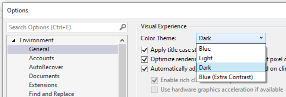
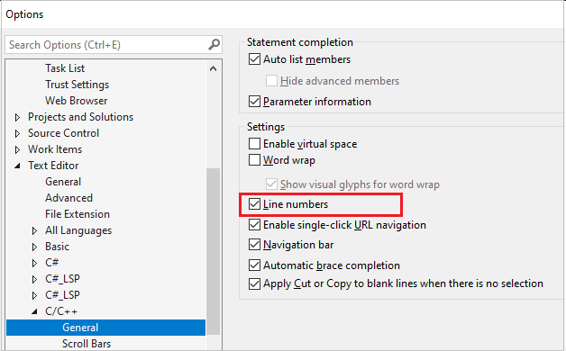

# How to set your C++ coding preferences in Visual Studio

You can customize many aspects of Visual Studio to suit your personal preferences. You can customize the menus and toolbars, arrange the window layout, set color themes, specify C++ formatting rules, including several flavors of ClangFormat, and create custom keyboard shortcuts. You can synchronize your preferences across multiple machines, and create and store multiple sets of preferences and share them with teammates. You can install extensions from the Visual Studio Marketplace which provide additional custom behavior. Many of these options are documented under [Personalize the Visual Studio IDE](/visualstudio/ide/personalizing-the-visual-studio-ide).

## Arrange window layout

Within the Visual Studio window, the space is divided into the main menu, the toolbar, the code editor (or document window), and tool windows (**Solution Explorer**, **Error List**, and so on). The default layout is shown below:

To hide all the tool windows, press **Alt** + **Shift** + **Enter** to toggle *full-screen mode*.

Some windows overlap each other in the same position. For example, **Solution Explorer**, **Class View**, **Resource View**, and **Source Control Explorer** all share the same default position. You switch between them by clicking on the tabs at the bottom of the frame. To make two or more of these windows visible at the same time, just drag one of them by its title bar to a new position. You can dock it against one of the Visual Studio main window borders, or you can float it. In the document window, each open file is contained in a tabbed frame. You can float or lock these tabs just like tool windows. For more information, see [Customize window layouts in Visual Studio](/visualstudio/ide/customizing-window-layouts-in-visual-studio).

## Set C++ coding styles and formatting

You can specify many individual code formatting options such as indentation and brace positions by navigating to **Tools** > **Options** > **Text Editor** > **C/C++** > **Formatting**. Alternatively, you can specify one of the [ClangFormat](https://clang.llvm.org/docs/ClangFormat.html) styles (or your own custom ClangFormat style):

## Set the color theme

To set a light or dark background, navigate to **Tools** > **Options** > **Environment** and choose **Color Theme**:

The following image shows the dark theme:

## Customize code colorization

Regardless of which theme is active, you can customize the font and colors for individual code elements by navigating to **Tools** > **Options** > **Environment** > **Fonts and Colors**. Scroll down the list of display items until you see the C++ options:

## Customize the toolbars

The toolbars provide a convenient way to issue commands with a single mouse-click, rather than using the menus or keyboard shortcuts. Visual Studio includes a standard set of toolbars. For standard C++ development, the most useful toolbars are probably Standard, Text Editor, Build, Debug, Source Control, and possibly Compare Files. For Windows development, the Dialog Editor and Image Editor are useful for laying out dialogs and editing icons.

Hover over the icons in the toolbar to see which command it represents:

You can add or remove commands or create a custom toolbar by clicking the down-arrow. To move the toolbar to a new location, drag it by the dotted bar on the left:

.

For more information, see [How to: Customize menus and toolbars in Visual Studio](/visualstudio/ide/how-to-customize-menus-and-toolbars-in-visual-studio).

## Show or hide line numbers

To specify whether line numbers show on the left of the editor windows, navigate to and check or uncheck **Line Numbers**:

## Create keyboard shortcuts

All commands in Visual Studio can be made with keyboard shortcuts using various combinations of keys with the Ctrl, Alt and Shift keys. You can create your own shortcuts by navigating to **Tools** > **Options** > **Environment** > **Keyboard**. For more information, see [Identify and customize keyboard shortcuts in Visual Studio](/visualstudio/ide/identifying-and-customizing-keyboard-shortcuts-in-visual-studio).
