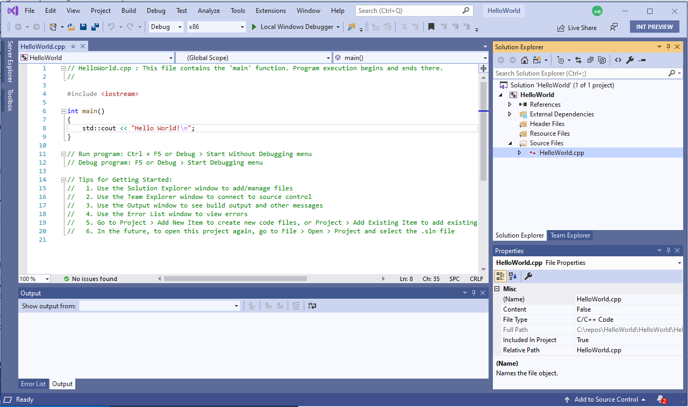

# How to set your preferences in Visual Studio

You can customize many aspects of Visual Studio to suit your personal preferences. You can create and store multiple sets of preferences; for example, you can define one window and toolbar layout and color scheme for unit testing, and another for debugging.  

## Arrange tool window layout

By default, the Visual Studio tool windows are arranged as shown below. 

If you prefer to maximize your code editor real estate, you can close all the tool windows by clicking on the **X** in the upper right corner of their title bar.

Some windows overlap each other in the same position. For example, Solution Explorer, Class View, Resource View, and Source Control Explorer all share the same default position. You switch between them by clicking on the tabs at the bottom of the frame. To make two or more of these windows visible at the same time, just drag one of them by its title bar to a new position. You can dock it against one of the Visual Studio main window borders, or you can "float" it. The Output Window, Error List, and other windows share the bottom part of the VS Window by default. 

Each open code file is contained in a tabbed frame in the code editor window. You can float code editor tabs just like tool windows.  

## Set coding styles and formatting

## Customize code colorization

## Set the color theme

## Create keyboard shortcuts