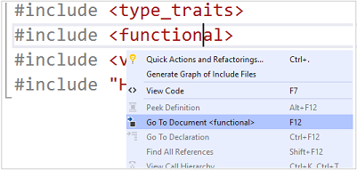
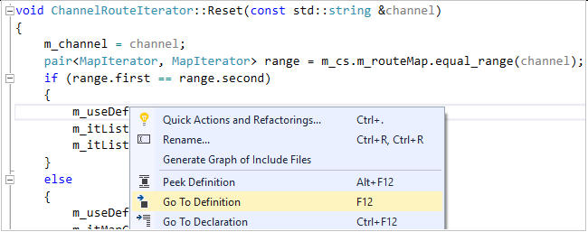
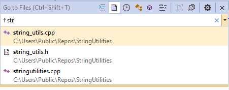
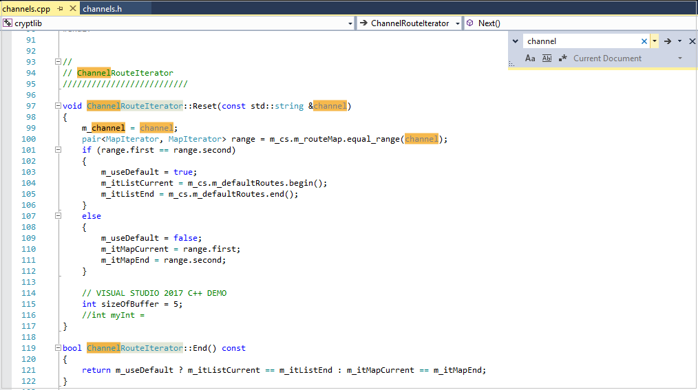
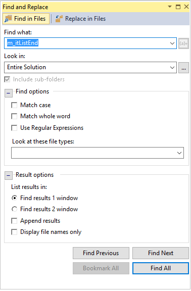
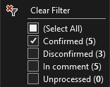

# Navigate C++ code in Visual Studio

Visual Studio provides a suite of tools to allow you to navigate around your codebase quickly and efficiently.

## Open an included file

Right-click on an `#include` directive and choose **Go To Document**, or press **F12** with the cursor over that line, to open the file.

## Toggle Header/Code File

You can switch between a header file and its corresponding source file, by right-clicking anywhere in your file and choosing **Toggle Header / Code File** or by pressing **Ctrl + K, Ctrl + O**.

## Go To Definition/Declaration

You can navigate to the definition of a code symbol by right-clicking it in the editor and choosing **Go To Definition**, or pressing **F12**. You can navigate to a declaration similarly from the right-click context menu, or by pressing **Ctrl + F12**.

## Go To

**Go To** refers to a set of navigation features that each provide a specific kind of result based on filters you specify. 

You can open **Go To** with **Ctrl + ,**. This creates a search box over the document you are editing.

**Go To** includes these search filters:

- **Go To Line (Ctrl + G)**: quickly jump to a different line in your current document
- **Go To All (Ctrl + ,)** or **(Ctrl + T)**: search results include everything below
- **Go To File (Ctrl 1, F)**: search for files in your solution
- **Go To Type (Ctrl 1, T)**: search results include:
  - Classes, Structs, Enums
  - Interfaces & Delegates (managed code only)
- **Go To Member (Ctrl 1, M)**: search results include:
  - Global variables and global functions
  - Class member variables and member functions
  - Constants
  - Enum Items
  - Properties and Events
- **Go To Symbol (Ctrl 1, S)**: search results include:
  - Results from Go To Types and Go To Members
  - All remaining C++ language constructs, including macros

When you first invoke **Go To** with **Ctrl +** , **Go To All** is activated (no filters on search results). You can then select your desired filter by using the buttons near the search textbox. You can invoke a specific filter using its corresponding keyboard shortcut. Doing so opens the **Go To** search box with that filter pre-selected. All keyboard shortcuts are configurable.

To apply a text filter, start your search query with the filter’s corresponding character followed by a space. (**Go To Line** can optionally omit the space.) These are the available text filters:

- Go To All: (no text filter)
- Go To Line Number: :
- Go To File: f
- Go To Type: t
- Go To Member: m
- Go To Symbol: #

The following example shows results from a *Go To Files* operation using the 'f' filter:

To see the list of text filters, type a ? followed by a space. You can also access the **Go To** commands with the **Edit** menu. This is another way to remind yourself of the main Go To keyboard shortcuts.

## Find / Find in Files

You can run a text search for anything in your solution with **Find (Ctrl + F)**  or **Find in Files (Ctrl + Shift + F)**.

Find can be scoped to a selection, the current document, all open documents, the current project, or the entire solution. You can use regular expressions as well as plain text. It also highlights all matches automatically in the IDE.

**Find in Files** is a more powerful version of **Find** that displays results in the **Find Results** window. You can search external code dependencies, filter by filetypes, and more. 

You can organize **Find in Files** results in two windows. You can append results from multiple searches together. Click on a result to go to that location in the file.

For more information, see [Find in Files](/visualstudio/ide/find-in-files) in the Visual Studio documentation.

## Find All References

To find all usages of a symbol in your codebase, place the caret in or just after the symbol, then right-click and choose **Find All References**. You can filter, sort, or group results in many different ways. Results populate incrementally. They are classified as Reads or Writes to help you see what is in your solution as opposed to system headers or other libraries.

You group results by the following categories:

- Project then Definition
- Definition Only
- Definition then Project
- Definition then Path
- Definition, Project then Path

 #### Filter Results

To filter results, hover over a column and click the filtering icon that pops up. You can filter results from the first column to hide things like string and comment references that you might not want to see.

- **Confirmed Results**: Actual code references to the symbol being searched for. For example, searching for a member function called `Size` will return all references to `Size` that match the scope of the class defining `Size`.

- **Disconfirmed Results**: This filter is off by default because it shows symbols whose name matches but are not actual references to the symbol you are searching for. For example, if you have two classes that each define a member function called `Size`, and you run a search for `Size` on a reference from an object of `Class1`, any references to `Size` from `Class2` appear as disconfirmed.

- **Unprocessed Results**: **Find All References** operations can take time to complete on larger codebases, so the Results list shows "unprocessed" results here. Unprocessed results match the name of the symbol being searched for but have not yet been confirmed as actual code references. You can turn on this filter to get faster results. Just be aware that some results might not be actual references.

 #### Sort Results

You can sort results by any column by clicking on that column. You can swap between ascending/descending order by clicking the column again.

## Navigation Bar

You can navigate to the definition of a type in a file, or to type members, by using the **Navigation Bar** that is above the editor window.

## See Also

[Read and understand C++ code](read-and-understand-code-cpp.md) 
[Edit and refactor C++ code](read-and-understand-code-cpp.md) 
[Collaborate with Live Share for C++](live-share-cpp.md)
