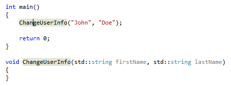
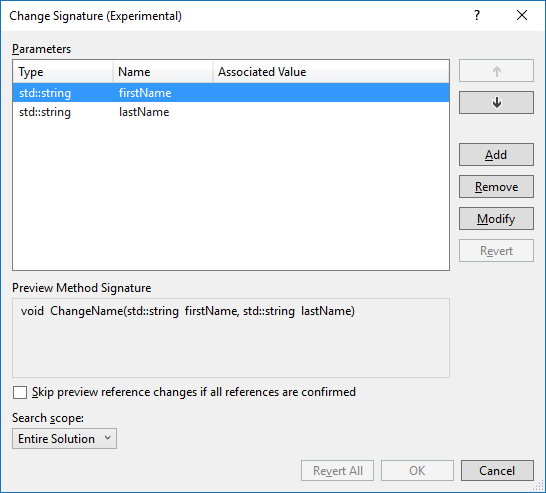
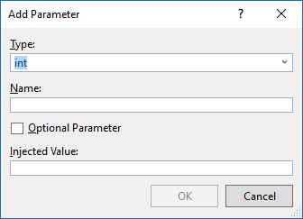
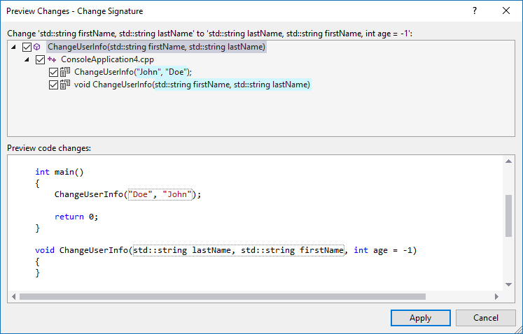

# Change Signature
**What:** Lets you modify a function's parameters.

**When:** You want to re-order, add, remove, or modify a function's parameters that is currently being used in a variety of locations.

**Why:** You could manually change these parameters yourself, and then find all calls to that function and change them one-by-one, but that could lead to errors.  This refactoring tool will perform the task automatically.

**How:**

1. Place the text or mouse cursor inside the name of the method to modify, or one of its usages:

   

1. Next, do one of the following:
   * **Keyboard**
     * Press **Ctrl+R**, then **Ctrl+O**.  (Note that your keyboard shortcut may be different based on which profile you've selected.)
     * Press **Ctrl+.** to trigger the **Quick Actions and Refactorings** menu and select **Change Signature** from the context menu.
   * **Mouse**
     * Select **Edit > Refactor > Reorder Parameters**.
     * Right-click the code, select the **Quick Actions and Refactorings** menu and select **Change Signature** from the context menu.

1. In the **Change Signature** dialog that pops up, you can use the buttons on the right side to change the method signature:

   

   | Button | Description
   | ------ | ---
   | **Up/Down**    | Move the selected parameter up and down the list
   | **Add**        | Add a new paramater to the list
   | **Remove**     | Remove the selected parameter from the list
   | **Modify**     | Modify the selected parameter by changing its type, name, and whether it is optional, and what its injected value would be
   | **Revert**     | Restore the selected parameter its original state
   | **Revert All** | Restore all parameters to their original state

   > [!TIP]
   > Use the **Skip preview reference changes if all references are confirmed** checkbox to make the changes immediately without the preview window popping up first.

   When adding or modifying a parameter, you will see the **Add Parameter** or **Edit Parameter** window.

   

   Here, you can do the following:

   | Entry | Description
   | ----- | ---
   | **Type**               | The type of the parameter (int, double, float, etc.)
   | **Name**               | The name of the parameter
   | **Optional Parameter** | Makes the parameter optionally specified
   | **Injected Value**     | The value inserted into any calls to the function where the parameter isn't specified (only valid for **Add**)
   | **Default value**      | The value used by the function if the caller doesn't specify one (only valid for **Optional Parameters**)

1. Use the **Search scope** drop down to select if the changes will apply to the project or the entire solution.

1. When you are finished, press the **OK** button to make the changes.  Ensure that the changes you are requesting are being made appropriately.  Use the checkboxes in the top half of the window to enable or disable the renaming of any item.

   

1. When everything looks good, click the **Apply** button and the function will be changed in your source code.

   