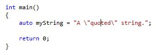

# Convert to Raw String Literal
**What:** Lets you turn any string into a C++ raw string literal.

**When:** You have a string with escaped characters which shouldn't be processed as escaped characters.

**Why:** You could double-escape characters, but this often leads to confusing and unreadable strings.  Using raw string literals makes strings much easier to read.

**How:**

1. Place text or mouse cursor over the escaped string to convert.

   

1. Next, do one of the following:
   * **Keyboard**
     * Press **Ctrl+.** to trigger the **Quick Actions and Refactorings** menu and select **Convert to Raw String Literal** from the context menu.
   * **Mouse**
     * Right-click the code, select the **Quick Actions and Refactorings** menu and select **Convert to Raw String Literal** from the context menu.
     * Click the  icon which appears in the left margin and select **Convert to Raw String Literal** from the context menu.

1. The string will be immediately converted into a raw string literal.  

   