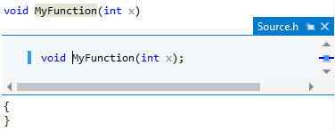

# Create Declaration / Definition
**What:** Lets you immediately generate the declaration or definition of a function.

**When:** You have a function that needs a declaration, or vice-versa.

**Why:** You could manually create the declaration/definition, but this will create it automatically, creating the header/code file if required.

**How:**

1. Place your text or mouse cursor over the function for which you want to create the declaration or definition.

   

1. Next, do one of the following:
   * **Keyboard**
     * Press **Ctrl+.** to trigger the **Quick Actions and Refactorings** menu and select **Create Declaration / Definition** from the context menu.
   * **Mouse**
     * Right-click and select the **Quick Actions and Refactorings** menu and select **Create Declaration / Definition** from the context menu.

1. The function's declaration/definition will be created in the source or header file, which you will see in a popup preview window.  If the source or header file does not exist, it will also be created and placed in the project.

   
