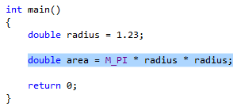
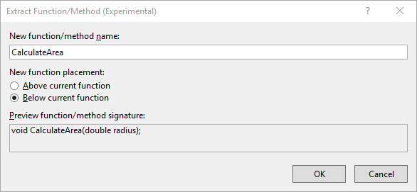
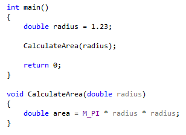

# Extract Function

**What:** Lets you turn a fragment of code into its own function.

**When:** You have a fragment of existing code in some function that needs to be called from another function.

**Why:** You could copy/paste that code, but that would lead to duplication.  A better solution is to refactor that fragment into its own function which can be called freely by any other function.

**How:**

1. Highlight the code to be extracted:

   

1. Next, do one of the following:
   * **Keyboard**
     * Press **Ctrl+R**, then **Ctrl+M**.  (Note that your keyboard shortcut may be different based on which profile you've selected.)
     * Press **Ctrl+.** to trigger the **Quick Actions and Refactorings** menu and select **Extract Function (Experimental)** from the context menu.
   * **Mouse**
     * Select **Edit > Refactor > Extract Function (Experimental)**.
     * Right-click the code, select the **Quick Actions and Refactorings** menu and select **Extract Function (Experimental)** from the context menu.
     * Click the  icon which appears in the left margin and select **Extract Function (Experimental)** from the context menu.

1. In the **Extract Function/Method (Experimental)** window, enter the new function name, select where you want the code to be placed, and click the **OK** button.

   

1. The new function will be created where you specified, a function prototype in the corresponding header file, and the original code will be changed to call that function.

   
