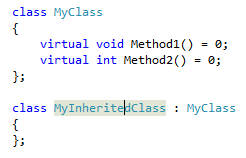
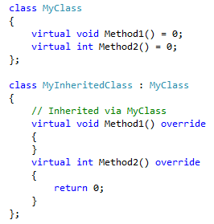

# Implement Pure Virtuals
**What:** Lets you immediately generate the code required to implement all pure virtual methods in a class. 

**When:** You want to inherit from a class with pure virtual functions.  

**Why:** You could manually implement all pure virtual functions one-by-one, however this feature will generate all method signatures automatically.

**How:**

1. Place your text or mouse cursor over the class in which you want to implement the pure virtual functions of the base class.

   

1. Next, do one of the following:
   * **Keyboard**
     * Press **Ctrl+.** to trigger the **Quick Actions and Refactorings** menu and select **Implement all Pure Virtuals for class '*ClassName*'** from the context menu, where *ClassName* is the name of the selected class.
   * **Mouse**
     * Right-click and select the **Quick Actions and Refactorings** menu and select **Implement all Pure Virtuals for class '*ClassName*'** from the context menu, where *ClassName* is the name of the selected class.

1. The pure virtual method signatures will be created automatically, ready to be implemented.

   
