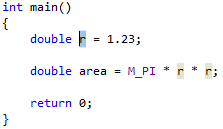
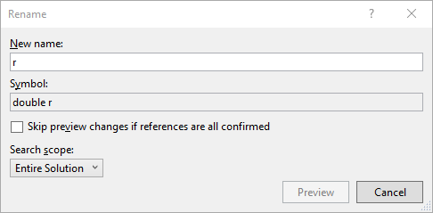
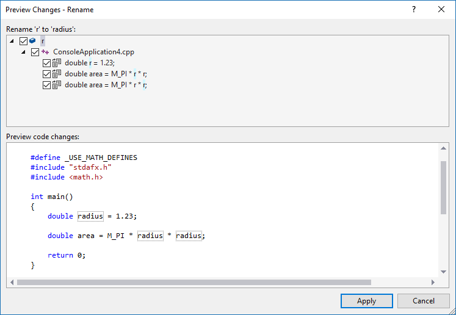

# Rename
**What:** Lets you rename identifiers for code symbols, such as fields, local variables, methods, namespaces, properties and types.

**When:** You want to safely rename something without having to find all instances, and copy/paste the new name.  

**Why:** Copy and pasting the new name across an entire project would likely result in errors.  This refactoring tool will accurately perform the renaming action.

**How:**

1. Highlight or place the text cursor inside the item to be renamed:

   

1. Next, do one of the following:
   * **Keyboard**
     * Press **Ctrl+R**, then **Ctrl+R**.  (Note that your keyboard shortcut may be different based on which profile you've selected.)
   * **Mouse**
     * Select **Edit > Refactor > Rename**.
     * Right-click the code and select **Rename**.

1. In the **Rename** window that pops up, enter the new name for the selected item and click the **Preview** button.  Change the **Search scope** if you need to widen or narrow the scope of the renaming.

   

   > [!TIP]
   > You can skip the preview by checking the **Skip preview changes if references are all confirmed** option.

1. When the **Preview Changes - Rename** window appears, ensure that the changes you are requesting are being made appropriately.  Use the checkboxes in the top half of the window to enable or disable the renaming of any item.

   

1. When everything looks good, click the **Apply** button and the item will be renamed in your source code.
