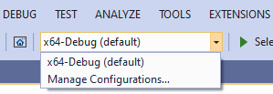

# Configure a Linux CMake project in Visual Studio

::: moniker range="vs-2015"
Linux support is available in Visual Studio 2017 and later. To see the documentation for these versions, set the Visual Studio **Version** selector control for this article to Visual Studio 2017 or Visual Studio 2019. It's found at the top of the table of contents on this page.
::: moniker-end

::: moniker range=">=vs-2017"
This topic describes how to add a Linux configuration to a CMake project that targets either a remote Linux system or Windows Subsystem for Linux (WSL). It continues the series that began with [Create a Linux CMake project in Visual Studio](cmake-linux-project.md). If you are using MSBuild, instead, see [Configure a Linux MSBuild Project in Visual Studio](configure-a-linux-project.md)

## Add a Linux configuration

A configuration can be used to target different platforms (Windows, WSL, a remote system) with the same source code. A configuration is also used to set your compilers, pass environment variables, and customize how CMake is invoked. The *CMakeSettings.json* file specifies some or all of the properties listed in [Customize CMake settings](../build/customize-cmake-settings.md), plus additional properties that control the build settings on the remote Linux machine.
::: moniker-end

::: moniker range="vs-2017"
To change the default CMake settings in Visual Studio 2017, choose **CMake** > **Change CMake Settings** > **CMakeLists.txt** from the main menu. Or, right-click *CMakeLists.txt* in **Solution Explorer** and choose **Change CMake Settings**. Visual Studio then creates a new *CMakeSettings.json* file in your root project folder. To make changes, open the file and modify it directly. For more information, see [Customize CMake settings](../build/customize-cmake-settings.md).

The default configuration for Linux-Debug in Visual Studio 2017 (and Visual Studio 2019 version 16.0) looks like this:

```json
{
      "name": "Linux-Debug",
      "generator": "Unix Makefiles",
      "remoteMachineName": "${defaultRemoteMachineName}",
      "configurationType": "Debug",
      "remoteCMakeListsRoot": "/var/tmp/src/${workspaceHash}/${name}",
      "cmakeExecutable": "/usr/local/bin/cmake",
      "buildRoot": "${env.LOCALAPPDATA}\\CMakeBuilds\\${workspaceHash}\\build\\${name}",
      "installRoot": "${env.LOCALAPPDATA}\\CMakeBuilds\\${workspaceHash}\\install\\${name}",
      "remoteBuildRoot": "/var/tmp/build/${workspaceHash}/build/${name}",
      "remoteInstallRoot": "/var/tmp/build/${workspaceHash}/install/${name}",
      "remoteCopySources": true,
      "remoteCopySourcesOutputVerbosity": "Normal",
      "remoteCopySourcesConcurrentCopies": "10",
      "remoteCopySourcesMethod": "rsync",
      "remoteCopySourcesExclusionList": [".vs", ".git"],
      "rsyncCommandArgs" : "-t --delete --delete-excluded",
      "remoteCopyBuildOutput" : "false",
      "cmakeCommandArgs": "",
      "buildCommandArgs": "",
      "ctestCommandArgs": "",
      "inheritEnvironments": [ "linux-x64" ]
}
```
::: moniker-end

::: moniker range="vs-2019"
To change the default CMake settings in Visual Studio 2019, from the main toolbar, open the **Configuration** dropdown and choose **Manage Configurations**.



This command opens the **CMake Settings Editor**, which you can use to edit the *CMakeSettings.json* file in your root project folder. You can also open the file with the JSON editor by clicking the **Edit JSON** button in the editor. For more information, see [Customize CMake Settings](../build/customize-cmake-settings.md).

The default Linux-Debug configuration in Visual Studio 2019 version 16.1, and later, looks like this:

```json
{
      "name": "Linux-Debug",
      "generator": "Unix Makefiles",
      "configurationType": "Debug",
      "cmakeExecutable": "/usr/bin/cmake",
      "remoteCopySourcesExclusionList": [ ".vs", ".git", "out" ],
      "cmakeCommandArgs": "",
      "buildCommandArgs": "",
      "ctestCommandArgs": "",
      "inheritEnvironments": [ "linux_x64" ],
      "remoteMachineName": "${defaultRemoteMachineName}",
      "remoteCMakeListsRoot": "$HOME/.vs/${projectDirName}/${workspaceHash}/src",
      "remoteBuildRoot": "$HOME/.vs/${projectDirName}/${workspaceHash}/out/build/${name}",
      "remoteInstallRoot": "$HOME/.vs/${projectDirName}/${workspaceHash}/out/install/${name}",
      "remoteCopySources": true,
      "rsyncCommandArgs": "-t --delete --delete-excluded",
      "remoteCopyBuildOutput": false,
      "remoteCopySourcesMethod": "rsync",
      "addressSanitizerRuntimeFlags": "detect_leaks=0",
      "variables": []
    }
  ]
}
```

In Visual Studio 2019 version 16.6 or later, Ninja is the default generator for configurations targeting a remote system or WSL. For more information, see this post on the [C++ Team Blog](https://devblogs.microsoft.com/cppblog/linux-development-with-visual-studio-first-class-support-for-gdbserver-improved-build-times-with-ninja-and-updates-to-the-connection-manager/).

::: moniker-end
::: moniker range=">=vs-2017"
For more information about these settings, see [CMakeSettings.json reference](../build/cmakesettings-reference.md).

When you do a build:
- If you're targeting a remote system, Visual Studio chooses the first remote system in the list under **Tools** > **Options** > **Cross Platform** > **Connection Manager** by default for remote targets.
- If no remote connections are found, you're prompted to create one. For more information, see [Connect to your remote Linux computer](connect-to-your-remote-linux-computer.md).

## Choose a Linux target

When you open a CMake project folder, Visual Studio parses the *CMakeLists.txt* file and specifies a Windows target of **x86-Debug**. To target a remote Linux system, you'll change the project settings to **Linux-Debug** or **Linux-Release**.

::: moniker-end
::: moniker range="vs-2019"

### Target Windows Subsystem for Linux

If you specify a remote Linux target, your source is copied to the remote system.

After you select a target, CMake runs automatically on the Linux system to generate the CMake cache for your project:


If you're targeting Windows Subsystem for Linux (WSL), you don't need to add a remote connection.

To target WSL, select **Manage Configurations** in the configuration dropdown in the main toolbar. Then press the **Add Configuration** button and choose **WSL-Debug** or **WSL-Release** if using GCC. Use the Clang variants if using the Clang/LLVM toolset.

**Visual Studio 2019 version 16.1** When you target WSL, Visual Studio doesn't need to copy source files and maintain two synchronous copies of your build tree because the compiler on Linux has direct access to your source files in the mounted Windows file system.
::: moniker-end
::: moniker range=">=vs-2017"

### IntelliSense

Accurate C++ IntelliSense requires access to the C++ headers referenced by your C++ source files. Visual Studio automatically uses the headers referenced by a CMake project from Linux to Windows to provide a full-fidelity IntelliSense experience. For more information, see [IntelliSense for remote headers](configure-a-linux-project.md#remote_intellisense).

### Locale setting

Visual Studio language settings aren't propagated to Linux targets because Visual Studio doesn't manage or configure installed packages. Messages shown in the Output window, such as build errors, are shown using the language and locale of the Linux target. You'll need to configure your Linux targets for the desired locale.

## Additional settings

Use the following settings to run commands on the Linux system before and after building, and before CMake generation. The values can be any command that is valid on the remote system. The output is piped back to Visual Studio.

```json
{
      "remotePrebuildCommand": "",
      "remotePreGenerateCommand": "",
      "remotePostbuildCommand": "",
}
```

## Next steps

[Configure CMake debugging sessions](../build/configure-cmake-debugging-sessions.md)

## See also

[Working with project properties](../build/working-with-project-properties.md)<br/>
[Customize CMake settings](../build/customize-cmake-settings.md)<br/>
[CMake predefined configuration reference](../build/cmake-predefined-configuration-reference.md)

::: moniker-end
