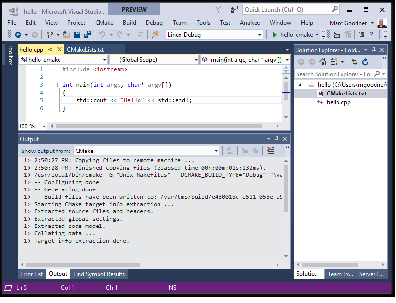

# Configure a Linux CMake project

When you open a folder that contains a CMake project, Visual Studio uses the metadata that CMake produces to configure IntelliSense and builds automatically. Local configuration and debugging settings are stored in JSON files that can optionally be shared with others who are using Visual Studio. 

Visual Studio does not modify the CMakeLists.txt files or the original CMake cache, so that others working on the same project can continue to use whatever tools they are already using.  

## Before you begin

First, make sure you have the **Linux development with C++** workload installed, including the CMake component. See [Install the C++ Linux workload in Visual Studio](download-install-and-setup-the-linux-development-workload.md). 

The CMake support in Visual Studio requires the server mode support that was introduced in CMake 3.8. For a Microsoft-provided CMake variant, download the latest prebuilt binaries at [https://github.com/Microsoft/CMake/releases](https://github.com/Microsoft/CMake/releases).

This topic assumes you have read [CMake Tools for Visual C++](../ide/cmake-tools-for-visual-cpp.md). For more information about CMake itself, see [Build, Test and Package Your Software With CMake](https://cmake.org/).

## Open a folder

To get started, choose **File** > **Open** > **Folder** from the main menu or else type `devenv.exe <foldername>` on the command line. The folder you open should have a CMakeLists.txt file in it, along with your source code.
The following example shows a simple CMakeLists.txt file and .cpp file:

```cpp
// hello.cpp

#include <iostream>

int main(int argc, char* argv[])
{
    std::cout << "Hello from Linux CMake" << std::endl;
}
```

CMakeLists.txt:

```cmd
project (hello-cmake)
add_executable(hello-cmake hello.cpp)
```

## Choose a Linux target

As soon as you open the folder, Visual Studio parses the CMakeLists.txt file and specifies a Windows target of **x86-Debug**. To target Linux, change the project settings to **Linux-Debug** or **Linux-Release**.

By default, Visual Studio chooses the first remote system in the list under **Tools** > **Options** > **Cross Platform** > **Connection Manager**. If no remote connections are found, you are prompted to create one. For more information, see [Connect to your remote Linux computer](connect-to-your-remote-linux-computer.md).

After you specify a Linux target, your source is copied to your Linux machine. Then, CMake is run on the Linux machine to generate the CMake cache for your project.



**Visual Studio 2017 version 15.7 and later:**<br/>
To provide IntelliSense support for remote headers, Visual Studio automatically copies them from the Linux machine to a directory on your local Windows machine. For more information, see [IntelliSense for remote headers](configure-a-linux-project.md#remote_intellisense).

## Debug the project

To debug your code on the remote system, set a breakpoint, select the CMake target as the startup item in the toolbar menu next to the project setting, and choose **&#x23f5; Start** on the toolbar, or press F5.

To customize your program’s command line arguments, right-click on the executable in **Solution Explorer** and select **Debug and Launch Settings**. This opens or creates a launch.vs.json configuration file that contains information about your program. To specify additional arguments, add them in the `args` JSON array. For more information, see [Open Folder projects in Visual C++](../ide/non-msbuild-projects.md).

## Configure CMake settings for Linux

To change the default CMake settings, choose **CMake | Change CMake Settings | CMakeLists.txt** from the main menu, or right-click CMakeSettings.txt in **Solution Explorer** and choose **Change CMake Settings**. Visual Studio then creates a new file in your folder called `CMakeSettings.json` that is populated with the default configurations that are listed in the project settings menu item. The following example shows the default configuration for Linux-Debug based on the previous code example:

```json
{
      "name": "Linux-Debug",
      "generator": "Unix Makefiles",
      "remoteMachineName": "${defaultRemoteMachineName}",
      "configurationType": "Debug",
      "remoteCMakeListsRoot": "/var/tmp/src/${workspaceHash}/${name}",
      "cmakeExecutable": "/usr/local/bin/cmake",
      "buildRoot": "${env.LOCALAPPDATA}\\CMakeBuilds\\${workspaceHash}\\build\\${name}",
      "installRoot": "${env.LOCALAPPDATA}\\CMakeBuilds\\${workspaceHash}\\install\\${name}",
      "remoteBuildRoot": "/var/tmp/build/${workspaceHash}/build/${name}",
      "remoteInstallRoot": "/var/tmp/build/${workspaceHash}/install/${name}",
      "remoteCopySources": true,
      "remoteCopySourcesOutputVerbosity": "Normal",
      "remoteCopySourcesConcurrentCopies": "10",
      "remoteCopySourcesMethod": "rsync",
      "remoteCopySourcesExclusionList": [".vs", ".git"],
      "rsyncCommandArgs" : "-t --delete --delete-excluded",
      "remoteCopyBuildOutput" : "false",
      "cmakeCommandArgs": "",
      "buildCommandArgs": "",
      "ctestCommandArgs": "",
      "inheritEnvironments": [ "linux-x64" ]
}
```

The `name` value can be whatever you like. The `remoteMachineName` value specifies which remote system to target, in case you have more than one. IntelliSense is enabled for this field to help you select the right system. The field `remoteCMakeListsRoot` specifies where your project sources will be copied to on the remote system. The field `remoteBuildRoot` is where the build output will be generated on your remote system. That output is also copied locally to the location specified by `buildRoot`. The `remoteInstallRoot` and `installRoot` fields are similar to `remoteBuildRoot` and `buildRoot`, except they apply when doing a cmake install. The `remoteCopySources` entry controls whether or not your local sources are copied to the remote machine. You might set this to false if you have a lot of files and you're already syncing the sources yourself. The `remoteCopyOutputVerbosity` value controls the verbosity of the copy step in case you need to diagnose errors. The `remoteCopySourcesConcurrentCopies` entry controls how many processes are spawned to do the copy. The `remoteCopySourcesMethod` value can be either `rsync` or `sftp`. The `remoteCopySourcesExclusionList` field allows you to control what gets copied to the remote machine. The `rsyncCommandArgs` value lets you control the rsync method of copying. The `remoteCopyBuildOutput` field controls whether or not the remote build output is copied to your local build folder.

You can use these optional settings for more control:

```json
{
      "remotePreBuildCommand": "",
      "remotePreGenerateCommand": "",
      "remotePostBuildCommand": "",
}
```

These options allow you to run commands on the remote system before and after building, and before CMake generation. The values can be any command that is valid on the remote system. The output is piped back to Visual Studio.

## Download prebuilt CMake binaries

Your Linux distro may have an older version of CMake. The CMake support in Visual Studio requires the server mode support that was introduced in CMake 3.8. For a Microsoft-provided CMake variant, download the latest prebuilt binaries at [https://github.com/Microsoft/CMake/releases](https://github.com/Microsoft/CMake/releases).

## See Also

[Working with Project Properties](../ide/working-with-project-properties.md)<br/>
[CMake Tools for Visual C++](../ide/cmake-tools-for-visual-cpp.md)
