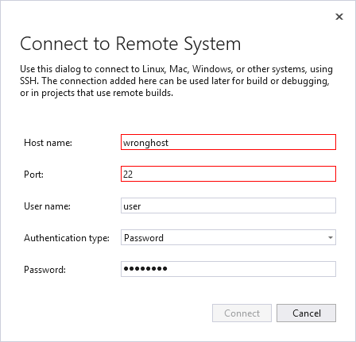

# Connect to Your remote Linux computer

When building a C++ Linux project in Visual Studio, Linux code is copied to your remote Linux computer and then compiled based on Visual Studio settings. To set up this remote connection:

1. Build the project for the first time or manually create a new entry by selecting **Tools > Options** and then open the **Cross Platform > Connection Manager** node and click the **Add** button.

   

   In either scenario, the **Connect to Remote System** window will be displayed.

   

1. Enter the following information:

   | Entry | Description
   | ----- | ---
   | **Host Name**           | Name or IP address of your target device
   | **Port**                | Port that the SSH service is running on, typically 22
   | **User name**           | User to authenticate as
   | **Authentication type** | Password or Private Key are both supported
   | **Password**            | Password for the entered user name
   | **Private key file**    | Private key file created for ssh connection
   | **Passphrase**          | Passphrase used with private key selected above

1. Click the **Connect** button to attempt a connection to the remote computer.  If the connection fails, the entry boxes which need to be changed will be outlined in red.

   