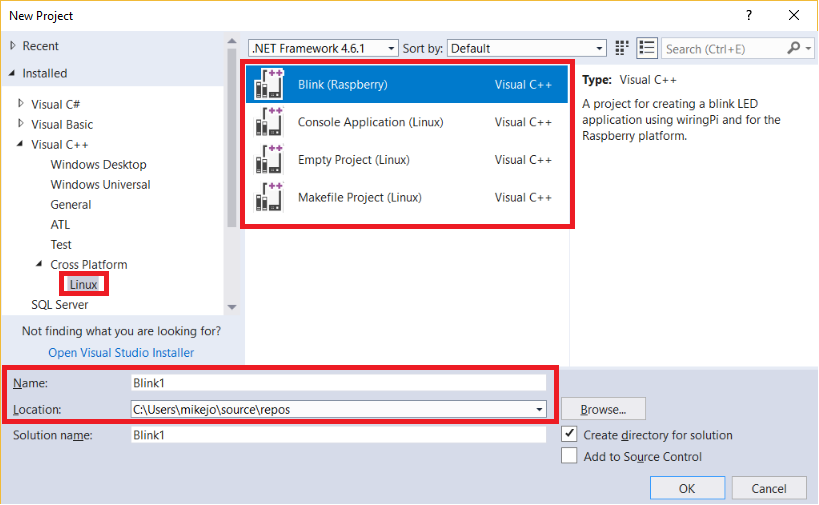

# Create a New Linux Project

First, make sure you have the **Linux Development Workload** for Visual Studio installed. For more information, see [Download, install, and setup the Linux workload](download-install-and-setup-the-linux-development-workload.md).

When coding C++ in Visual Studio for Linux, you have the choice of creating a Visual Studio project, or a CMake project. This topic describes how to create a Visual Studio project. For information about CMake Projects, see [Configure a Linux CMake Project ](cmake-linux-project.md).

To create a new Linux project in Visual Studio, do the following:

1. Select **File > New Project** in Visual Studio, or press **Ctrl + Shift + N**.
1. Select the **Visual C++ > Cross Platform > Linux** node and then select the project type you would like to create, enter a Name/Location, and click OK.

   

   | Project Type | Description
   | ------------ | ---
   | **Blink (Raspberry)**           | Project targeted for a Raspberry Pi device with sample code written to blink an LED
   | **Console Application (Linux)** | Project targeted for any Linux computer with sample code written to output text to the console
   | **Empty Project (Linux)**       | Project targeted for any Linux computer with no sample code written
   | **Makefile Project (Linux)**    | Project targeted for any Linux computer which will be built using a standard Makefile build system

