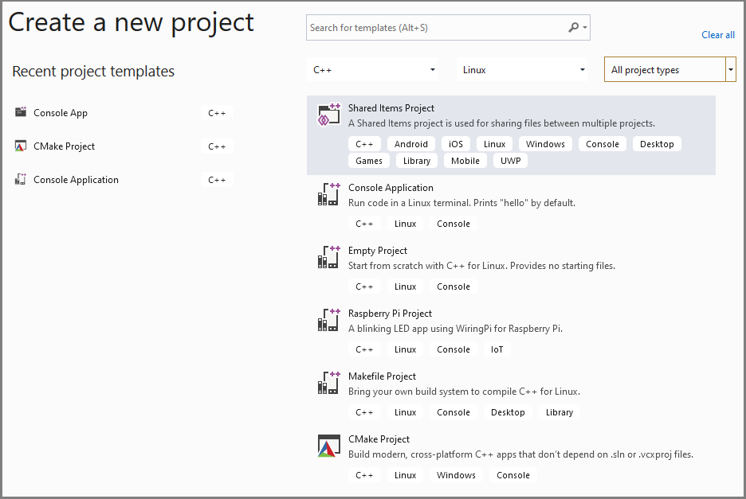

# Create a new Linux project

::: moniker range="vs-2015"

Linux projects are available in Visual Studio 2017 and later.

::: moniker-end

First, make sure you have the **Linux Development Workload** for Visual Studio installed. For more information, see [Download, install, and setup the Linux workload](download-install-and-setup-the-linux-development-workload.md).

When you create a new C++ project for Linux in Visual Studio, you can choose to create a Visual Studio project or a CMake project. This article describes how to create a Visual Studio project. For information about how to create and work with existing CMake Projects, see [Configure a Linux CMake Project ](cmake-linux-project.md).

## To create a new Linux project

To create a new Linux project in Visual Studio, follow these steps:

::: moniker range="vs-2019"

1. Select **File > New Project** in Visual Studio, or press **Ctrl + Shift + N**.
1. Set the **Language** to **C++** and search for "Linux". Select the project type to create, and then choose **Next**. Enter a **Name** and **Location**, and choose **Create**.

   

::: moniker-end

::: moniker range="vs-2017"

1. Select **File > New Project** in Visual Studio, or press **Ctrl + Shift + N**.
1. Select the **Visual C++ > Cross Platform > Linux** node, and then select the project type to create. Enter a **Name** and **Location**, and choose **OK**.

   

::: moniker-end

   | Project Type | Description |
   | ------------ | --- |
   | **Blink (Raspberry)**           | Project targeted for a Raspberry Pi device, with sample code that blinks an LED |
   | **Console Application (Linux)** | Project targeted for any Linux computer, with sample code that outputs text to the console |
   | **Empty Project (Linux)**       | Project targeted for any Linux computer, with no sample code |
   | **Makefile Project (Linux)**    | Project targeted for any Linux computer, built using a standard Makefile build system |

## Next Steps

[Configure a Linux project](configure-a-linux-project.md)
