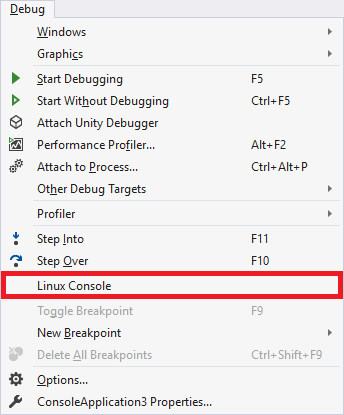

# Deploy, Run, and Debug Your Project

Now that the project is created, you will need to connect to your Linux computer, which is where the code will be compiled, executed, and debugged.

1. Set the remote target architecture using the standard dropdown in Visual Studio as shown:
   

There are several ways to interact with and debug your Linux project.

* The traditional Visual Studio features, such as breakpoints, watch windows, and hovering over a variable, will all work as expected, so you may debug as you normally would.
* A special Linux Console window can be opened with the **Debug > Linux Console** menu item.

  

  This console will display any console output from the target computer as well as take input and send it to the target computer.

  

* Command line arguments can be passed to the executable using the **Program Arguments** item in the project's **Debugging** property page.
  
  

* GDB is used to debug applications running on Linux.  However, this can run in two different modes, which can be selected from the **Debugging Mode** option in the project's **Debugging** property page:

  

  | Selection | Description
  | --------- | ---
  | gdbserver | GDB is run locally which connects to gdbserver running on the remote system.  Note that this is the only mode which the Linux Console window supports. 
  | gdb       | the Visual Studio debugger drives GDB on the remote system, which is more compatible if the local version of GDB is not compatible with the version installed on the target computer

* Specific debugger options can be passed to GDB using the **Additional Debugger Commands** entry.  For example, you might want to ignore SIGILL (illegal instruction) signals.  You could use the **handle** command to achieve this.  by adding the following to the **Additional Debugger Commands** entry as shown above:

  ```handle SIGILL nostop noprint```
