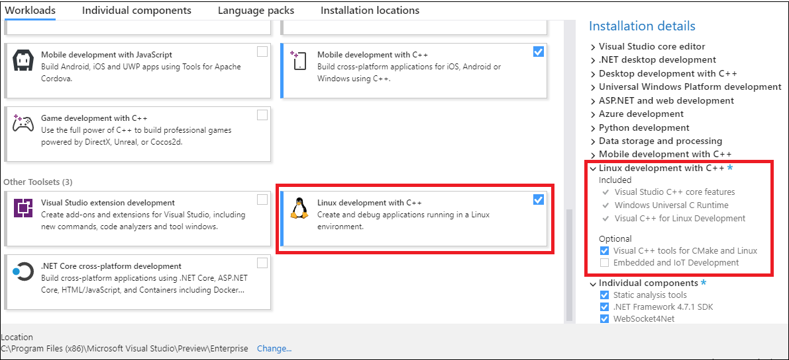

# Download, install, and set up the Linux workload


::: moniker range=">=vs-2017"

You can use the Visual Studio IDE in Windows to create, edit and debug C++ projects that execute on a Linux physical computer, virtual machine, or the [Windows Subsystem for Linux](/windows/wsl/about). 

You can work on your existing code base that uses CMake or any other build system without having to convert it to a Visual Studio project. If your code base is cross-platform, you can target both Windows and Linux from within Visual Studio. For example, you can edit, debug and profile your code on Windows using Visual Studio, then quickly retarget the project for Linux to do further testing. The Linux header files are automatically copied to your local machine where Visual Studio uses them to provide full IntelliSense support (Statement Completion, Go to Definition, and so on). 
 
For any of these scenarios, the **Linux development with C++** workload is required. 

::: moniker-end

::: moniker range="vs-2019"

In Visual Studio 2019 you can specify separate targets for building and debugging. When targeting WSL, it is no longer necessary to add a remote connection or configure SSH.

Support for [AddressSanitizer (ASan)](https://github.com/google/sanitizers/wiki/AddressSanitizer) is integrated into Visual Studio for Linux projects.

::: moniker-end

::: moniker range=">=vs-2017"

## Visual Studio setup

1. Type "Visual Studio Installer" in the Windows search box:
   
2. Look for the installer under the **Apps** results and double-click it. When the installer opens, choose **Modify**, and then click on the **Workloads** tab. Scroll down to **Other toolsets** and select the **Linux development with C++** workload.

   

1. If you are targeting IoT or embedded platforms, go to the **Installation details** pane on the right, under **Linux development with C++**, expand **Optional Components** and choose the components you need. CMake support for Linux is selected by default.

1. Click **Modify** to continue with the installation.

## Options for creating a Linux environment

If you don't already have a Linux machine, you can create a Linux Virtual Machine on Azure. For more information, see [Quickstart: Create a Linux virtual machine in the Azure portal](/azure/virtual-machines/linux/quick-create-portal).

On Windows 10, you can install and target your favorite Linux distro on the Windows Subsystem for Linux (WSL). For more information, see [Windows Subsystem for Linux Installation Guide for Windows 10](/windows/wsl/install-win10). WSL is a convenient console environment but is not recommended for graphical applications. 

::: moniker-end

::: moniker range="vs-2019"

## Linux setup: Ubuntu on WSL

On WSL, no remote connection is required. **zip** and **rsync** are required for automatic syncing of Linux headers with Visual Studio for Intellisense support. If the required applications are not already present, you can install them as follows:

```bash
   `sudo g++ gdb make rsync zip`
```
::: moniker-end

::: moniker range=">=vs-2017"

## Ubuntu on remote Linux systems

The target Linux system must have **openssh-server**, **g++**, **gdb**, and **gdbserver** installed, and the ssh daemon must be running. **zip** is required for automatic syncing of remote headers with your local machine for Intellisense support. If these applications are not already present, you can install them as follows:

1. At a shell prompt on your Linux computer, run:

   `sudo apt-get install openssh-server g++ gdb gdbserver zip`

   You may be prompted for your root password due to the sudo command.  If so, enter it and continue. Once complete, the required services and tools are installed.

1. Ensure the ssh service is running on your Linux computer by running:

   `sudo service ssh start`

   This starts the service and runs it in the background, ready to accept connections.

::: moniker-end

::: moniker range="vs-2019"

## Fedora on WSL

Fedora uses the **dnf** package installer. To download **g++**, **gdb**, **rsync** and **zip**, run:

   `sudo dnf install gcc-g++ gdb rsync zip`

**zip** and **rsync** are required for automatic syncing of Linux headers with Visual Studio for Intellisense support.

::: moniker-end

::: moniker range=">=vs-2017"

## Fedora on remote Linux systems

The target machine running Fedora uses the **dnf** package installer. To download **openssh-server**, **g++**, **gdb**, **gdbserver** and **zip**, and restart the ssh daemon, follow these instructions:

1. At a shell prompt on your Linux computer, run:

   `sudo dnf install openssh-server gcc-g++ gdb gdb-gdbserver zip`

   You may be prompted for your root password due to the sudo command.  If so, enter it and continue. Once complete, the required services and tools are installed.

1. Ensure the ssh service is running on your Linux computer by running:

   `sudo systemctl start sshd`

   This starts the service and runs it in the background, ready to accept connections.

::: moniker-end

::: moniker range="vs-2015"

Support for Linux C++ development is available in Visual Studio 2017 and later.

::: moniker-end

## Next Steps

You are now ready to create or open a Linux project and configure it to run on the target system. For more information, see:

- [Create a new Linux project](create-a-new-linux-project.md)
- [Configure a Linux CMake project](cmake-linux-project.md)
