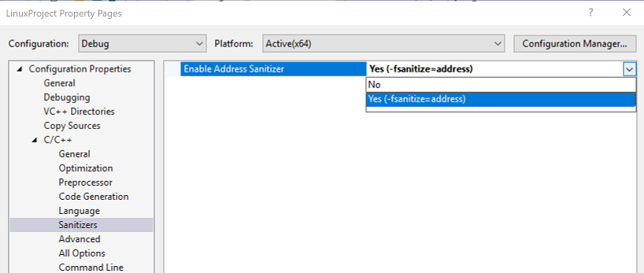
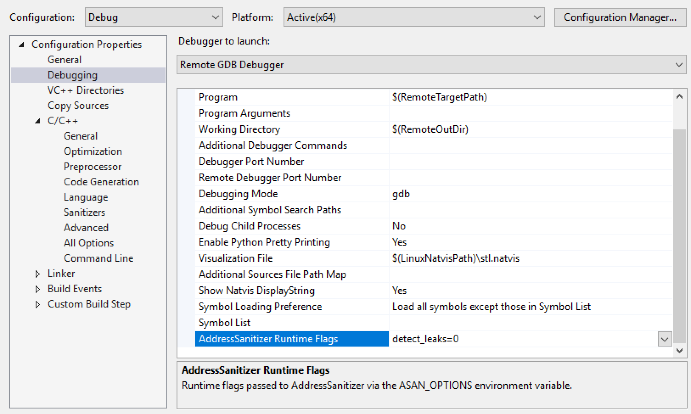
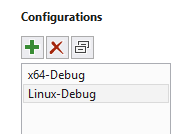

# Configure Linux projects to use Address Sanitizer

In Visual Studio 2019 version 16.1, AddressSanitizer (ASan) support is integrated into Linux projects. You can enable ASan for MSBuild-based Linux projects as well as CMake projects. It works on remote Linux systems and on Windows Subsystem for Linux (WSL).

## About ASan

ASan is a runtime memory error detector for C/C++ that catches the following errors:

- Use after free (dangling pointer reference)
- Heap buffer overflow
- Stack buffer overflow
- Use after return
- Use after scope
- Initialization order bugs

When ASan detects an error, it stops execution immediately. When you run an ASan-enabled program in the debugger, you see a message that describes the type of error, the memory address, and the location in the source file where the error occurred:

   

You can also view the full ASan output (including where the corrupted memory was allocated/deallocated) in the Debug pane of the output window.

## Enable ASan for MSBuild-based Linux projects

To enable ASan for MSBuild-based Linux projects, right-click on the project in **Solution Explorer** and select **Properties**. Next, navigate to **Configuration Properties** > **C/C++** > **Sanitizers**. ASan is enabled via compiler and linker flags and requires recompilation in order to work.



You can pass optional ASan runtime flags by navigating to **Configuration Properties** > **Debugging** > **AddressSanitizer Runtime Flags**. Click the down arrow to add or remove flags.



## Enable ASan for Visual Studio CMake projects

To enable ASan for CMake, right click on the CMakeLists.txt file in **Solution Explorer** and choose open the **CMake Settings for Project**.

Make sure you have a Linux configuration (for example **Linux-Debug**) selected in the left pane of the dialog:



The ASan options are under **General**. Enter the ASan runtime flags in the format "flag=value", separated by semicolons.


## Install the ASan debug symbols

To enable the ASan diagnostics, you have to install its debug symbols (libasan-dbg) on your remote Linux machine or WSL installation. The version of libasan-dbg that you load depends on the version of GCC you have installed on your Linux machine:

|**ASan version**|**GCC version**|
| --- | --- |
|libasan0|gcc-4.8|
|libasan2|gcc-5|
|libasan3|gcc-6|
|libasan4|gcc-7|
|libasan5|gcc-8|

You can determine the version of GCC you have with the following command:

```bash
gcc --version
```

You can also view the version of libasan-dbg you will need by running your program and then looking at the **Debug** pane of the **Output** window. The version of ASan that is loaded corresponds to the version of libasan-dbg you will need on your Linux machine. You can use **Ctrl + F** to search for "libasan" in the window. If you have libasan4, for example, you see a line like this:

```output
Loaded '/usr/lib/x86_64-linux-gnu/libasan.so.4'. Symbols loaded.
```

You can install the ASan debug bits on Linux distros that use apt with the following command (this command installs version 4):

```bash
sudo apt-get install libasan4-dbg
```

If ASan is enabled, Visual Studio prompts you at the top of the **Debug** pane of the **Output** window to install the ASan debug symbols.

