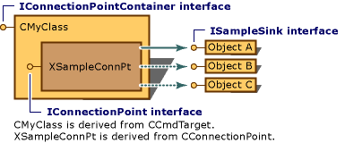

# Connection Points
This article explains how to implement connection points (formerly known as OLE connection points) using the MFC classes `CCmdTarget` and `CConnectionPoint`.  
  
 In the past, the Component Object Model (COM) defined a general mechanism (**IUnknown::QueryInterface**) that allowed objects to implement and expose functionality in interfaces. However, a corresponding mechanism that allowed objects to expose their capability to call specific interfaces was not defined. That is, COM defined how incoming pointers to objects (pointers to that object's interfaces) were handled, but it did not have an explicit model for outgoing interfaces (pointers the object holds to other objects' interfaces). COM now has a model, called connection points, that supports this functionality.  
  
 A connection has two parts: the object calling the interface, called the source, and the object implementing the interface, called the sink. A connection point is the interface exposed by the source. By exposing a connection point, a source allows sinks to establish connections to itself (the source). Through the connection point mechanism (the **IConnectionPoint** interface), a pointer to the sink interface is passed to the source object. This pointer provides the source with access to the sink's implementation of a set of member functions. For example, to fire an event implemented by the sink, the source can call the appropriate method of the sink's implementation. The following figure demonstrates the connection point just described.  
  
   
An Implemented Connection Point  
  
 MFC implements this model in the [CConnectionPoint](../mfc/reference/cconnectionpoint-class.md) and [CCmdTarget](../mfc/reference/ccmdtarget-class.md) classes. Classes derived from **CConnectionPoint** implement the **IConnectionPoint** interface, used to expose connection points to other objects. Classes derived from `CCmdTarget` implement the **IConnectionPointContainer** interface, which can enumerate all of an object's available connection points or find a specific connection point.  
  
 For each connection point implemented in your class, you must declare a connection part that implements the connection point. If you implement one or more connection points, you must also declare a single connection map in your class. A connection map is a table of connection points supported by the ActiveX control.  
  
 The following examples demonstrate a simple connection map and one connection point. The first example declares the connection map and point; the second example implements the map and point. Note that `CMyClass` must be a `CCmdTarget`-derived class. In the first example, code is inserted in the class declaration, under the **protected** section:  
  
 [!code-cpp[NVC_MFCConnectionPoints#1](../mfc/codesnippet/cpp/connection-points_1.h)]  
  
 The `BEGIN_CONNECTION_PART` and **END_CONNECTION_PART** macros declare an embedded class, `XSampleConnPt` (derived from `CConnectionPoint`), that implements this particular connection point. If you want to override any `CConnectionPoint` member functions or add member functions of your own, declare them between these two macros. For example, the `CONNECTION_IID` macro overrides the `CConnectionPoint::GetIID` member function when placed between these two macros.  
  
 In the second example, code is inserted in the control's implementation file (.cpp file). This code implements the connection map, which includes the connection point, `SampleConnPt`:  
  
 [!code-cpp[NVC_MFCConnectionPoints#2](../mfc/codesnippet/cpp/connection-points_2.cpp)]  
  
 If your class has more than one connection point, insert additional `CONNECTION_PART` macros between the `BEGIN_CONNECTION_MAP` and `END_CONNECTION_MAP` macros.  
  
 Finally, add a call to `EnableConnections` in the class's constructor. For example:  
  
 [!code-cpp[NVC_MFCConnectionPoints#3](../mfc/codesnippet/cpp/connection-points_3.cpp)]  
  
 Once this code has been inserted, your `CCmdTarget`-derived class exposes a connection point for the **ISampleSink** interface. The following figure illustrates this example.  
  
   
A Connection Point Implemented with MFC  
  
 Usually, connection points support "multicasting" — the ability to broadcast to multiple sinks connected to the same interface. The following example fragment demonstrates how to multicast by iterating through each sink on a connection point:  
  
 [!code-cpp[NVC_MFCConnectionPoints#4](../mfc/codesnippet/cpp/connection-points_4.cpp)]  
  
 This example retrieves the current set of connections on the `SampleConnPt` connection point with a call to `CConnectionPoint::GetConnections`. It then iterates through the connections and calls **ISampleSink::SinkFunc** on every active connection.  
  
## See Also  
 [MFC COM](../mfc/mfc-com.md)

