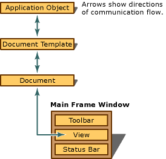

# Documents, Views, and the Framework
At the heart of the MFC framework are the concepts of document and view. A document is a data object with which the user interacts in an editing session. It is created by the `New` or **Open** command on the **File** menu and is typically saved in a file. (Standard MFC documents, derived from class **CDocument**, are different from Active documents and OLE compound documents.) A view is a window object through which the user interacts with a document.  
  
 The key objects in a running application are:  
  
-   The document or documents.  
  
     Your document class (derived from [CDocument](../mfc/reference/cdocument-class.md)) specifies your application's data.  
  
     If you want OLE functionality in your application, derive your document class from [COleDocument](../mfc/reference/coledocument-class.md) or one of its derived classes, depending on the type of functionality you need.  
  
-   The view or views.  
  
     Your view class (derived from [CView](../mfc/reference/cview-class.md)) is the user's "window on the data." The view class controls how the user sees your document's data and interacts with it. In some cases, you may want a document to have multiple views of the data.  
  
     If you need scrolling, derive from [CScrollView](../mfc/reference/cscrollview-class.md). If your view has a user interface that is laid out in a dialog-template resource, derive from [CFormView](../mfc/reference/cformview-class.md). For simple text data, use or derive from [CEditView](../mfc/reference/ceditview-class.md). For a form-based data-access application, such as a data-entry program, derive from [CRecordView](../mfc/reference/crecordview-class.md) (for ODBC). Also available are classes [CTreeView](../mfc/reference/ctreeview-class.md), [CListView](../mfc/reference/clistview-class.md), and [CRichEditView](../mfc/reference/cricheditview-class.md).  
  
-   The frame windows  
  
     Views are displayed inside "document frame windows." In an SDI application, the document frame window is also the "main frame window" for the application. In an MDI application, document windows are child windows displayed inside a main frame window. Your derived main frame-window class specifies the styles and other characteristics of the frame windows that contain your views. If you need to customize frame windows, derive from [CFrameWnd](../mfc/reference/cframewnd-class.md) to customize the document frame window for SDI applications. Derive from [CMDIFrameWnd](../mfc/reference/cmdiframewnd-class.md) to customize the main frame window for MDI applications. Also derive a class from [CMDIChildWnd](../mfc/reference/cmdichildwnd-class.md) to customize each distinct kind of MDI document frame windows that your application supports.  
  
-   The document template or templates  
  
     A document template orchestrates the creation of documents, views, and frame windows. A particular document-template class, derived from class [CDocTemplate](../mfc/reference/cdoctemplate-class.md), creates and manages all open documents of one type. Applications that support more than one type of document have multiple document templates. Use class [CSingleDocTemplate](../mfc/reference/csingledoctemplate-class.md) for SDI applications, or use class [CMultiDocTemplate](../mfc/reference/cmultidoctemplate-class.md) for MDI applications.  
  
-   The application object  
  
     Your application class (derived from [CWinApp](../mfc/reference/cwinapp-class.md)) controls all of the objects above and specifies application behavior such as initialization and cleanup. The application's one and only application object creates and manages the document templates for any document types the application supports.  
  
-   Thread objects  
  
     If your application creates separate threads of execution — for example, to perform calculations in the background — you'll use classes derived from [CWinThread](../mfc/reference/cwinthread-class.md). [CWinApp](../mfc/reference/cwinapp-class.md) itself is derived from `CWinThread` and represents the primary thread of execution (or the main process) in your application. You can also use MFC in secondary threads.  
  
 In a running application, these objects cooperatively respond to user actions, bound together by commands and other messages. A single application object manages one or more document templates. Each document template creates and manages one or more documents (depending on whether the application is SDI or MDI). The user views and manipulates a document through a view contained inside a frame window. The following figure shows the relationships among these objects for an SDI application.  
  
   
Objects in a Running SDI Application  
  
 The rest of this family of articles explains how the framework tools, the MFC Application Wizard, and the resource editors, create these objects, how they work together, and how you use them in your programming. Documents, views, and frame windows are discussed in more detail in [Window Objects](../mfc/window-objects.md) and [Document/View Architecture](../mfc/document-view-architecture.md).  
  
## See Also  
 [Using the Classes to Write Applications for Windows](../mfc/using-the-classes-to-write-applications-for-windows.md)
