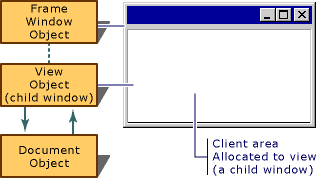

# Frame Windows

When an application runs under Windows, the user interacts with documents displayed in frame windows. A document frame window has two major components: the frame and the contents that it frames. A document frame window can be a [single document interface](../mfc/sdi-and-mdi.md) (SDI) frame window or a [multiple document interface](../mfc/sdi-and-mdi.md) (MDI) child window. Windows manages most of the user's interaction with the frame window: moving and resizing the window, closing it, and minimizing and maximizing it. You manage the contents inside the frame.

## Frame Windows and Views

The MFC framework uses frame windows to contain views. The two components — frame and contents — are represented and managed by two different classes in MFC. A frame-window class manages the frame, and a view class manages the contents. The view window is a child of the frame window. Drawing and other user interaction with the document take place in the view's client area, not the frame window's client area. The frame window provides a visible frame around a view, complete with a caption bar and standard window controls such as a control menu, buttons to minimize and maximize the window, and controls for resizing the window. The "contents" consist of the window's client area, which is fully occupied by a child window — the view. The following figure shows the relationship between a frame window and a view.

  
Frame Window and View

## Frame Windows and Splitter Windows

Another common arrangement is for the frame window to frame multiple views, usually using a [splitter window](../mfc/multiple-document-types-views-and-frame-windows.md). In a splitter window, the frame window's client area is occupied by a splitter window, which in turn has multiple child windows, called panes, which are views.

### What do you want to know more about

**General Frame Window Topics**

- [Window objects](../mfc/window-objects.md)

- [Frame window classes](../mfc/frame-window-classes.md)

- [The Frame-Window classes created by the Application Wizard](../mfc/frame-window-classes-created-by-the-application-wizard.md)

- [Frame window styles](../mfc/frame-window-styles-cpp.md)

- [What frame windows do](../mfc/what-frame-windows-do.md)

**Topics on Using Frame Windows**

- [Using frame windows](../mfc/using-frame-windows.md)

- [Creating document frame windows](../mfc/creating-document-frame-windows.md)

- [Destroying frame windows](../mfc/destroying-frame-windows.md)

- [Managing MDI child windows](../mfc/managing-mdi-child-windows.md)

- [Managing the current view](../mfc/managing-the-current-view.md) in a frame window that contains more than one view

- [Managing menus, control bars, and accelerators (other objects that share the frame window's space)](../mfc/managing-menus-control-bars-and-accelerators.md)

**Topics on Special Frame Window Capabilities**

- [Dragging and dropping files](../mfc/dragging-and-dropping-files-in-a-frame-window.md) from File Explorer or File Manager into a frame window

- [Responding to dynamic data exchange (DDE)](../mfc/responding-to-dynamic-data-exchange-dde.md)

- [Semimodal states: Context-sensitive Windows Help (Orchestrating other window actions)](../mfc/orchestrating-other-window-actions.md)

- [Semimodal states: printing and print preview (Orchestrating other window actions)](../mfc/orchestrating-other-window-actions.md)

**Topics on Other Kinds of Windows**

- [Using Views](../mfc/using-views.md)

- [Dialog boxes](../mfc/dialog-boxes.md)

- [Controls](../mfc/controls-mfc.md)

## See Also

[Windows](../mfc/windows.md)

