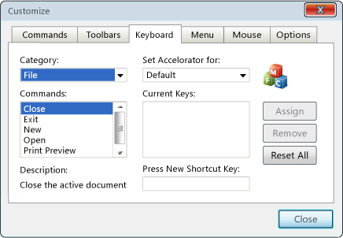
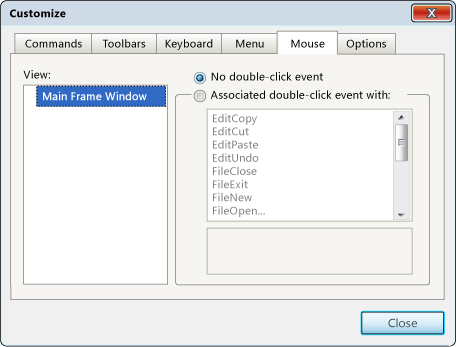

# Keyboard and Mouse Customization

MFC allows the user of your application to customize how it handles keyboard and mouse input. The user can customize keyboard input by assigning keyboard shortcuts to commands. The user can also customize the mouse input by selecting the command that should be executed when the user double-clicks inside specific windows of the application. This topic explains how to customize the input for your application.

In the **Customization** dialog box, the user can change the custom controls for the mouse and the keyboard. To display this dialog box, the user points to **Customize** on the **View** menu and then clicks **Toolbars and Docking**. In the dialog box, the user clicks either the **Keyboard** tab or the **Mouse** tab.

## Keyboard Customization

The following illustration shows the **Keyboard** tab of the **Customization** dialog box.

  
Keyboard Customization Tab

The user interacts with the keyboard tab to assign one or more keyboard shortcuts to a command. The available commands are listed on the left side of the tab. The user can select any available command from the menu. Only menu commands can be associated with a keyboard shortcut. After the user enters a new shortcut, the **Assign** button becomes enabled. When the user clicks this button, the application associates the selected command with that shortcut.

All of the currently assigned keyboard shortcuts are listed in the list box in the right column. The user can also select individual shortcuts and remove them, or reset all the mappings for the application.

If you want to support this customization in your application, you must create a [CKeyboardManager](reference/ckeyboardmanager-class.md) object. To create a `CKeyboardManager` object, call the function [CWinAppEx::InitKeyboardManager](reference/cwinappex-class.md#initkeyboardmanager). This method creates and initializes a keyboard manager. If you create a keyboard manager manually, you still must call `CWinAppEx::InitKeyboardManager` to initialize it.

If you use the Wizard to create your application, the Wizard will initialize the keyboard manager. After your application initializes the keyboard manager, the framework adds a **Keyboard** tab to the **Customization** dialog box.

## Mouse Customization

The following illustration shows the **Mouse** tab of the **Customization** dialog box.

  
Mouse Customization Tab

The user interacts with this tab to assign a menu command to the mouse double-click action. The user selects a view from the left side of the window and then uses the controls on the right side to associate a command with the double-click action. After the user clicks **Close**, the application executes the associated command whenever the user double-clicks anywhere in the view.

By default, mouse customization is not enabled when you create an application by using the Wizard.

#### To enable mouse customization

1. Initialize a [CMouseManager](reference/cmousemanager-class.md) object by calling [CWinAppEx::InitMouseManager](reference/cwinappex-class.md#initmousemanager).

1. Obtain a pointer to the mouse manager by using [CWinAppEx::GetMouseManager](reference/cwinappex-class.md#getmousemanager).

1. Add views to the mouse manager by using the [CMouseManager::AddView](reference/cmousemanager-class.md#addview) method. Do this for every view you want to add to the mouse manager.

After your application initializes the mouse manager, the framework adds the **Mouse** tab to the **Customize** dialog box. If you do not add any views, accessing the tab will cause an unhandled exception. After you have created a list of views, the **Mouse** tab is available to the user.

When you add a new view to the mouse manager, you give it a unique ID. If you want to support mouse customization for a window, you must process the WM_LBUTTONDBLCLICK message and call the [CWinAppEx::OnViewDoubleClick](reference/cwinappex-class.md#onviewdoubleclick) function. When you call this function, one of the parameters is the ID for that window. It is the responsibility of the programmer to keep track of the ID numbers and the objects associated with them.

## Security Concerns

As described in [User-defined Tools](user-defined-tools.md), the user can associate a user-defined tool ID with the double-click event. When the user double-clicks a view, the application looks for a user tool that matches the associated ID. If the application finds a matching tool, it executes the tool. If the application cannot find a matching tool, it sends a WM_COMMAND message with the ID to the view that was double-clicked.

The customized settings are stored in the registry. By editing the registry, an attacker can replace a valid user tool ID with an arbitrary command. When the user double-clicks a view, the view processes the command that the attacker planted. This could cause unexpected and potentially dangerous behavior.

In addition, this kind of attack can bypass user interface safeguards. For example, suppose an application has printing disabled. That is, in its user interface, the **Print** menu and button are unavailable. Normally this prevents the application from printing. But if an attacker edited the registry, a user could now could send the print command directly by double-clicking the view, bypassing the user interface elements that are unavailable.

To guard against this kind of attack, add code to your application command handler to verify that a command is valid before it is executed. Do not depend on the user interface to prevent a command from being sent to the application.

## See also

[Customization for MFC](customization-for-mfc.md) 
[CKeyboardManager Class](reference/ckeyboardmanager-class.md) 
[CMouseManager Class](reference/cmousemanager-class.md) 
[Security Implications of Customization](security-implications-of-customization.md)
