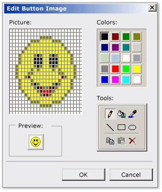

# CMFCImageEditorDialog Class
The `CMFCImageEditorDialog` class supports an image editor dialog box.  
  
## Syntax  
  
```  
class CMFCImageEditorDialog : public CDialogEx  
```  
  
## Members  
  
### Public Constructors  
  
|Name|Description|  
|----------|-----------------|  
|[CMFCImageEditorDialog::CMFCImageEditorDialog](#cmfcimageeditordialog__cmfcimageeditordialog)|Constructs a `CMFCImageEditorDialog` object.|  
  
## Remarks  
 The `CMFCImageEditorDialog` class provides a dialog box that includes:  
  
-   A picture area that you use to modify individual pixels in an image.  
  
-   Drawing tools to modify the pixels in the picture area.  
  
-   A color palette to specify the color that is used by the drawing tools.  
  
-   A preview area that displays the effect of your edit.  
  
 The following illustration shows an image editor dialog box.  
  
   
  
 One way to use a `CMFCImageEditorDialog` object is to pass it a `CBitmap` image to be edited. Do not create a large image because the image editing area has a limited size and the logical pixel size is adjusted to fit the area. Call the `DoModal` method to start a modal dialog box.  
  
## Inheritance Hierarchy  
 [CObject](../../mfc/reference/cobject-class.md)  
  
 [CCmdTarget](../../mfc/reference/ccmdtarget-class.md)  
  
 [CWnd](../../mfc/reference/cwnd-class.md)  
  
 [CDialog](../../mfc/reference/cdialog-class.md)  
  
 [CDialogEx](../../mfc/reference/cdialogex-class.md)  
  
 [CMFCImageEditorDialog](../../mfc/reference/cmfcimageeditordialog-class.md)  
  
## Requirements  
 **Header:** afximageeditordialog.h  
  
##  <a name="cmfcimageeditordialog__cmfcimageeditordialog"></a>  CMFCImageEditorDialog::CMFCImageEditorDialog  
 Constructs a `CMFCImageEditorDialog` object.  
  
```  
CMFCImageEditorDialog(
    CBitmap* pBitmap,  
    CWnd* pParent=NULL,  
    int nBitsPixel=-1);
```  
  
### Parameters  
 `pBitmap`  
 Pointer to an image.  
  
 `pParent`  
 Pointer to the parent window of the current image editor dialog box.  
  
 `nBitsPixel`  
 The number of bits used to represent the color of a single pixel, which is also referred to as color depth.  If the `nBitsPixel` parameter is -1, the color depth is derived from the image specified by the `pBitmap` parameter. The default value is -1.  
  
### Return Value  
 To modify an image, pass an image pointer to the `CMFCImageEditorDialog` constructor. Then call the `DoModal` method to open a modal dialog box. When the `DoModal` method returns, the bitmap contains the new image.  
  
### Remarks  
  
### Example  
 The following example demonstrates how to construct an object of the `CMFCImageEditorDialog` class. This example is part of the [New Controls sample](../../top/visual-cpp-samples.md).  
  
 [!code-cpp[NVC_MFC_NewControls#8](../../mfc/reference/codesnippet/CPP/cmfcimageeditordialog-class_1.cpp)]  
[!code-cpp[NVC_MFC_NewControls#40](../../mfc/reference/codesnippet/CPP/cmfcimageeditordialog-class_2.cpp)]  
  
## See Also  
 [Hierarchy Chart](../../mfc/hierarchy-chart.md)   
 [Classes](../../mfc/reference/mfc-classes.md)   
 [CMFCToolBar Class](../../mfc/reference/cmfctoolbar-class.md)
