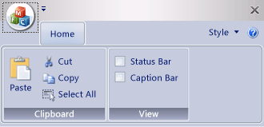
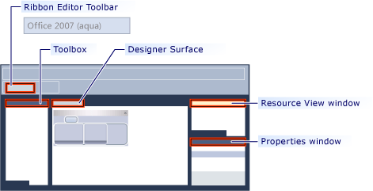

# Ribbon Designer (MFC)
The Ribbon Designer lets you create and customize ribbons in MFC applications. A ribbon is a user interface (UI) element that organizes commands into logical groups. These groups appear on separate tabs in a strip across the top of the window. The ribbon replaces the menu bar and toolbars. A ribbon can significantly improve application usability. For more information, see [Ribbons](http://go.microsoft.com/fwlink/linkid=129233). The following illustration shows a ribbon.  
  
   
  
 In earlier versions of Visual Studio, ribbons had to be created by writing code that uses the MFC ribbon classes such as [CMFCRibbonBar Class](../mfc/reference/cmfcribbonbar-class.md). In [!INCLUDE[vs_dev10_long](../build/includes/vs_dev10_long_md.md)], the ribbon designer provides an alternative method for building ribbons. First, create and customize a ribbon as a resource. Then load the ribbon resource from code in the MFC application. You can even use ribbon resources and MFC ribbon classes together. For example, you can create a ribbon resource, and then programmatically add more elements to it at runtime by using code.  
  
## Understanding the Ribbon Designer  
 The ribbon designer creates and stores the ribbon as a resource. When you create a ribbon resource, the ribbon designer does these three things:  
  
-   Adds an entry in the project resource definition script (*.rc). In the following example, `IDR_RIBBON` is the unique name that identifies the ribbon resource, `RT_RIBBON_XML` is the resource type, and `ribbon.mfcribbon-ms` is the name of the resource file.  
  
 ```  
    IDR_RIBBON RT_RIBBON_XML      "res\\ribbon.mfcribbon-ms"  
 ```  
  
-   Adds the definitions of Command IDs to resource.h.  
  
 ```  
 #define IDR_RIBBON            307  
 ```  
  
-   Creates a ribbon resource file (*.mfcribbon-ms) that contains the XML code that defines the ribbon's buttons, controls, and attributes. Changes to the ribbon in the ribbon designer are stored in the resource file as XML. The following code example shows part of the contents of a \*.mfcribbon-ms file:  
  
 ```  
 <RIBBON_BAR>  
 <ELEMENT_NAME>RibbonBar</ELEMENT_NAME>  
 <IMAGE>  
 <ID>  
 <NAME>IDB_BUTTONS</NAME>  
 <VALUE>113</VALUE>  
 </ID>   
 ```  
  
 To use the ribbon resource in your MFC application, load the resource by calling [CMFCRibbonBar::LoadFromResource](../mfc/reference/cmfcribbonbar-class.md#loadfromresource).  
  
## Creating a Ribbon By Using the Ribbon Designer  
 These are the two ways to add a ribbon resource to your MFC project:  
  
-   Create an MFC application and configure the MFC Project Wizard to create the ribbon. For more information, see [Walkthrough: Creating a Ribbon Application By Using MFC](../mfc/walkthrough-creating-a-ribbon-application-by-using-mfc.md).  
  
-   In an existing MFC project, create a ribbon resource and load it. For more information, see [Walkthrough: Updating the MFC Scribble Application (Part 1)](../mfc/walkthrough-updating-the-mfc-scribble-application-part-1.md).  
  
 If your project already has a manually coded ribbon, MFC has functions that you can use to convert the existing ribbon to a ribbon resource. For more information, see [How to: Convert an Existing MFC Ribbon to a Ribbon Resource](../mfc/how-to-convert-an-existing-mfc-ribbon-to-a-ribbon-resource.md).  
  
> [!NOTE]
>  Ribbons cannot be created in dialog-based applications. For more information, see [Application Type, MFC Application Wizard](../mfc/reference/application-type-mfc-application-wizard.md).  
  
## Customizing Ribbons  
 To open a ribbon in the ribbon designer, double-click the ribbon resource in Resource View. In the designer, you can add, remove, and customize elements on the ribbon, the Application button, or the quick access toolbar. You can also link events, for example, button-click events and menu events, to a method in your application.  
  
 The following illustration shows the various components in the ribbon designer.  
  
   
  
- **Toolbox:** Contains controls that can be dragged to the designer surface.  
  
- **Designer Surface:** Contains the visual representation of the ribbon resource.  
  
- **Properties window:** Lists the attributes of the item that is selected on the designer surface.  
  
- **Resource View window:** Displays the resources that include ribbon resources, in your project.  
  
- **Ribbon Editor Toolbar:** Contains commands that let you preview the ribbon and change its visual theme.  
  
 The following topics describe how to use the features in the ribbon designer:  
  
- [How to: Customize the Application Button](../mfc/how-to-customize-the-application-button.md)  
  
- [How to: Customize the Quick Access Toolbar](../mfc/how-to-customize-the-quick-access-toolbar.md)  
  
- [How to: Add Ribbon Controls and Event Handlers](../mfc/how-to-add-ribbon-controls-and-event-handlers.md)  
  
- [How to: Load a Ribbon Resource from an MFC Application](../mfc/how-to-load-a-ribbon-resource-from-an-mfc-application.md)  
  
## Definitions of Ribbon Elements  
   
  
- **Application button:** The button that appears on the upper-left corner of a ribbon. The Application button replaces the File menu and is visible even when the ribbon is minimized. When the button is clicked, a menu that has a list of commands is displayed.  
  
- **Quick Access toolbar:** A small, customizable toolbar that displays frequently used commands.  
  
- **Category**: The logical grouping that represents the contents of a ribbon tab.  
  
- **Category Default button:** The button that appears on the ribbon when the ribbon is minimized. When the button is clicked, the category reappears as a menu.  
  
- **Panel:** An area of the ribbon bar that displays a group of related controls. Every ribbon category contains one or more ribbon panels.  
  
- **Ribbon elements:** Controls in the panels, for example, buttons and combo boxes. To see the various controls that can be hosted on a ribbon, see [RibbonGadgets Sample: Ribbon Gadgets Application](../visual-cpp-samples.md).  
  
## See Also  
 [User Interface Elements](../mfc/user-interface-elements-mfc.md)   
 [Working with Resource Files](../windows/working-with-resource-files.md)

