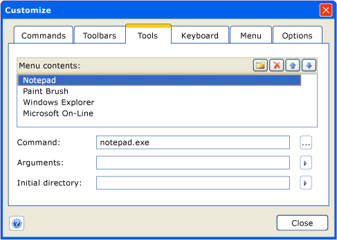

# User-defined Tools
MFC supports user-defined tools. A user-defined tool is a special command that executes an external, user-specified program. You can use the customization process to manage user-defined tools. However, you cannot use this process if your application object is not derived from [CWinAppEx Class](../mfc/reference/cwinappex-class.md). For more information about customization, see [Customization for MFC](../mfc/customization-for-mfc.md).  
  
 If you enabled user-defined tools support, the customization dialog box automatically includes the **Tools** tab. The following illustration shows the **Tools** page.  
  
   
Customization dialog box Tools tab  
  
## Enabling user-defined tools support  
 To enable user-defined tools in an application, call [CWinAppEx::EnableUserTools](../mfc/reference/cwinappex-class.md#enableusertools). However, you must first define several constants in the resource files of your application to use as parameters for this call.  
  
 In the resource editor create a dummy command that uses an appropriate command ID. In the following example, we use **ID_TOOLS_ENTRY** as the command ID. This command ID marks a location in one or more menus where the framework will insert the user-defined tools.  
  
 You must set aside some consecutive IDs in the string table to represent the user-defined tools. The number of strings that you set aside is equal to the maximum number of user tools that the users can define. In the following example, these are named **ID_USER_TOOL1** through **ID_USER_TOOL10**.  
  
 You can offer suggestions to the users to help them select directories and arguments for the external programs that will be called as tools. To do this, create two popup menus in the resource editor. In the following example these are named **IDR_MENU_ARGS** and **IDR_MENU_DIRS**. For each command in these menus, define a string in your application string table. The resource ID of the string must be equal to the command ID.  
  
 You can also create a derived class from [CUserTool Class](../mfc/reference/cusertool-class.md) to replace the default implementation. To do this, pass the runtime information for your derived class as the fourth parameter in CWinAppEx::EnableUserTools, instead of RUNTIME_CLASS([CUserTool Class](../mfc/reference/cusertool-class.md)).  
  
 After you define the appropriate constants, call [CWinAppEx::EnableUserTools](../mfc/reference/cwinappex-class.md#enableusertools) to enable user-defined tools.  
  
 The following method call shows how to use these constants:  
  
 [!code-cpp[NVC_MFC_VisualStudioDemo#1](../mfc/codesnippet/cpp/user-defined-tools_1.cpp)]  
  
 In this example, the tools tab will be included on the **Customization** dialog box. The framework will replace any command that matches the command ID **ID_TOOLS_ENTRY** in any menu with the set of currently defined user tools whenever a user opens that menu. The command IDs **ID_USER_TOOL1** through **ID_USER_TOOL10** are reserved for use for user-defined tools. The class [CUserTool Class](../mfc/reference/cusertool-class.md) handles calls to the user tools. The tool tab of the **Customization** dialog box provides buttons to the right of the argument and directory entry fields to access the menus **IDR_MENU_ARGS** and **IDR_MENU_DIRS**.When a user selects a command from one of these menus, the framework appends to the appropriate text box the string that has the resource ID equal to the command ID.  
  
### Including predefined tools  
 If you want to predefine some tools on the application startup, you must override the [CFrameWnd::LoadFrame](../mfc/reference/cframewnd-class.md#loadframe) method of the main window of your application. In that method, you must perform the following steps.  
  
##### To add new tools in LoadFrame  
  
1.  Obtain a pointer to the [CUserToolsManager Class](../mfc/reference/cusertoolsmanager-class.md) object by calling [CWinAppEx::GetUserToolsManager](../mfc/reference/cwinappex-class.md#getusertoolsmanager).  
  
2.  For every tool that you want to create, call [CUserToolsManager::CreateNewTool](../mfc/reference/cusertoolsmanager-class.md#createnewtool). This method returns a pointer to a [CUserTool Class](../mfc/reference/cusertool-class.md) object and adds the newly created user tool to the internal collection of tools. If you provided the runtime information for a derived class of [CUserTool Class](../mfc/reference/cusertool-class.md) as the fourth parameter of [CWinAppEx::EnableUserTools](../mfc/reference/cwinappex-class.md#enableusertools), [CUserToolsManager::CreateNewTool](../mfc/reference/cusertoolsmanager-class.md#createnewtool) will instantiate and return an instance of that class instead.  
  
3.  For each tool, set its text label by setting `CUserTool::m_strLabel` and set its command by calling `CUserTool::SetCommand`. The default implementation of [CUserTool Class](../mfc/reference/cusertool-class.md) automatically retrieves available icons from the program that is specified in the call to `SetCommand`.  
  
## See Also  
 [Customization for MFC](../mfc/customization-for-mfc.md)   
 [CUserTool Class](../mfc/reference/cusertool-class.md)   
 [CUserToolsManager Class](../mfc/reference/cusertoolsmanager-class.md)   
 [CWinAppEx Class](../mfc/reference/cwinappex-class.md)

