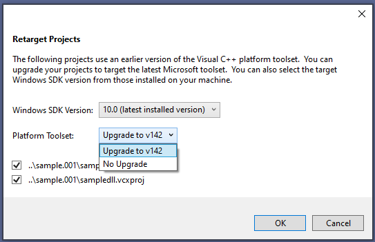
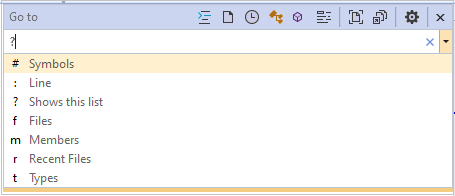
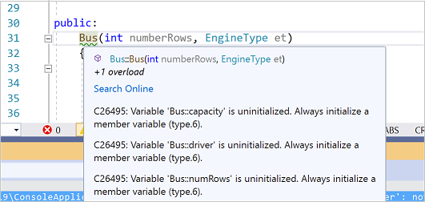
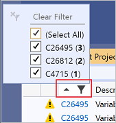
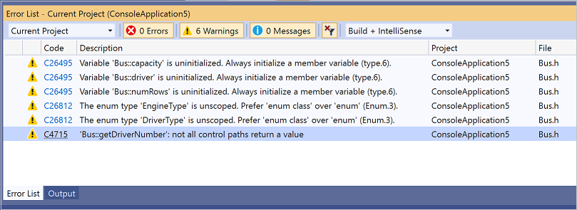

# Visual Studio IDE tools for upgrading C++ code

Visual Studio helps you upgrade legacy C++ code with compiler options, code analysis warnings, and editor features such as Quick Fixes, Quick Info, and the enhanced scroll bar. The term "legacy code" refers to any of these categories:

1. code that was formerly allowed by the Microsoft C++ compiler (MSVC) but never conformed to the C++ standard.\
   To upgrade older non-conformant MSVC code, turn on the [/permissive-](../build/reference/permissive-standards-conformance.md) compiler option. All instances of non-conformant usages are underlined with red squiggles in the code editor. The error messages in the **Error List** window include a recommendation for how to fix the error. Click on the error code to go to its help page in the documentation. If fixing all the errors at once is impractical, you can upgrade non-conformant code in stages by turning on the **permissive-** option, fixing some errors, then turning the option off again. The code will compile with the new improvements, and you can go back and fix the remaining issues at a later time. See the [/permissive-](../build/reference/permissive-standards-conformance.md) page for examples of non-conformant MSVC code.
1. code that was permitted in an earlier version of the C++ standard but has been deprecated or removed in a later version.\
   To upgrade to a newer language standard, set the [C++ Language Standard](../build/reference/std-specify-language-standard-version.md) option to the desired standard and fix any compile errors that are raised. In general, we recommend setting the language standard to [/std:c++17](../build/reference/std-specify-language-standard-version.md). The errors raised when upgrading to a newer standard are not related to the errors raised when using the **permissive-** option.
1. code that conforms to all versions of the standard but is no longer considered best practice in modern C++.\

## Open and convert a legacy project

If your legacy project is based on an older version of Visual Studio, you can open it in Visual Studio 2017 or Visual Studio 2019. Visual Studio automatically converts it to the current project schema with support for all the latest compiler and IDE features. 



For more information, see [Upgrade C++ projects from earlier versions of Visual Studio](upgrading-projects-from-earlier-versions-of-visual-cpp.md).

## Search the code base

Upgrading a code base often involves searching through multiple files. To search for anything in your code base, press **Ctrl+T** to bring up the **Go to All** search box.



To narrow the search scope, type one of the 1-letter filters, followed by a space and then the thing you are looking for.

## Error List

After you set the desired C++ Language Standard and any other compiler options, press **Ctrl+Shift+B** to compile your project. You can expect to see some errors and warnings in the form of red squiggles in various places in the code. The errors also appear in the **Error List**. For more information about an specific error, click on the error code to go to the help page in the documentation. Error codes that begin with a "C" are compiler errors. Codes that begin with "MSB" are MSBuild errors that indicate a problem with the project configuration.


The document health indicator at the bottom of the editor shows the number of errors and warnings in the current document, and enables you to navigate directly from one warning/error to the next.


In many cases, you can find more information about a specific error in the documentation on the Visual Studio change history and conformance improvements.

- [C++ conformance improvements](../overview/cpp-conformance-improvements.md)
- [Visual C++ Change History 2003 - 2015](visual-cpp-change-history-2003-2015.md)
- [Overview of potential upgrade issues](overview-of-potential-upgrade-issues-visual-cpp.md)

## Use code analysis to modernize your code base

For the third category, we recommend that you run code analysis on your project so that the code, at a minimum, conforms to the Microsoft Native Recommended Rules. These rules are a combination of rules defined by Microsoft and a subset of the [C++ Core Guidelines](https://isocpp.github.io/CppCoreGuidelines/CppCoreGuidelines). By conforming to the guidelines you will greatly reduce or eliminate common sources of bugs, and at the same time make your code more readable and therefore easier to maintain. Code Analysis using the Microsoft Native Recommended Rules is enabled by default. Code that violates one of the rules is flagged as a warning and is underlined with a green squiggle in the code editor. Hover over the squiggle to see a **QuickInfo** tooltip that describes the issue.



Click on the filter icon in the **Code** column to choose which warnings are displayed.



Code analysis errors and warnings also appear in the **Error List** just like compiler errors.



You can change which rules are active, and create custom rulesets. For more information about using Code Analysis, see [Code analysis for C/C++ overview](/visualstudio/code-quality/code-analysis-for-c-cpp-overview).

## Use Quick Actions to modernize code

The code editor provides Quick Actions for some common recommendations. When the light bulb icon is displayed, you can click on it to see the available Quick Actions.

### Convert macros to constexpr functions

The following image shows the use of macro called `AVERAGE`, which has the default semantic colorization. The image also shows the QuickInfo tooltip that is displayed when the mouse cursor hovers over it:


Because the use of macros is discouraged in modern C++, Visual Studio makes it easy to convert macros to **constexpr** functions:

1. Right-click on `AVERAGE` and choose **Go to Definition**.
2. Click on the screwdriver icon and choose **Convert macro to constexpr**

   

The macro is converted as shown below:


And the call to `AVERAGE` is now colorized as a function call, and the Quick Info tooltip shows the deduced type of the function:


### Initialize variables

Uninitialized variables can hold random values that lead to serious bugs. Code analysis flags these instances, and the editor provides a Quick Action:


### Convert to raw string literal

Raw string literals are less error-prone and more convenient to type than strings with embedded escape characters. Right-click on a string and choose **Quick Actions** to convert it to a raw string literal.


The string is converted to:

```cpp
R"(C:\Users\bjarnes\demo\output.txt)"
```
