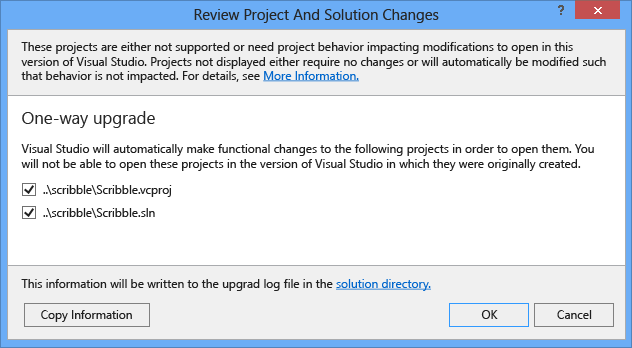
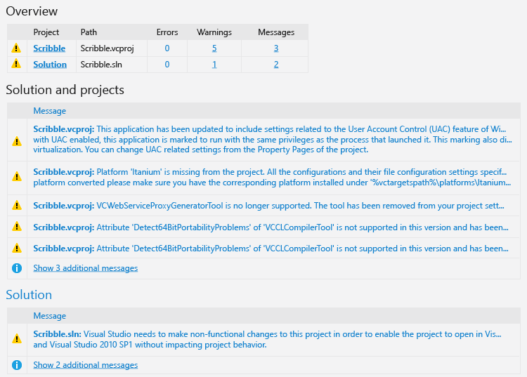

# Porting Guide: MFC Scribble
This topic is the first of several topics that introduce you to the upgrade procedure for Visual C++ projects that were created in older versions of Visual Studio to [!INCLUDE[cpp_dev14_long](../porting/includes/cpp_dev14_long_md.md)]. These topics introduce the upgrade process by example, starting with a very simple project and moving to slightly more complex ones. In this topic, we work through the upgrade process for a specific project, MFC Scribble. It is suitable as a basic introduction to the upgrade process for C++ projects.  
  
 Each version of Visual Studio introduces possible incompatibilities that can complicate moving code from an older version of Visual Studio to a newer one. Sometimes the required changes are in your code, so you must recompile and update your code, and sometimes the required changes are to the project files. When you open a project that was created with a previous version of Visual Studio, Visual Studio automatically asks you whether to update a project or solution to the latest version. These tools usually upgrade only the project files; they do not modify your source code.  
  
## MFC Scribble  
 MFC Scribble is a well-known sample that has been included in many different releases of Visual C++. It's a simple drawing application that illustrates some of the basic features of MFC. There are various versions of it available, including both managed and native code versions. For this example, we found an old version of Scribble in native code from Visual Studio 2005 and opened it in [!INCLUDE[vs_dev14](../ide/includes/vs_dev14_md.md)].  
  
 Before attempting to upgrade, we back up our entire solution and all its contents. Next, we needed to decide on the specific method of upgrade. For more complex solutions and projects that haven't been upgraded for a long time, you should consider upgrading one version of Visual Studio at a time. That way, you can narrow down which version of Visual Studio introduced a problem. For a simple project, it's worth trying to open it in the latest version of Visual Studio and allowing the wizard to convert the project. If that doesn't work, you can try upgrading one version at a time, if you have access to the appropriate versions of Visual Studio.  
  
 Note that you can also run devenv at the command line, using the `/Upgrade` option, instead of using the wizard to upgrade your projects. See [/Upgrade (devenv.exe)](../Topic/-Upgrade%20\(devenv.exe\).md). That could be helpful in automating the upgrade process for a large number of projects.  
  
### Step 1. Converting the Project File  
 When you open an old project file in Visual Studio 2015, Visual Studio offers to convert the project file to the most recent version, which we accepted. The following dialog box appeared:  
  
   
  
 An error occurred notifying us that the Itanium target is not available and won't be converted.  
  
```Output  
Platform 'Itanium' is missing from this project. All the configurations and their file configuration settings specific to this platform will be ignored. If you want this platform converted, please make sure you have the corresponding platform installed under '%vctargetpath%\platforms\Itanium'.Continue to convert this project without this platform?  
```  
  
 At the time the previous Scribble project was created, Itanium was an important target platform. The Windows platform no longer supports Itanium, so we chose to continue without supporting the Itanium platform.  
  
 Visual Studio then displayed a migration report listing all of the issues with the old project file.  
  
   
  
 In this case, the issues were all warnings, and Visual Studio made the appropriate changes in the project file. The big difference as far as the project is concerned is that the build tool changed from vcbuild to msbuild. This change was first introduced in Visual Studio 2010. Other changes include some rearrangement of the sequence of elements in the project file itself. None of the issues required further attention for this simple project.  
  
### Step 2. Getting it to build  
 Before building, we check the platform toolset so we know what compiler version the project system is using. In the project properties dialog, under **Configuration Properties**, in the **General** category, look at the **Platform Toolset** property. It contains the version of Visual Studio and the platform tool version number, which in this case is v140 for the [!INCLUDE[cpp_dev14_long](../porting/includes/cpp_dev14_long_md.md)] version of the tools. When you convert a project that was originally compiled with Visual C++ 2010, 2012, or 2013, the toolset is not automatically updated to the [!INCLUDE[cpp_dev14_long](../porting/includes/cpp_dev14_long_md.md)] toolset. In the case of Scribble, the version we converted was created for Visual Studio 2005, so it is converted to use the latest toolset.  
  
 When building, the first issue that appears is about MBCS code.  
  
```Output  
error MSB8031:  
```  
  
 The link in the error message takes us to a topic about the deprecation of MBCS in Visual Studio 2013. By default, the MFC installation in Visual C++ 2013 doesn't include the MBCS version of MFC. The MBCS version of MFC is required to build this project in its current form. We can either migrate the code to use Unicode, or we can download and install the MBCS version of MFC. If we go with downloading the MBCS version of MFC, we can add a definition for the macro NO_WARN_MBCS_MFC_DEPRECATION to suppress this warning.  
  
 To download the MBCS version of MFC, first read about the deprecation of the MBCS version of MFC in the article [MFC MBCS DLL Add-on](../mfc/mfc-mbcs-dll-add-on.md), and at the VC blog, and download the MBCS version of MFC [here](http://www.microsoft.com/download/details.aspx?id=44930). In the project properties dialog box, under the **C/C++** category, under **Preprocessor**, add the NO_WARN_MBCS_MFC_DEPRECATION to the list of predefined macros.  
  
 To make the switch to Unicode, open the project's properties, under **Configuration Properties**, choose the **General** section, and locate the **Character Set** property. Change this from **Use Multi-Byte Character Set** to **Use Unicode Character Set**. The effect of this change is that now the _UNICODE and UNICODE macros are defined and _MBCS is not, which you can verify in the properties dialog under the **C/C++** category at the **Command Line** property.  
  
```Output  
/GS /analyze- /W4 /Gy /Zc:wchar_t /Zi /Gm- /O2 /Ob1 /Fd".\Release\vc140.pdb" /Zc:inline /fp:precise /D "_AFXDLL" /D "WIN32" /D "NDEBUG" /D "_WINDOWS" /D "_UNICODE" /D "UNICODE" /errorReport:prompt /GF /WX /Zc:forScope /Gd /Oy /MD /Fa".\Release\" /EHsc /nologo /Fo".\Release\" /Fp".\Release\Scribble.pch"  
```  
  
 Although Scribble project wasn't set up to compile with Unicode characters, it was already written with TCHAR instead of char, so nothing actually needs to be changed. The project builds successfully with the Unicode character set.  
  
 However, there's another problem. The compiler tells us that _WINNT32_WINNT is not defined:  
  
```Output  
_WIN32_WINNT not defined. Defaulting to _WIN32_WINNT_MAXVER (see WinSDKVer.h)  
```  
  
 This is a warning, not an error, and is very common when upgrading a Visual C++ project. This is the macro that defines what the lowest version of Windows that our application will run on. If we ignore the warning, we accept the default value, _WIN32_WINNT_MAXVER, which means the current version of Windows. For a table of possible values, see [Using the Windows Headers](https://msdn.microsoft.com/en-us/library/aa383745.aspx). For example, we can set it to run on any version from Vista onwards.  
  
```  
#define _WIN32_WINNT _WIN32_WINNT_VISTA  
```  
  
 If the code uses parts of the Windows API that aren't available on the version of Windows that you specify with this macro, you should see that as a compiler error. In the case of the Scribble code, there is no error.  
  
### Step 3. Testing and debugging  
 There is no test suite, so we just started the app, tested its features manually through the UI. No issues were observed.  
  
### Step 4. Improve the code  
 Now that you've migrated to Visual Studio 2015, you might want to make some changes to take advantage of new C++ features. The current version of Visual C++ compiler is much more conformant to the C++ standard then previous versions, so if you have a mind to make some code changes to make your code more secure, and more portable to other compilers and operating systems, you should consider some improvements.  
  
## Next steps  
 Scribble was a small and simple Windows desktop application, and it wasn't hard to convert. Many small, simple apps convert just as easily to the new version.  For more complex applications, with many more lines of code, older legacy code that might not be up to modern engineering standards, multiple projects and libraries, custom build steps, or for complex scripted automated builds, it will take more time to upgrade. Continue with the [next example](../porting/porting-guide-com-spy.md), an ATL/COM application called COM Spy.  
  
## See Also  
 [Porting and Upgrading: Examples and Case Studies](../porting/porting-and-upgrading-examples-and-case-studies.md)   
 [Next Example: COM Spy](../porting/porting-guide-com-spy.md)