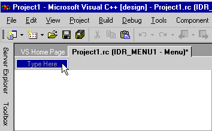

# Creating a Menu

> [!NOTE]
> The **Resource Window** is not available in Express editions.

### To create a standard menu

1. From the **View** menu, click on **Resource View** and then right-click on the **Menu** heading and choose **Add Resource**. Choose **Menu**.

2. Select the **New Item** box (the rectangle that contains "Type Here") on the menu bar.

       
New Item Box

3. Type a name for your new menu, for example, "File".

     The text you type appears in both the **Menu** editor and in the **Caption** box in the [Properties Window](/visualstudio/ide/reference/properties-window). You can edit the properties for your new menu in either location.

     Once you have given your new menu a name on the menu bar, the new-item box shifts to the right (to allow you to add another menu), and another new-item box opens below your first menu so you can add menu commands to it.

       
New Item Box with Focus Shifted After You Type Menu Name

   > [!NOTE]
   > To create a single-item menu on the menu bar, set the **Popup** property to **False**.

For information on adding resources to managed projects, please see [Resources in Desktop Apps](/dotnet/framework/resources/index) in the *.NET Framework Developer's Guide*. For information on manually adding resource files to managed projects, accessing resources, displaying static resources, and assigning resource strings to properties, see [Creating Resource Files for Desktop Apps](/dotnet/framework/resources/creating-resource-files-for-desktop-apps). For information on globalization and localization of resources in managed apps, see [Globalizing and Localizing .NET Framework Applications](/dotnet/standard/globalization-localization/index).

## Requirements

Win32

## See Also

[Menu Editor](../windows/menu-editor.md)