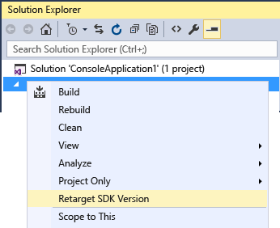
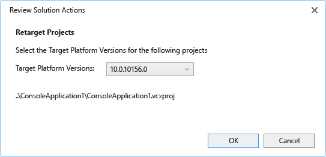

# How to: Use the Windows 10 SDK in a Windows Desktop Application

When you create a classic Windows desktop project in Visual Studio 2017, it is set up by default to build with the version of the Windows 10 SDK that was installed when the C++ Desktop workload was installed or last updated. This version of the Windows SDK is compatible with Windows 7 and later. See [Using the Windows Headers](/windows/desktop/WinProg/using-the-windows-headers) for more information about targeting specific versions of Windows.

If you want to target an earlier version of the SDK, you can open **Project | Properties** and choose from the other SDK versions available in the Windows SDK Version dropdown.

Starting with Visual Studio 2015 and the Windows 10 SDK, the CRT library was separated into two parts, one (ucrtbase) that contains the functions that are acceptable to be used in Universal Windows Apps, and one that contains everything else (vcruntime140). Since the Windows 10 SDK contains new functions, such as many C99 functions, you need to follow these steps in order to use those functions. See [CRT Library Features](../c-runtime-library/crt-library-features.md).

### To target the Windows 10 SDK

1. Make sure the Windows 10 SDK is installed. The Windows 10 SDK is installed as part of the **Desktop development with C++** workload. A standalone version is available at [Downloads and tools for Windows 10](https://developer.microsoft.com/windows/downloads).

2. Open the shortcut menu for the project node, and choose **Retarget SDK Version**.

   

   The **Review Solution Actions** dialog appears.

   

3. In the **Target Platform Version** dropdown list, choose the version of the Windows 10 SDK you want to target. Choose the OK button to apply the change.

   Note that 8.1 in this context refers to the Windows SDK version, which is also backwardly compatible with Windows 8, Windows Server 2012, Windows 7, Windows Server 2008, and Windows Vista.

   If this step is successful, the following text appears in the Output window:

   `Retargeting End: 1 completed, 0 failed, 0 skipped`

4. Open the project properties, and in the **Configuration Properties, General** section, notice the values of **Windows Target Platform Version**. Changing the value here has the same effect as following this procedure. See [General Property Page (Project)](../build/reference/general-property-page-project.md).

   

   This action changes the values of project macros that include paths to header files and library files. To see what changed, in the **Visual C++ Directories** section of the **Project Properties** dialog, choose one of the properties such as the **Include Directories**, choose to open the dropdown list, and choose \<Edit>. The **Include Directories** dialog appears.

   

   Choose the **Macros >>** button, and scroll down the list of macros to the Windows SDK macros to see all the new values.

   

5. Repeat for other projects, as needed, and rebuild the solution.

### To target the Windows 8.1 SDK

1. Open the shortcut menu for the project node, and choose **Retarget SDK Version**.

2. In the **Target Platform Version** dropdown list, choose **8.1**.

## See Also

[Windows Desktop Applications (Visual C++)](../windows/how-to-use-the-windows-10-sdk-in-a-windows-desktop-application.md)