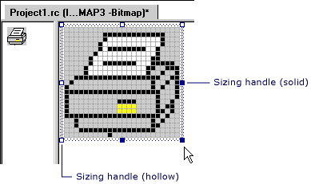

# Resizing an Image (Image Editor for Icons)

The behavior of the **Image** editor while resizing an image depends on whether you've [selected](../windows/selecting-an-area-of-an-image-image-editor-for-icons.md) the entire image or just part of it.

When the selection includes only part of the image, the **Image** editor shrinks the selection by deleting rows or columns of pixels and filling the vacated regions with the current background color. It can also stretch the selection by duplicating rows or columns of pixels.

When the selection includes the entire image, the **Image** editor either shrinks and stretches the image, or crops and extends it.

There are two mechanisms for resizing an image: the sizing handles and the [Properties window](/visualstudio/ide/reference/properties-window). You drag the sizing handles to change the size of all or part of an image. Sizing handles that you can drag are solid. You can't drag handles that are hollow. Use the **Properties** window to resize the entire image only, not a selected part.

 
Sizing Handles

> [!NOTE]
> If you have the **Tile Grid** option selected in the [Grid Settings dialog box](../windows/grid-settings-dialog-box-image-editor-for-icons.md), then resizing snaps to the next tile grid line. If only the **Pixel Grid** option is selected (the default setting), resizing snaps to the next available pixel.

For information on adding resources to managed projects, see [Resources in Desktop Apps](/dotnet/framework/resources/index) in the *.NET Framework Developer's Guide*. For information on manually adding resource files to managed projects, accessing resources, displaying static resources, and assigning resource strings to properties, see [Creating Resource Files for Desktop Apps](/dotnet/framework/resources/creating-resource-files-for-desktop-apps). For information on globalization and localization of resources in managed apps, see [Globalizing and Localizing .NET Framework Applications](/dotnet/standard/globalization-localization/index).

## To resize an entire image using the properties window

1. Open the image whose properties you want to change.

1. In the **Width** and **Height** boxes in the [Properties window](/visualstudio/ide/reference/properties-window), type the dimensions that you want.

   If you're increasing the size of the image, the **Image** editor extends the image to the right, downward, or both, and fills the new region with the current background color. The image isn't stretched.

   If you shorten the size of the image, the **Image** editor crops the image on the right or bottom edge, or both.

   > [!NOTE]
   > You can use the **Width** and **Height** properties to resize only the entire image, not to resize a partial selection.

## To crop or extend an entire image

1. Select the entire image.

   If part of the image is currently selected, and you want to select the entire image, select anywhere on the image outside the current selection border.

1. Drag a sizing handle until the image is the right size.

Normally, the **Image** editor crops or enlarges an image when you resize it by moving a sizing handle. If you hold down the **Shift** key as you move a sizing handle, the **Image** editor shrinks or stretches the image.

## To shrink or stretch an entire image

1. Select the entire image.

   If a part of the image is currently selected and you want to select the entire image, select anywhere on the image outside the current selection border.

1. Hold down the **Shift** key and drag a sizing handle until the image is the right size.

## To shrink or stretch part of an image

1. Select the part of the image you want to resize. For more information, see [Selecting an Area of the Image](../windows/selecting-an-area-of-an-image-image-editor-for-icons.md).

1. Drag one of the sizing handles until the selection is the right size.

## Requirements

None

## See Also

[Accelerator Keys](../windows/accelerator-keys-image-editor-for-icons.md) 
[Editing Graphical Resources](../windows/editing-graphical-resources-image-editor-for-icons.md) 
[Image Editor for Icons](../windows/image-editor-for-icons.md)