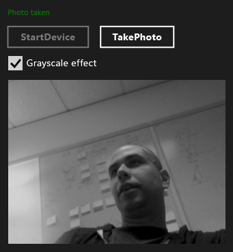

# Walkthrough: Creating a UWP app using WRL and Media Foundation

Learn how to use the Windows Runtime C++ Template Library (WRL) to create a Universal Windows Platform (UWP) app that uses [Microsoft Media Foundation](http://msdn.microsoft.com/library/windows/apps/ms694197).

This example creates a custom Media Foundation transform that applies a grayscale effect to images that are captured from a webcam. The app uses C++ to define the custom transform and C# to use the component to transform the captured images.

> [!NOTE]
> Instead of C#, you can also use JavaScript, Visual Basic, or C++ to consume the custom transform component.

In most cases, you can use C++/CX to create Windows Runtime). However, sometimes you have to use the WRL. For example, when you create a media extension for Microsoft Media Foundation, you must create a component that implements both COM and Windows Runtime interfaces. Because C++/CX can only create Windows Runtime objects, to create a media extension you must use the WRL because it enables the implementation of both COM and Windows Runtime interfaces.

> [!NOTE]
> Although this code example is long, it demonstrates the minimum that's required to create a useful Media Foundation transform. You can use it as a starting point for your own custom transform. This example is adapted from the [Media extensions sample](http://code.msdn.microsoft.com/windowsapps/Media-extensions-sample-7b466096), which uses media extensions to apply effects to video, decode video, and create scheme handlers that produce media streams.

## Prerequisites

- Experience with the [Windows Runtime](http://msdn.microsoft.com/library/windows/apps/br211377.aspx).

- Experience with COM.

- A webcam.

## Key points

- To create a custom Media Foundation component, use a Microsoft Interface Definition Language (MIDL) definition file to define an interface, implement that interface, and then make it activatable from other components.

- The `namespace` and `runtimeclass` attributes, and the `NTDDI_WIN8`[version](/windows/desktop/Midl/version) attribute value are important parts of the MIDL definition for a Media Foundation component that uses WRL.

- [Microsoft::WRL::RuntimeClass](../windows/runtimeclass-class.md) is the base class for the custom Media Foundation component. The [Microsoft::WRL::RuntimeClassType::WinRtClassicComMix](../windows/runtimeclasstype-enumeration.md) enum value, which is provided as a template argument, marks the class for use both as a Windows Runtime class and as a classic COM runtime class.

- The [InspectableClass](../windows/inspectableclass-macro.md) macro implements basic COM functionality such as reference counting and the `QueryInterface` method, and sets the runtime class name and trust level.

- Use the Microsoft::WRL::[Module class](https://www.microsoftonedoc.com/#/organizations/e6f6a65cf14f462597b64ac058dbe1d0/projects/3fedad16-eaf1-41a6-8f96-0c1949c68f32/containers/a3daf831-1c5f-4bbe-964d-503870caf874/tocpaths/b4acf5de-2f4c-4c8b-b5ff-9140d023ecbe/locales/en-US) to implement DLL entry-point functions such as [DllGetActivationFactory](http://msdn.microsoft.com/library/br205771.aspx), [DllCanUnloadNow](/windows/desktop/api/combaseapi/nf-combaseapi-dllcanunloadnow), and [DllGetClassObject](/windows/desktop/api/combaseapi/nf-combaseapi-dllgetclassobject).

- Link your component DLL to runtimeobject.lib. Also specify [/WINMD](../cppcx/compiler-and-linker-options-c-cx.md) on the linker line to generate Windows metadata.

- Use project references to make WRL components accessible to UWP apps.

### To use the WRL to create the Media Foundation grayscale transform component

1. In Visual Studio, create a **Blank Solution** project. Name the project, for example, *MediaCapture*.

2. Add a **DLL (Universal Windows)** project to the solution. Name the project, for example, *GrayscaleTransform*.

3. Add a **Midl File (.idl)** file to the project. Name the file, for example, *GrayscaleTransform.idl*.

4. Add this code to GrayscaleTransform.idl.

   [!code-cpp[wrl-media-capture#1](../windows/codesnippet/CPP/walkthrough-creating-a-windows-store-app-using-wrl-and-media-foundation_1.idl)]

5. Use the following code to replace the contents of `pch.h`.

   [!code-cpp[wrl-media-capture#2](../windows/codesnippet/CPP/walkthrough-creating-a-windows-store-app-using-wrl-and-media-foundation_2.h)]

6. Add a new header file to the project, name it `BufferLock.h`, and then add this code:

   [!code-cpp[wrl-media-capture#3](../windows/codesnippet/CPP/walkthrough-creating-a-windows-store-app-using-wrl-and-media-foundation_3.h)]

7. `GrayscaleTransform.h` is not used in this example. You can remove it from the project if you want to.

8. Use the following code to replace the contents of `GrayscaleTransform.cpp`.

   [!code-cpp[wrl-media-capture#4](../windows/codesnippet/CPP/walkthrough-creating-a-windows-store-app-using-wrl-and-media-foundation_4.cpp)]

9. Add a new module-definition file to the project, name it `GrayscaleTransform.def`, and then add this code:

   ```
   EXPORTS
       DllCanUnloadNow                     PRIVATE
       DllGetActivationFactory             PRIVATE
       DllGetClassObject                   PRIVATE
   ```

10. Use the following code to replace the contents of `dllmain.cpp`.

   [!code-cpp[wrl-media-capture#6](../windows/codesnippet/CPP/walkthrough-creating-a-windows-store-app-using-wrl-and-media-foundation_6.cpp)]

11. In the project’s **Property Pages** dialog box, set the following **Linker** properties.

   1. Under **Input**, for the **Module Definition File**, specify `GrayScaleTransform.def`.

   2. Also under **Input**, add `runtimeobject.lib`, `mfuuid.lib`, and `mfplatf.lib` to the **Additional Dependencies** property.

   3. Under **Windows Metadata**, set **Generate Windows Metadata** to **Yes (/WINMD)**.

### To use the WRL the custom Media Foundation component from a C# app

1. Add a new **C# Blank App (XAML)** project to the `MediaCapture` solution. Name the project, for example, *MediaCapture*.

2. In the **MediaCapture** project, add a reference to the `GrayscaleTransform` project. To learn how, see [How to: Add or Remove References By Using the Reference Manager](/visualstudio/ide/how-to-add-or-remove-references-by-using-the-reference-manager).

3. In `Package.appxmanifest`, on the **Capabilities** tab, select **Microphone** and **Webcam**. Both capabilities are required to capture photos from the webcam.

4. In `MainPage.xaml`, add this code to the root [Grid](http://msdn.microsoft.com/library/windows/apps/xaml/windows.ui.xaml.controls.grid.aspx) element:

   [!code-xml[wrl-media-capture#7](../windows/codesnippet/Xaml/walkthrough-creating-a-windows-store-app-using-wrl-and-media-foundation_7.xaml)]

5. Use the following code to replace the contents of `MainPage.xaml.cs`.

   [!code-cs[wrl-media-capture#8](../windows/codesnippet/CSharp/walkthrough-creating-a-windows-store-app-using-wrl-and-media-foundation_8.cs)]

The following illustration shows the `MediaCapture app`.



## Next Steps

The example shows how to capture photos from the default webcam one at a time. The [Media extensions sample](http://code.msdn.microsoft.com/windowsapps/Media-extensions-sample-7b466096) does more. It demonstrates how to enumerate webcam devices and work with local scheme handlers, and demonstrates additional media effects that work on both individual photos and streams of video.

## See Also

[Windows Runtime C++ Template Library (WRL)](../windows/windows-runtime-cpp-template-library-wrl.md)  
[Microsoft Media Foundation](http://msdn.microsoft.com/library/windows/apps/ms694197)  
[Media extensions sample](http://code.msdn.microsoft.com/windowsapps/Media-extensions-sample-7b466096)