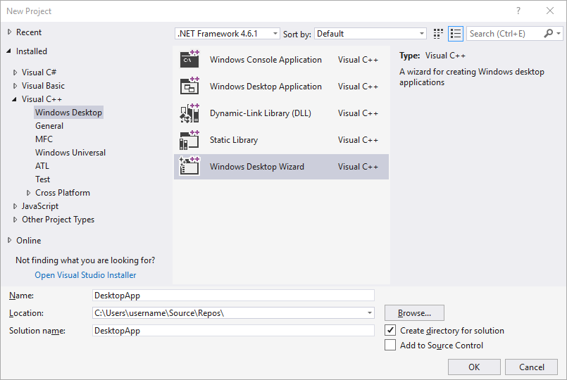
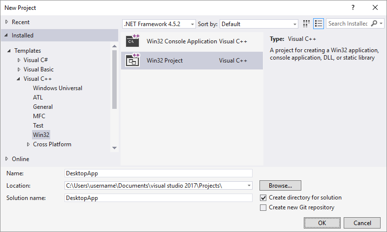
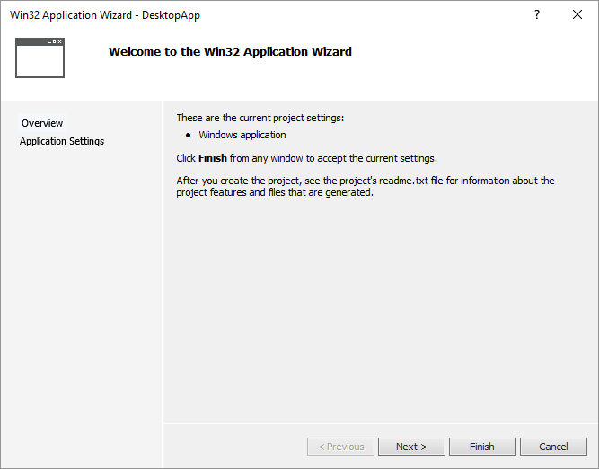
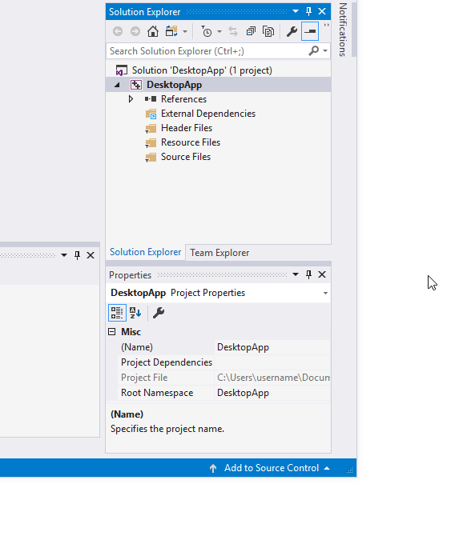
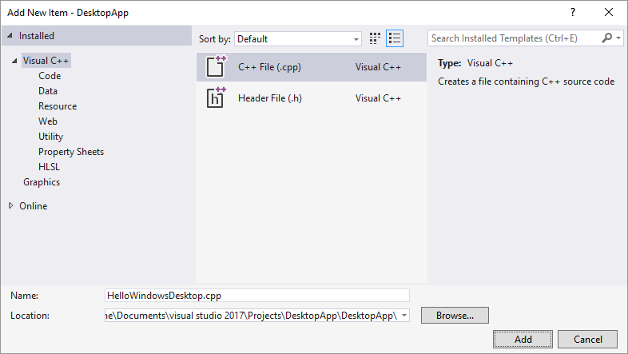
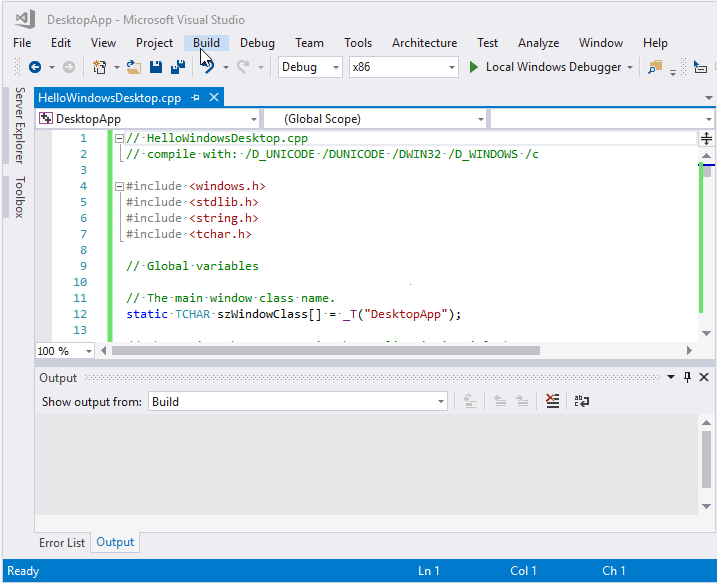

# Walkthrough: Create a traditional Windows Desktop application (C++)

This walkthrough shows how to create a traditional Windows desktop application in Visual Studio. The example application you'll create uses the Windows API to display "Hello, Windows desktop!" in a window. You can use the code that you develop in this walkthrough as a pattern to create other Windows desktop applications.

The Windows API (also known as the Win32 API, Windows Desktop API, and Windows Classic API) is a C-language-based framework for creating Windows applications. It has been in existence since the 1980s and has been used to create Windows applications for decades. More advanced and easier-to-program frameworks have been built on top of the Windows API. For example, MFC, ATL, the .NET frameworks. Even the most modern Windows Runtime code for UWP and Store apps written in C++/WinRT uses the Windows API underneath. For more information about the Windows API, see [Windows API Index](/windows/win32/apiindex/windows-api-list). There are many ways to create Windows applications, but the process above was the first.

> [!IMPORTANT]
> For the sake of brevity, some code statements are omitted in the text. The [Build the code](#build-the-code) section at the end of this document shows the complete code.

## Prerequisites

- A computer that runs Microsoft Windows 7 or later versions. We recommend Windows 10 for the best development experience.

- A copy of Visual Studio. For information on how to download and install Visual Studio, see [Install Visual Studio](/visualstudio/install/install-visual-studio). When you run the installer, make sure that the **Desktop development with C++** workload is checked. Don't worry if you didn't install this workload when you installed Visual Studio. You can run the installer again and install it now.

   

- An understanding of the basics of using the Visual Studio IDE. If you've used Windows desktop apps before, you can probably keep up. For an introduction, see [Visual Studio IDE feature tour](/visualstudio/ide/visual-studio-ide).

- An understanding of enough of the fundamentals of the C++ language to follow along. Don't worry, we don't do anything too complicated.

## Create a Windows desktop project

Follow these steps to create your first Windows desktop project. As you go, you'll enter the code for a working Windows desktop application. There's a version selector in the upper left of this page. Make sure it's set to the version of Visual Studio that you're using.

::: moniker range="vs-2019"

### To create a Windows desktop project in Visual Studio 2019

1. From the main menu, choose **File** > **New** > **Project** to open the **Create a New Project** dialog box.

1. At the top of the dialog, set **Language** to **C++**, set **Platform** to **Windows**, and set **Project type** to **Desktop**.

1. From the filtered list of project types, choose **Windows Desktop Wizard** then choose **Next**. In the next page, enter a name for the project, for example, *DesktopApp*.

1. Choose the **Create** button to create the project.

1. The **Windows Desktop Project** dialog now appears. Under **Application type**, select **Desktop application (.exe)**. Under **Additional options**, select **Empty project**. Choose **OK** to create the project.

1. In **Solution Explorer**, right-click the **DesktopApp** project, choose **Add**, and then choose **New Item**.

   

1. In the **Add New Item** dialog box, select **C++ File (.cpp)**. In the **Name** box, type a name for the file, for example, *HelloWindowsDesktop.cpp*. Choose **Add**.

   

Your project is now created and your source file is opened in the editor. To continue, skip ahead to [Create the code](#create-the-code).

::: moniker-end

::: moniker range="vs-2017"

### To create a Windows desktop project in Visual Studio 2017

1. On the **File** menu, choose **New** and then choose **Project**.

1. In the **New Project** dialog box, in the left pane, expand **Installed** > **Visual C++**, then select **Windows Desktop**. In the middle pane, select **Windows Desktop Wizard**.

   In the **Name** box, type a name for the project, for example, *DesktopApp*. Choose **OK**.

   

1. In the **Windows Desktop Project** dialog, under **Application type**, select **Windows application (.exe)**. Under **Additional options**, select **Empty project**. Make sure **Precompiled Header** isn't selected. Choose **OK** to create the project.

1. In **Solution Explorer**, right-click the **DesktopApp** project, choose **Add**, and then choose **New Item**.

   

1. In the **Add New Item** dialog box, select **C++ File (.cpp)**. In the **Name** box, type a name for the file, for example, *HelloWindowsDesktop.cpp*. Choose **Add**.

   

Your project is now created and your source file is opened in the editor. To continue, skip ahead to [Create the code](#create-the-code).

::: moniker-end

::: moniker range="vs-2015"

### To create a Windows desktop project in Visual Studio 2015

1. On the **File** menu, choose **New** and then choose **Project**.

1. In the **New Project** dialog box, in the left pane, expand **Installed** > **Templates** > **Visual C++**, and then select **Win32**. In the middle pane, select **Win32 Project**.

   In the **Name** box, type a name for the project, for example, *DesktopApp*. Choose **OK**.

   

1. On the **Overview** page of the **Win32 Application Wizard**, choose **Next**.

   

1. On the **Application Settings** page, under **Application type**, select **Windows application**. Under **Additional options**, uncheck **Precompiled header**, then select **Empty project**. Choose **Finish** to create the project.

1. In **Solution Explorer**, right-click the DesktopApp project, choose **Add**, and then choose **New Item**.

   

1. In the **Add New Item** dialog box, select **C++ File (.cpp)**. In the **Name** box, type a name for the file, for example, *HelloWindowsDesktop.cpp*. Choose **Add**.

   

Your project is now created and your source file is opened in the editor.

::: moniker-end

## Create the code

Next, you'll learn how to create the code for a Windows desktop application in Visual Studio.

### To start a Windows desktop application

1. Just as every C application and C++ application must have a `main` function as its starting point, every Windows desktop application must have a `WinMain` function. `WinMain` has the following syntax.

   ```cpp
   int CALLBACK WinMain(
      _In_ HINSTANCE hInstance,
      _In_opt_ HINSTANCE hPrevInstance,
      _In_ LPSTR     lpCmdLine,
      _In_ int       nCmdShow
   );
   ```

   For information about the parameters and return value of this function, see [WinMain entry point](/windows/win32/api/winbase/nf-winbase-winmain).

   > [!NOTE]
   > What are all those extra words, such as `CALLBACK`, or `HINSTANCE`, or `_In_`? The traditional Windows API uses typedefs and preprocessor macros extensively to abstract away some of the details of types and platform-specific code, such as calling conventions, **__declspec** declarations, and compiler pragmas. In Visual Studio, you can use the IntelliSense [Quick Info](/visualstudio/ide/using-intellisense#quick-info) feature to see what these typedefs and macros define. Hover your mouse over the word of interest, or select it and press **Ctrl**+**K**, **Ctrl**+**I** for a small pop-up window that contains the definition. For more information, see [Using IntelliSense](/visualstudio/ide/using-intellisense). Parameters and return types often use *SAL Annotations* to help you catch programming errors. For more information, see [Using SAL Annotations to Reduce C/C++ Code Defects](/cpp/code-quality/using-sal-annotations-to-reduce-c-cpp-code-defects).

1. Windows desktop programs require &lt;windows.h>. &lt;tchar.h> defines the `TCHAR` macro, which resolves ultimately to **wchar_t** if the UNICODE symbol is defined in your project, otherwise it resolves to **char**.  If you always build with UNICODE enabled, you don't need TCHAR and can just use **wchar_t** directly.

   ```cpp
   #include <windows.h>
   #include <tchar.h>
   ```

1. Along with the `WinMain` function, every Windows desktop application must also have a window-procedure function. This function is typically named `WndProc`, but you can name it whatever you like. `WndProc` has the following syntax.

   ```cpp
   LRESULT CALLBACK WndProc(
      _In_ HWND   hWnd,
      _In_ UINT   message,
      _In_ WPARAM wParam,
      _In_ LPARAM lParam
   );
   ```

   In this function, you write code to handle *messages* that the application receives from Windows when *events* occur. For example, if a user chooses an OK button in your application, Windows will send a message to you and you can write code inside your `WndProc` function that does whatever work is appropriate. It's called *handling* an event. You only handle the events that are relevant for your application.

   For more information, see [Window Procedures](/windows/win32/winmsg/window-procedures).

### To add functionality to the WinMain function

1. In the `WinMain` function, you populate a structure of type [WNDCLASSEX](/windows/win32/api/winuser/ns-winuser-wndclassexw). The structure contains information about the window: the application icon, the background color of the window, the name to display in the title bar, among other things. Importantly, it contains a function pointer to your window procedure. The following example shows a typical `WNDCLASSEX` structure.

   ```cpp
   WNDCLASSEX wcex;

   wcex.cbSize         = sizeof(WNDCLASSEX);
   wcex.style          = CS_HREDRAW | CS_VREDRAW;
   wcex.lpfnWndProc    = WndProc;
   wcex.cbClsExtra     = 0;
   wcex.cbWndExtra     = 0;
   wcex.hInstance      = hInstance;
   wcex.hIcon          = LoadIcon(hInstance, IDI_APPLICATION);
   wcex.hCursor        = LoadCursor(NULL, IDC_ARROW);
   wcex.hbrBackground  = (HBRUSH)(COLOR_WINDOW+1);
   wcex.lpszMenuName   = NULL;
   wcex.lpszClassName  = szWindowClass;
   wcex.hIconSm        = LoadIcon(wcex.hInstance, IDI_APPLICATION);
   ```

   For information about the fields of the structure above, see [WNDCLASSEX](/windows/win32/api/winuser/ns-winuser-wndclassexw).

1. Register the `WNDCLASSEX` with Windows so that it knows about your window and how to send messages to it. Use the [RegisterClassEx](/windows/win32/api/winuser/nf-winuser-registerclassexw) function and pass the window class structure as an argument. The `_T` macro is used because we use the `TCHAR` type.

   ```cpp
   if (!RegisterClassEx(&wcex))
   {
      MessageBox(NULL,
         _T("Call to RegisterClassEx failed!"),
         _T("Windows Desktop Guided Tour"),
         NULL);

      return 1;
   }
   ```

1. Now you can create a window. Use the [CreateWindow](/windows/win32/api/winuser/nf-winuser-createwindoww) function.

   ```cpp
   static TCHAR szWindowClass[] = _T("DesktopApp");
   static TCHAR szTitle[] = _T("Windows Desktop Guided Tour Application");

   // The parameters to CreateWindow explained:
   // szWindowClass: the name of the application
   // szTitle: the text that appears in the title bar
   // WS_OVERLAPPEDWINDOW: the type of window to create
   // CW_USEDEFAULT, CW_USEDEFAULT: initial position (x, y)
   // 500, 100: initial size (width, length)
   // NULL: the parent of this window
   // NULL: this application does not have a menu bar
   // hInstance: the first parameter from WinMain
   // NULL: not used in this application
   HWND hWnd = CreateWindow(
      szWindowClass,
      szTitle,
      WS_OVERLAPPEDWINDOW,
      CW_USEDEFAULT, CW_USEDEFAULT,
      500, 100,
      NULL,
      NULL,
      hInstance,
      NULL
   );
   if (!hWnd)
   {
      MessageBox(NULL,
         _T("Call to CreateWindow failed!"),
         _T("Windows Desktop Guided Tour"),
         NULL);

      return 1;
   }
   ```

   This function returns an `HWND`, which is a handle to a window. A handle is somewhat like a pointer that Windows uses to keep track of open windows. For more information, see [Windows Data Types](/windows/win32/WinProg/windows-data-types).

1. At this point, the window has been created, but we still need to tell Windows to make it visible. That's what this code does:

   ```cpp
   // The parameters to ShowWindow explained:
   // hWnd: the value returned from CreateWindow
   // nCmdShow: the fourth parameter from WinMain
   ShowWindow(hWnd,
      nCmdShow);
   UpdateWindow(hWnd);
   ```

   The displayed window doesn't have much content because you haven't yet implemented the `WndProc` function. In other words, the application isn't yet handling the messages that Windows is now sending to it.

1. To handle the messages, we first add a message loop to listen for the messages that Windows sends. When the application receives a message, this loop dispatches it to your `WndProc` function to be handled. The message loop resembles the following code.

   ```cpp
   MSG msg;
   while (GetMessage(&msg, NULL, 0, 0))
   {
      TranslateMessage(&msg);
      DispatchMessage(&msg);
   }

   return (int) msg.wParam;
   ```

   For more information about the structures and functions in the message loop, see [MSG](/windows/win32/api/winuser/ns-winuser-msg), [GetMessage](/windows/win32/api/winuser/nf-winuser-getmessage), [TranslateMessage](/windows/win32/api/winuser/nf-winuser-translatemessage), and [DispatchMessage](/windows/win32/api/winuser/nf-winuser-dispatchmessage).

   At this point, the `WinMain` function should resemble the following code.

   ```cpp
   int WINAPI WinMain(HINSTANCE hInstance,
                      HINSTANCE hPrevInstance,
                      LPSTR lpCmdLine,
                      int nCmdShow)
   {
      WNDCLASSEX wcex;

      wcex.cbSize = sizeof(WNDCLASSEX);
      wcex.style          = CS_HREDRAW | CS_VREDRAW;
      wcex.lpfnWndProc    = WndProc;
      wcex.cbClsExtra     = 0;
      wcex.cbWndExtra     = 0;
      wcex.hInstance      = hInstance;
      wcex.hIcon          = LoadIcon(hInstance, IDI_APPLICATION);
      wcex.hCursor        = LoadCursor(NULL, IDC_ARROW);
      wcex.hbrBackground  = (HBRUSH)(COLOR_WINDOW+1);
      wcex.lpszMenuName   = NULL;
      wcex.lpszClassName  = szWindowClass;
      wcex.hIconSm        = LoadIcon(wcex.hInstance, IDI_APPLICATION);

      if (!RegisterClassEx(&wcex))
      {
         MessageBox(NULL,
            _T("Call to RegisterClassEx failed!"),
            _T("Windows Desktop Guided Tour"),
            NULL);

         return 1;
      }

      // Store instance handle in our global variable
      hInst = hInstance;

      // The parameters to CreateWindow explained:
      // szWindowClass: the name of the application
      // szTitle: the text that appears in the title bar
      // WS_OVERLAPPEDWINDOW: the type of window to create
      // CW_USEDEFAULT, CW_USEDEFAULT: initial position (x, y)
      // 500, 100: initial size (width, length)
      // NULL: the parent of this window
      // NULL: this application dows not have a menu bar
      // hInstance: the first parameter from WinMain
      // NULL: not used in this application
      HWND hWnd = CreateWindow(
         szWindowClass,
         szTitle,
         WS_OVERLAPPEDWINDOW,
         CW_USEDEFAULT, CW_USEDEFAULT,
         500, 100,
         NULL,
         NULL,
         hInstance,
         NULL
      );

      if (!hWnd)
      {
         MessageBox(NULL,
            _T("Call to CreateWindow failed!"),
            _T("Windows Desktop Guided Tour"),
            NULL);

         return 1;
      }

      // The parameters to ShowWindow explained:
      // hWnd: the value returned from CreateWindow
      // nCmdShow: the fourth parameter from WinMain
      ShowWindow(hWnd,
         nCmdShow);
      UpdateWindow(hWnd);

      // Main message loop:
      MSG msg;
      while (GetMessage(&msg, NULL, 0, 0))
      {
         TranslateMessage(&msg);
         DispatchMessage(&msg);
      }

      return (int) msg.wParam;
   }
   ```

### To add functionality to the WndProc function

1. To enable the `WndProc` function to handle the messages that the application receives, implement a switch statement.

   One important message to handle is the [WM_PAINT](/windows/win32/gdi/wm-paint) message. The application receives the `WM_PAINT` message when part of its displayed window must be updated. The event can occur when a user moves a window in front of your window, then moves it away again. Your application doesn't know when these events occur. Only Windows knows, so it notifies your app with a `WM_PAINT` message. When the window is first displayed, all of it must be updated.

   To handle a `WM_PAINT` message, first call [BeginPaint](/windows/win32/api/winuser/nf-winuser-beginpaint), then handle all the logic to lay out the text, buttons, and other controls in the window, and then call [EndPaint](/windows/win32/api/winuser/nf-winuser-endpaint). For the application, the logic between the beginning call and the ending call is to display the string "Hello, Windows desktop!" in the window. In the following code, notice that the [TextOut](/windows/win32/api/wingdi/nf-wingdi-textoutw) function is used to display the string.

   ```cpp
   PAINTSTRUCT ps;
   HDC hdc;
   TCHAR greeting[] = _T("Hello, Windows desktop!");

   switch (message)
   {
   case WM_PAINT:
      hdc = BeginPaint(hWnd, &ps);

      // Here your application is laid out.
      // For this introduction, we just print out "Hello, Windows desktop!"
      // in the top left corner.
      TextOut(hdc,
         5, 5,
         greeting, _tcslen(greeting));
      // End application-specific layout section.

      EndPaint(hWnd, &ps);
      break;
   }
   ```

   `HDC` in the code is a handle to a device context, which is a data structure that Windows uses to enable your application to communicate with the graphics subsystem. The `BeginPaint` and `EndPaint` functions make your application behave like a good citizen and doesn't use the device context for longer than it needs to. The functions help make the graphics subsystem is available for use by other applications.

1. An application typically handles many other messages. For example, [WM_CREATE](/windows/win32/winmsg/wm-create) when a window is first created, and [WM_DESTROY](/windows/win32/winmsg/wm-destroy) when the window is closed. The following code shows a basic but complete `WndProc` function.

   ```cpp
   LRESULT CALLBACK WndProc(HWND hWnd, UINT message, WPARAM wParam, LPARAM lParam)
   {
      PAINTSTRUCT ps;
      HDC hdc;
      TCHAR greeting[] = _T("Hello, Windows desktop!");

      switch (message)
      {
      case WM_PAINT:
         hdc = BeginPaint(hWnd, &ps);

         // Here your application is laid out.
         // For this introduction, we just print out "Hello, Windows desktop!"
         // in the top left corner.
         TextOut(hdc,
            5, 5,
            greeting, _tcslen(greeting));
         // End application specific layout section.

         EndPaint(hWnd, &ps);
         break;
      case WM_DESTROY:
         PostQuitMessage(0);
         break;
      default:
         return DefWindowProc(hWnd, message, wParam, lParam);
         break;
      }

      return 0;
   }
   ```

## Build the code

As promised, here's the complete code for the working application.

### To build this example

1. Delete any code you've entered in *HelloWindowsDesktop.cpp* in the editor. Copy this example code and then paste it into *HelloWindowsDesktop.cpp*:

   ```cpp
   // HelloWindowsDesktop.cpp
   // compile with: /D_UNICODE /DUNICODE /DWIN32 /D_WINDOWS /c

   #include <windows.h>
   #include <stdlib.h>
   #include <string.h>
   #include <tchar.h>

   // Global variables

   // The main window class name.
   static TCHAR szWindowClass[] = _T("DesktopApp");

   // The string that appears in the application's title bar.
   static TCHAR szTitle[] = _T("Windows Desktop Guided Tour Application");

   HINSTANCE hInst;

   // Forward declarations of functions included in this code module:
   LRESULT CALLBACK WndProc(HWND, UINT, WPARAM, LPARAM);

   int CALLBACK WinMain(
      _In_ HINSTANCE hInstance,
      _In_opt_ HINSTANCE hPrevInstance,
      _In_ LPSTR     lpCmdLine,
      _In_ int       nCmdShow
   )
   {
      WNDCLASSEX wcex;

      wcex.cbSize = sizeof(WNDCLASSEX);
      wcex.style          = CS_HREDRAW | CS_VREDRAW;
      wcex.lpfnWndProc    = WndProc;
      wcex.cbClsExtra     = 0;
      wcex.cbWndExtra     = 0;
      wcex.hInstance      = hInstance;
      wcex.hIcon          = LoadIcon(hInstance, IDI_APPLICATION);
      wcex.hCursor        = LoadCursor(NULL, IDC_ARROW);
      wcex.hbrBackground  = (HBRUSH)(COLOR_WINDOW+1);
      wcex.lpszMenuName   = NULL;
      wcex.lpszClassName  = szWindowClass;
      wcex.hIconSm        = LoadIcon(wcex.hInstance, IDI_APPLICATION);

      if (!RegisterClassEx(&wcex))
      {
         MessageBox(NULL,
            _T("Call to RegisterClassEx failed!"),
            _T("Windows Desktop Guided Tour"),
            NULL);

         return 1;
      }

      // Store instance handle in our global variable
      hInst = hInstance;

      // The parameters to CreateWindow explained:
      // szWindowClass: the name of the application
      // szTitle: the text that appears in the title bar
      // WS_OVERLAPPEDWINDOW: the type of window to create
      // CW_USEDEFAULT, CW_USEDEFAULT: initial position (x, y)
      // 500, 100: initial size (width, length)
      // NULL: the parent of this window
      // NULL: this application does not have a menu bar
      // hInstance: the first parameter from WinMain
      // NULL: not used in this application
      HWND hWnd = CreateWindow(
         szWindowClass,
         szTitle,
         WS_OVERLAPPEDWINDOW,
         CW_USEDEFAULT, CW_USEDEFAULT,
         500, 100,
         NULL,
         NULL,
         hInstance,
         NULL
      );

      if (!hWnd)
      {
         MessageBox(NULL,
            _T("Call to CreateWindow failed!"),
            _T("Windows Desktop Guided Tour"),
            NULL);

         return 1;
      }

      // The parameters to ShowWindow explained:
      // hWnd: the value returned from CreateWindow
      // nCmdShow: the fourth parameter from WinMain
      ShowWindow(hWnd,
         nCmdShow);
      UpdateWindow(hWnd);

      // Main message loop:
      MSG msg;
      while (GetMessage(&msg, NULL, 0, 0))
      {
         TranslateMessage(&msg);
         DispatchMessage(&msg);
      }

      return (int) msg.wParam;
   }

   //  FUNCTION: WndProc(HWND, UINT, WPARAM, LPARAM)
   //
   //  PURPOSE:  Processes messages for the main window.
   //
   //  WM_PAINT    - Paint the main window
   //  WM_DESTROY  - post a quit message and return
   LRESULT CALLBACK WndProc(HWND hWnd, UINT message, WPARAM wParam, LPARAM lParam)
   {
      PAINTSTRUCT ps;
      HDC hdc;
      TCHAR greeting[] = _T("Hello, Windows desktop!");

      switch (message)
      {
      case WM_PAINT:
         hdc = BeginPaint(hWnd, &ps);

         // Here your application is laid out.
         // For this introduction, we just print out "Hello, Windows desktop!"
         // in the top left corner.
         TextOut(hdc,
            5, 5,
            greeting, _tcslen(greeting));
         // End application-specific layout section.

         EndPaint(hWnd, &ps);
         break;
      case WM_DESTROY:
         PostQuitMessage(0);
         break;
      default:
         return DefWindowProc(hWnd, message, wParam, lParam);
         break;
      }

      return 0;
   }
   ```

1. On the **Build** menu, choose **Build Solution**. The results of the compilation should appear in the **Output** window in Visual Studio.

   

1. To run the application, press **F5**. A window that contains the text "Hello, Windows desktop!" should appear in the upper-left corner of the display.

   

Congratulations! You've completed this walkthrough and built a traditional Windows desktop application.

## See also

[Windows Desktop Applications](../windows/windows-desktop-applications-cpp.md)
